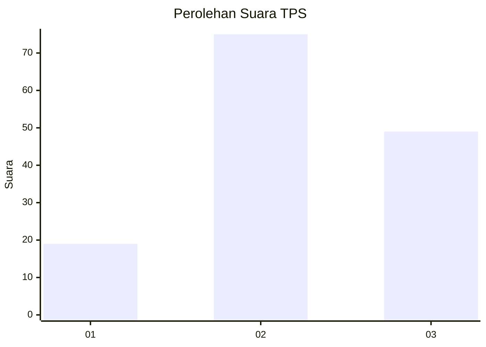
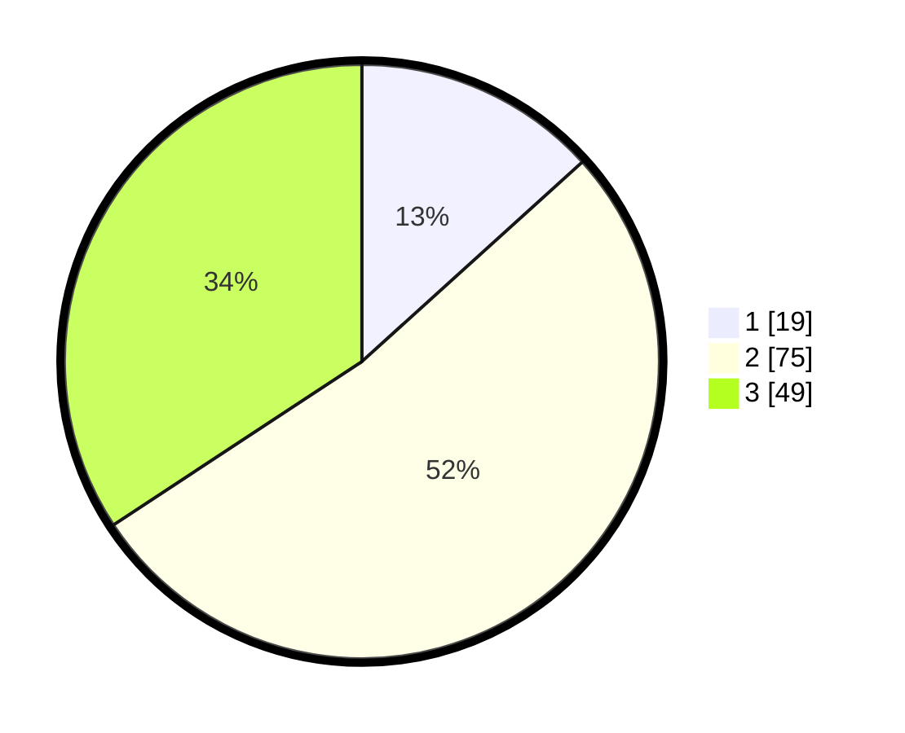

# Hasil

## Grafik

## Tabel

| No. | Nama Paslon    | Suara | Suara (raw) | Persentase |
|:--- |:-------------- | -----:| -----------:| ----------:|
| 1   | ANIES MUHAIMIN | 19    | [19][p-1]   | 13,29      |
| 2   | PRABOWO GIBRAN | 75    | [75][p-2]   | 52,45      |
| 3   | GANJAR MAHFUD  | 49    | [49][p-3]   | 34,27      |

[p-1]: https://github.com/gigit-pemilu/pemilu-2024/blob/main/pilpres/hitung-suara/sub/35-jawa-timur/sub/03-trenggalek/sub/03-pule/sub/2001-sidomulyo/sub/021-tps/sub/paslon-1.txt
[p-2]: https://github.com/gigit-pemilu/pemilu-2024/blob/main/pilpres/hitung-suara/sub/35-jawa-timur/sub/03-trenggalek/sub/03-pule/sub/2001-sidomulyo/sub/021-tps/sub/paslon-2.txt
[p-3]: https://github.com/gigit-pemilu/pemilu-2024/blob/main/pilpres/hitung-suara/sub/35-jawa-timur/sub/03-trenggalek/sub/03-pule/sub/2001-sidomulyo/sub/021-tps/sub/paslon-3.txt

## Foto C Plano

https://sirekap-obj-formc.kpu.go.id/0b1a/pemilu/ppwp/35/03/03/20/01/3503032001021-20240214-192155--6de581af-4c72-42f2-870b-e75c7a8ad68a.jpg

https://sirekap-obj-formc.kpu.go.id/0b1a/pemilu/ppwp/35/03/03/20/01/3503032001021-20240214-192202--2f553675-daf6-4820-929d-f132d8269d83.jpg

https://sirekap-obj-formc.kpu.go.id/0b1a/pemilu/ppwp/35/03/03/20/01/3503032001021-20240214-192203--9ce94306-32d3-4736-9533-4f3e6740955e.jpg

## Metadata

| Key        | Value               |
| ---------- | ------------------- |
| Time Stamp | 2024-02-14 21:46:01 |

