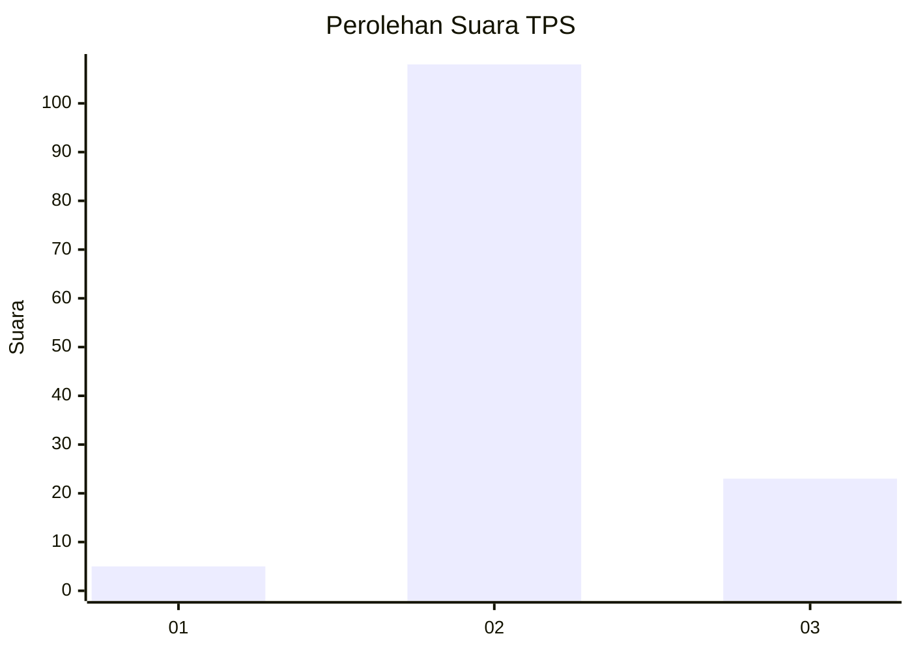

# Hasil

## Grafik

## Tabel

| No. | Nama Paslon    | Suara | Suara (raw) | Persentase |
|:--- |:-------------- | -----:| -----------:| ----------:|
| 1   | ANIES MUHAIMIN | 5     | [5][p-1]    | 3,68       |
| 2   | PRABOWO GIBRAN | 108   | [108][p-2]  | 79,41      |
| 3   | GANJAR MAHFUD  | 23    | [23][p-3]   | 16,91      |

[p-1]: https://github.com/gigit-pemilu/pemilu-2024/blob/main/pilpres/hitung-suara/sub/35-jawa-timur/sub/03-trenggalek/sub/03-pule/sub/2001-sidomulyo/sub/022-tps/sub/paslon-1.txt
[p-2]: https://github.com/gigit-pemilu/pemilu-2024/blob/main/pilpres/hitung-suara/sub/35-jawa-timur/sub/03-trenggalek/sub/03-pule/sub/2001-sidomulyo/sub/022-tps/sub/paslon-2.txt
[p-3]: https://github.com/gigit-pemilu/pemilu-2024/blob/main/pilpres/hitung-suara/sub/35-jawa-timur/sub/03-trenggalek/sub/03-pule/sub/2001-sidomulyo/sub/022-tps/sub/paslon-3.txt

## Foto C Plano

https://sirekap-obj-formc.kpu.go.id/76bc/pemilu/ppwp/35/03/03/20/01/3503032001022-20240218-091106--a54ee3f9-a1e0-4326-a915-be61fcc34777.jpg

https://sirekap-obj-formc.kpu.go.id/76bc/pemilu/ppwp/35/03/03/20/01/3503032001022-20240218-091147--8aa70e7e-b984-473a-bf64-bad043acf45a.jpg

https://sirekap-obj-formc.kpu.go.id/76bc/pemilu/ppwp/35/03/03/20/01/3503032001022-20240216-031441--fd8d07db-dbd7-40f4-b07b-125c604632b9.jpg

## Metadata

| Key        | Value               |
| ---------- | ------------------- |
| Time Stamp | 2024-02-24 22:31:28 |

