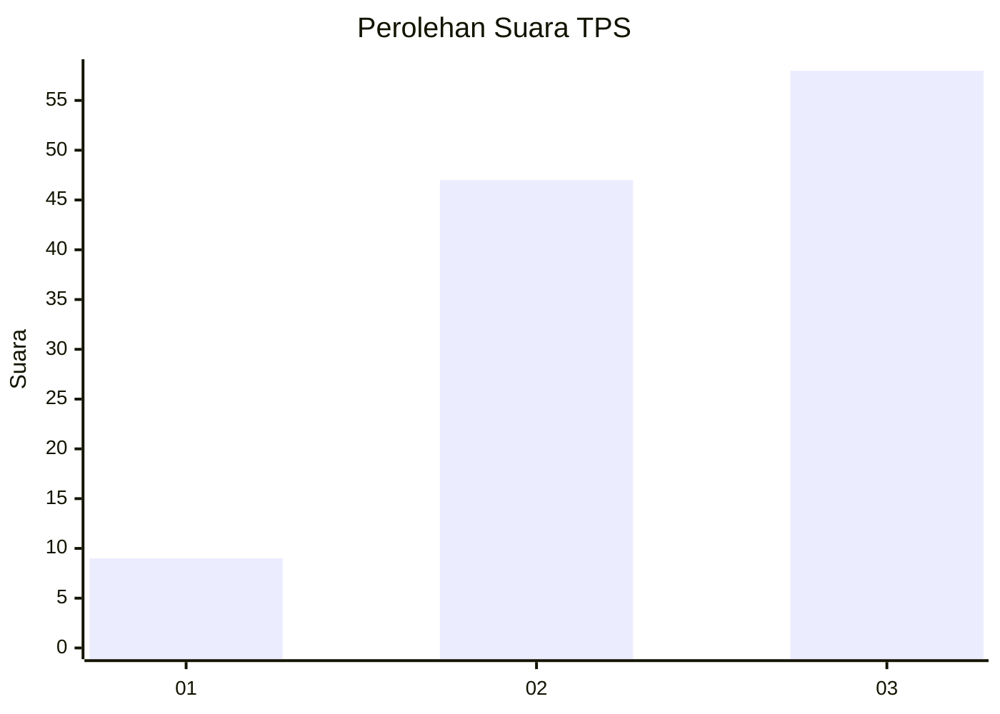
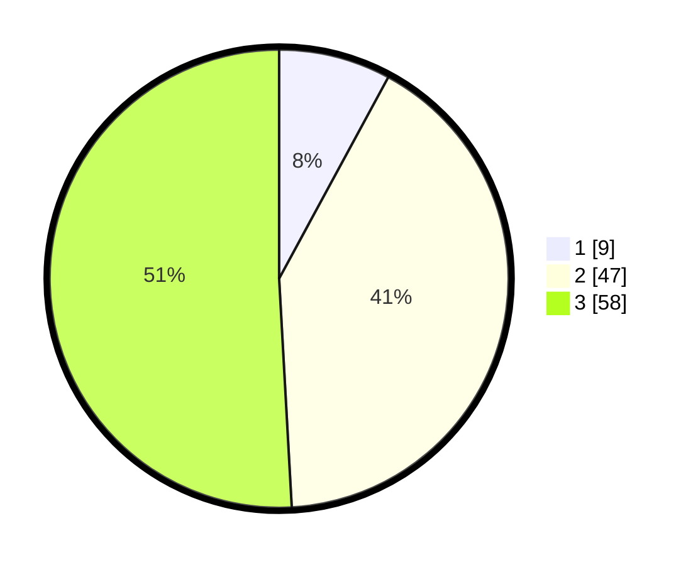

# Hasil

## Grafik

## Tabel

| No. | Nama Paslon    | Suara | Suara (raw) | Persentase |
|:--- |:-------------- | -----:| -----------:| ----------:|
| 1   | ANIES MUHAIMIN | 9     | [9][p-1]    | 7,89       |
| 2   | PRABOWO GIBRAN | 47    | [47][p-2]   | 41,23      |
| 3   | GANJAR MAHFUD  | 58    | [58][p-3]   | 50,88      |

[p-1]: https://github.com/gigit-pemilu/pemilu-2024/blob/main/pilpres/hitung-suara/sub/35-jawa-timur/sub/03-trenggalek/sub/03-pule/sub/2003-joho/sub/003-tps/sub/paslon-1.txt
[p-2]: https://github.com/gigit-pemilu/pemilu-2024/blob/main/pilpres/hitung-suara/sub/35-jawa-timur/sub/03-trenggalek/sub/03-pule/sub/2003-joho/sub/003-tps/sub/paslon-2.txt
[p-3]: https://github.com/gigit-pemilu/pemilu-2024/blob/main/pilpres/hitung-suara/sub/35-jawa-timur/sub/03-trenggalek/sub/03-pule/sub/2003-joho/sub/003-tps/sub/paslon-3.txt

## Foto C Plano

https://sirekap-obj-formc.kpu.go.id/9b4b/pemilu/ppwp/35/03/03/20/03/3503032003003-20240214-141521--6cf6a513-7a14-4769-8de4-7f897ca452f5.jpg

https://sirekap-obj-formc.kpu.go.id/9b4b/pemilu/ppwp/35/03/03/20/03/3503032003003-20240214-225913--65fb8f06-77e8-46c2-a08b-f033320400ab.jpg

https://sirekap-obj-formc.kpu.go.id/9b4b/pemilu/ppwp/35/03/03/20/03/3503032003003-20240214-230036--df1eed80-735b-4f5d-8715-24950f09dafc.jpg

## Metadata

| Key        | Value               |
| ---------- | ------------------- |
| Time Stamp | 2024-02-15 07:00:44 |

