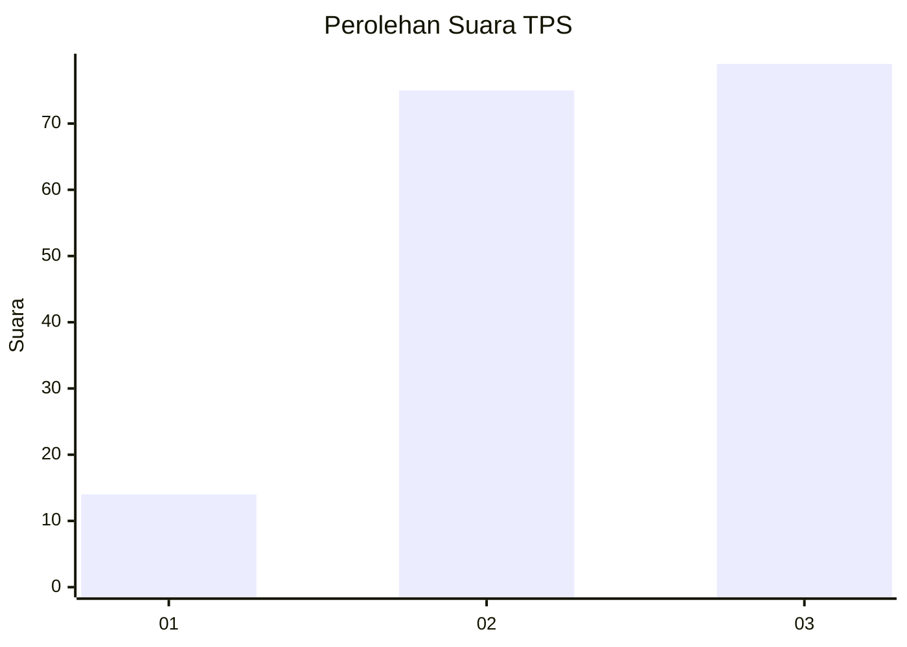
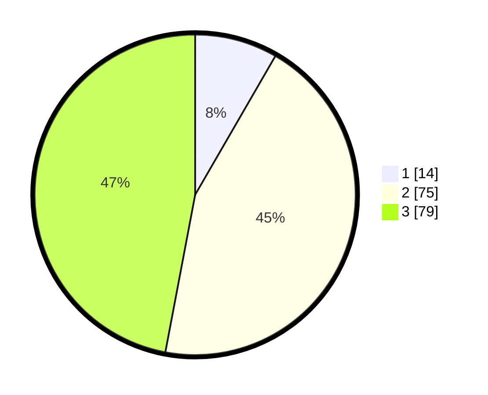

# Hasil

## Grafik

## Tabel

| No. | Nama Paslon    | Suara | Suara (raw) | Persentase |
|:--- |:-------------- | -----:| -----------:| ----------:|
| 1   | ANIES MUHAIMIN | 14    | [14][p-1]   | 8,33       |
| 2   | PRABOWO GIBRAN | 75    | [75][p-2]   | 44,64      |
| 3   | GANJAR MAHFUD  | 79    | [79][p-3]   | 47,02      |

[p-1]: https://github.com/gigit-pemilu/pemilu-2024/blob/main/pilpres/hitung-suara/sub/35-jawa-timur/sub/03-trenggalek/sub/03-pule/sub/2003-joho/sub/006-tps/sub/paslon-1.txt
[p-2]: https://github.com/gigit-pemilu/pemilu-2024/blob/main/pilpres/hitung-suara/sub/35-jawa-timur/sub/03-trenggalek/sub/03-pule/sub/2003-joho/sub/006-tps/sub/paslon-2.txt
[p-3]: https://github.com/gigit-pemilu/pemilu-2024/blob/main/pilpres/hitung-suara/sub/35-jawa-timur/sub/03-trenggalek/sub/03-pule/sub/2003-joho/sub/006-tps/sub/paslon-3.txt

## Foto C Plano

https://sirekap-obj-formc.kpu.go.id/cb48/pemilu/ppwp/35/03/03/20/03/3503032003006-20240215-005406--30085930-5a55-419f-8596-6c2829be5944.jpg

https://sirekap-obj-formc.kpu.go.id/cb48/pemilu/ppwp/35/03/03/20/03/3503032003006-20240215-005529--6efa51d6-d7a2-4461-a9cc-c3008c851dfe.jpg

## Metadata

| Key        | Value               |
| ---------- | ------------------- |
| Time Stamp | 2024-02-16 23:45:47 |

