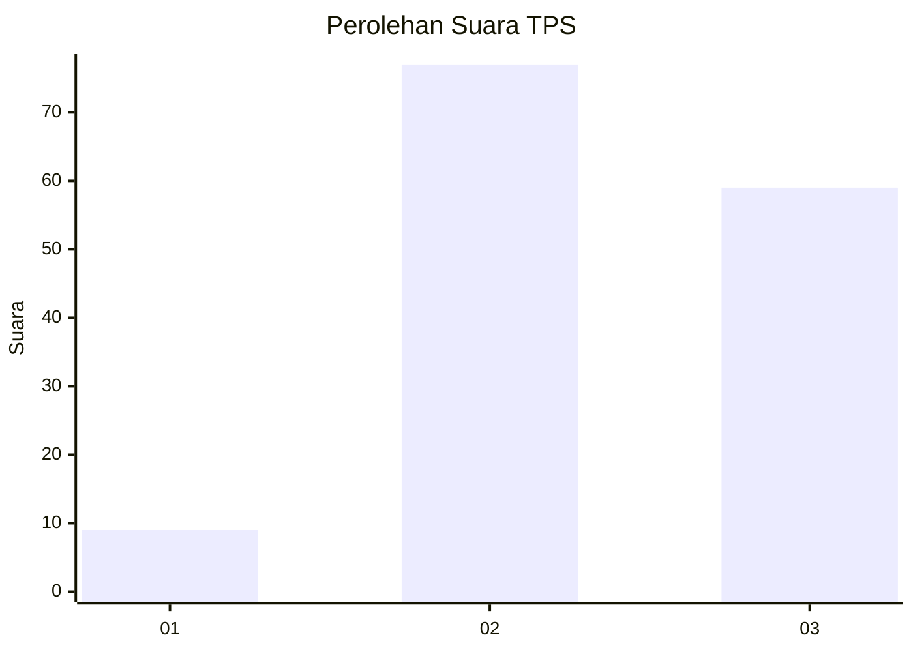
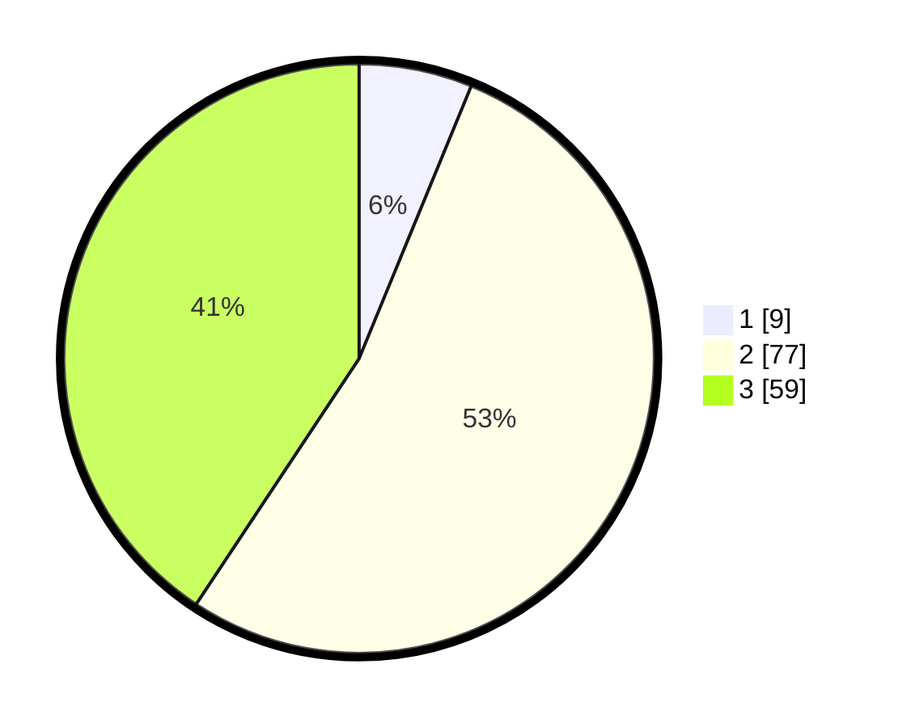

# Hasil

## Grafik

## Tabel

| No. | Nama Paslon    | Suara | Suara (raw) | Persentase |
|:--- |:-------------- | -----:| -----------:| ----------:|
| 1   | ANIES MUHAIMIN | 9     | [9][p-1]    | 6,21       |
| 2   | PRABOWO GIBRAN | 77    | [77][p-2]   | 53,10      |
| 3   | GANJAR MAHFUD  | 59    | [59][p-3]   | 40,69      |

[p-1]: https://github.com/gigit-pemilu/pemilu-2024-35-jawa-timur/blob/main/pilpres/hitung-suara/sub/35-jawa-timur/sub/03-trenggalek/sub/03-pule/sub/2003-joho/sub/008-tps/sub/paslon-1.txt
[p-2]: https://github.com/gigit-pemilu/pemilu-2024-35-jawa-timur/blob/main/pilpres/hitung-suara/sub/35-jawa-timur/sub/03-trenggalek/sub/03-pule/sub/2003-joho/sub/008-tps/sub/paslon-2.txt
[p-3]: https://github.com/gigit-pemilu/pemilu-2024-35-jawa-timur/blob/main/pilpres/hitung-suara/sub/35-jawa-timur/sub/03-trenggalek/sub/03-pule/sub/2003-joho/sub/008-tps/sub/paslon-3.txt

## Foto C Plano

https://sirekap-obj-formc.kpu.go.id/18a8/pemilu/ppwp/35/03/03/20/03/3503032003008-20240216-151245--926d7659-f320-4a01-bc0a-d87a4e3b583d.jpg

https://sirekap-obj-formc.kpu.go.id/18a8/pemilu/ppwp/35/03/03/20/03/3503032003008-20240216-151247--5b0e4c3b-9e87-4774-9f2a-9a5d253194ce.jpg

https://sirekap-obj-formc.kpu.go.id/18a8/pemilu/ppwp/35/03/03/20/03/3503032003008-20240216-151246--b853f3f2-9e6a-44a6-b089-f1554be5a17a.jpg

## Metadata

| Key        | Value               |
| ---------- | ------------------- |
| Time Stamp | 2024-02-17 01:00:00 |

## DATA PEMILIH TETAP

Jumlah pemilih dalam DPT: **205**.
 * L: **111**.
 * P: **94**.

## DATA PENGGUNA HAK PILIH

Jumlah pengguna hak pilih dalam DPT: **152**.
 * L: **76**.
 * P: **76**.

Jumlah pengguna hak pilih dalam DPTb: **0**.
 * L: **0**.
 * P: **0**.

Jumlah pengguna hak pilih dalam DPK: **0**.
 * L: **0**.
 * P: **0**.

Jumlah pengguna hak pilih: **152**.
 * L: **76**.
 * P: **76**.

## JUMLAH SUARA SAH DAN TIDAK SAH

JUMLAH SELURUH SUARA SAH: **9**.

JUMLAH SUARA TIDAK SAH: **77**.

JUMLAH SELURUH SUARA SAH DAN SUARA TIDAK SAH: **59**.

