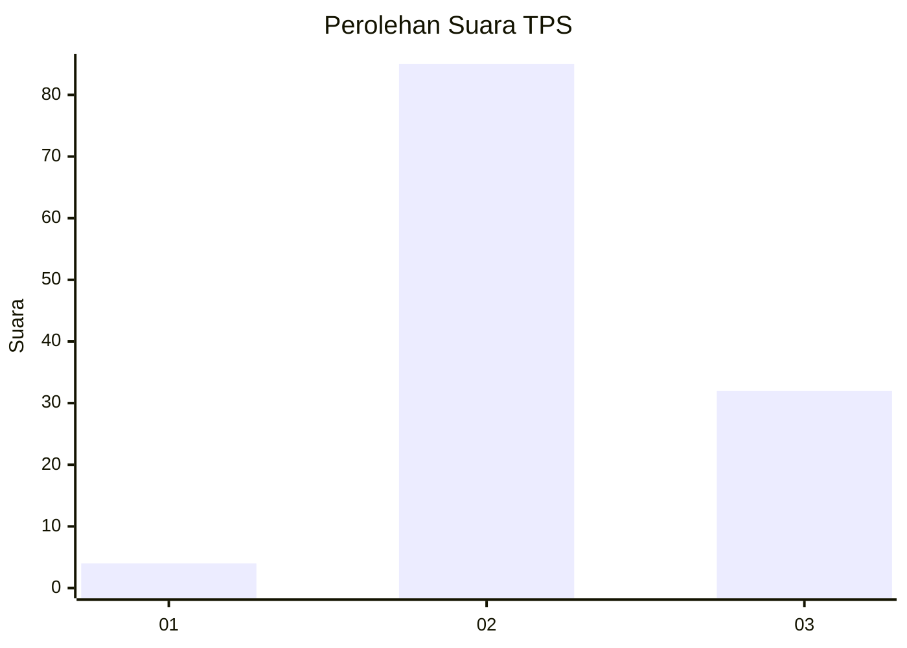
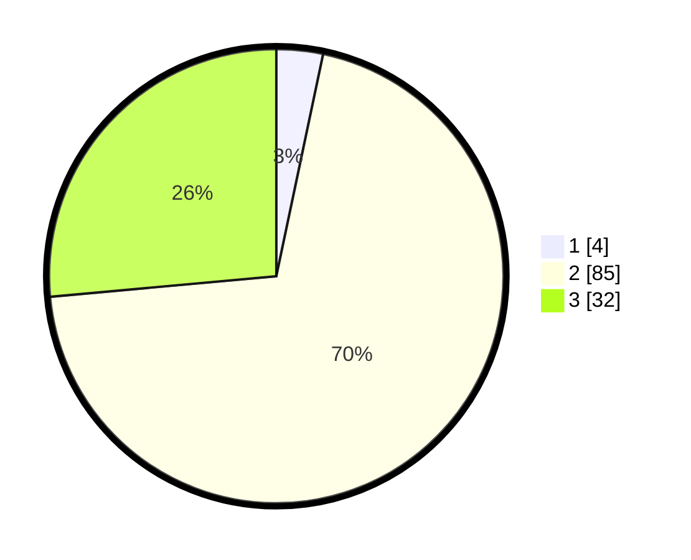

# Hasil

## Grafik

## Tabel

| No. | Nama Paslon    | Suara | Suara (raw) | Persentase |
|:--- |:-------------- | -----:| -----------:| ----------:|
| 1   | ANIES MUHAIMIN | 4     | [4][p-1]    | 3,31       |
| 2   | PRABOWO GIBRAN | 85    | [85][p-2]   | 70,25      |
| 3   | GANJAR MAHFUD  | 32    | [32][p-3]   | 26,45      |

[p-1]: https://github.com/gigit-pemilu/pemilu-2024/blob/main/pilpres/hitung-suara/sub/35-jawa-timur/sub/03-trenggalek/sub/03-pule/sub/2003-joho/sub/011-tps/sub/paslon-1.txt
[p-2]: https://github.com/gigit-pemilu/pemilu-2024/blob/main/pilpres/hitung-suara/sub/35-jawa-timur/sub/03-trenggalek/sub/03-pule/sub/2003-joho/sub/011-tps/sub/paslon-2.txt
[p-3]: https://github.com/gigit-pemilu/pemilu-2024/blob/main/pilpres/hitung-suara/sub/35-jawa-timur/sub/03-trenggalek/sub/03-pule/sub/2003-joho/sub/011-tps/sub/paslon-3.txt

## Foto C Plano

https://sirekap-obj-formc.kpu.go.id/3f6c/pemilu/ppwp/35/03/03/20/03/3503032003011-20240214-213112--5b70a991-a3f9-4f9e-b03b-06a163563f4f.jpg

https://sirekap-obj-formc.kpu.go.id/3f6c/pemilu/ppwp/35/03/03/20/03/3503032003011-20240214-213238--37740225-0084-4220-a870-66566e2b8d2a.jpg

https://sirekap-obj-formc.kpu.go.id/3f6c/pemilu/ppwp/35/03/03/20/03/3503032003011-20240214-213427--7651ed75-c4d7-477b-85b9-108f93dff3ae.jpg

## Metadata

| Key        | Value               |
| ---------- | ------------------- |
| Time Stamp | 2024-02-16 23:45:47 |

## DATA PEMILIH TETAP

Jumlah pemilih dalam DPT: **171**.
 * L: **89**.
 * P: **82**.

## DATA PENGGUNA HAK PILIH

Jumlah pengguna hak pilih dalam DPT: **127**.
 * L: **66**.
 * P: **61**.

Jumlah pengguna hak pilih: **127**.
 * L: **66**.
 * P: **61**.

## JUMLAH SUARA SAH DAN TIDAK SAH

JUMLAH SELURUH SUARA SAH: **121**.

JUMLAH SUARA TIDAK SAH: **6**.

JUMLAH SELURUH SUARA SAH DAN SUARA TIDAK SAH: **127**.

