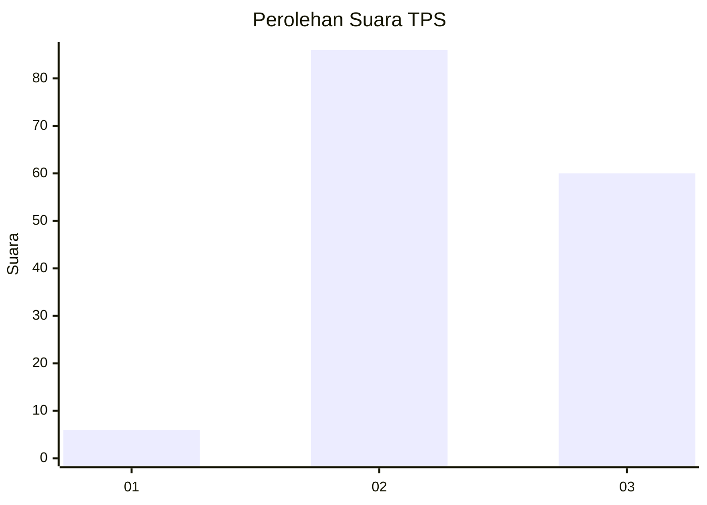
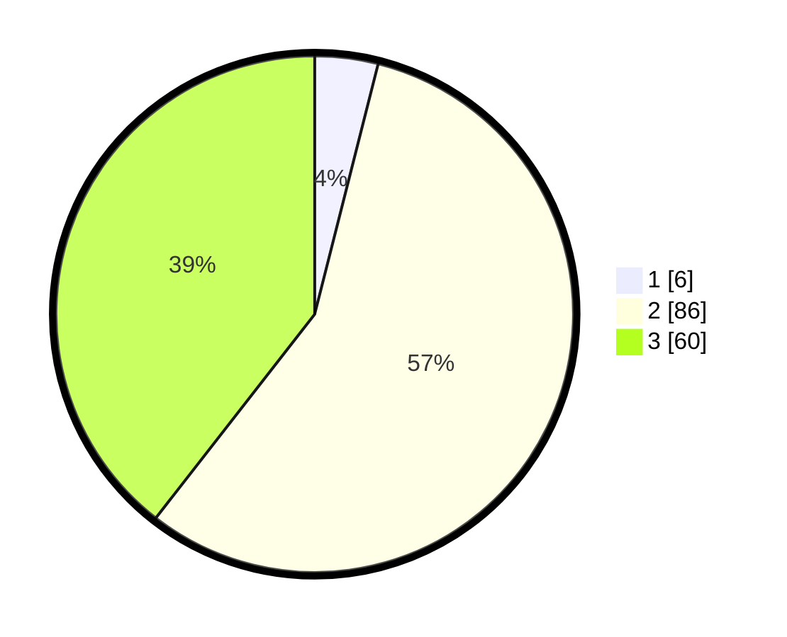

# Hasil

## Grafik

## Tabel

| No. | Nama Paslon    | Suara | Suara (raw) | Persentase |
|:--- |:-------------- | -----:| -----------:| ----------:|
| 1   | ANIES MUHAIMIN | 6     | [6][p-1]    | 3,95       |
| 2   | PRABOWO GIBRAN | 86    | [86][p-2]   | 56,58      |
| 3   | GANJAR MAHFUD  | 60    | [60][p-3]   | 39,47      |

[p-1]: https://github.com/gigit-pemilu/pemilu-2024/blob/main/pilpres/hitung-suara/sub/35-jawa-timur/sub/03-trenggalek/sub/03-pule/sub/2005-pakel/sub/002-tps/sub/paslon-1.txt
[p-2]: https://github.com/gigit-pemilu/pemilu-2024/blob/main/pilpres/hitung-suara/sub/35-jawa-timur/sub/03-trenggalek/sub/03-pule/sub/2005-pakel/sub/002-tps/sub/paslon-2.txt
[p-3]: https://github.com/gigit-pemilu/pemilu-2024/blob/main/pilpres/hitung-suara/sub/35-jawa-timur/sub/03-trenggalek/sub/03-pule/sub/2005-pakel/sub/002-tps/sub/paslon-3.txt

## Foto C Plano

https://sirekap-obj-formc.kpu.go.id/9883/pemilu/ppwp/35/03/03/20/05/3503032005002-20240214-190057--1c4764ac-9286-4ac9-ad4e-9152b576f8b7.jpg

https://sirekap-obj-formc.kpu.go.id/9883/pemilu/ppwp/35/03/03/20/05/3503032005002-20240214-185714--47250cd6-2a97-47b2-a489-a40bed804d5e.jpg

## Metadata

| Key        | Value               |
| ---------- | ------------------- |
| Time Stamp | 2024-02-15 07:00:44 |

