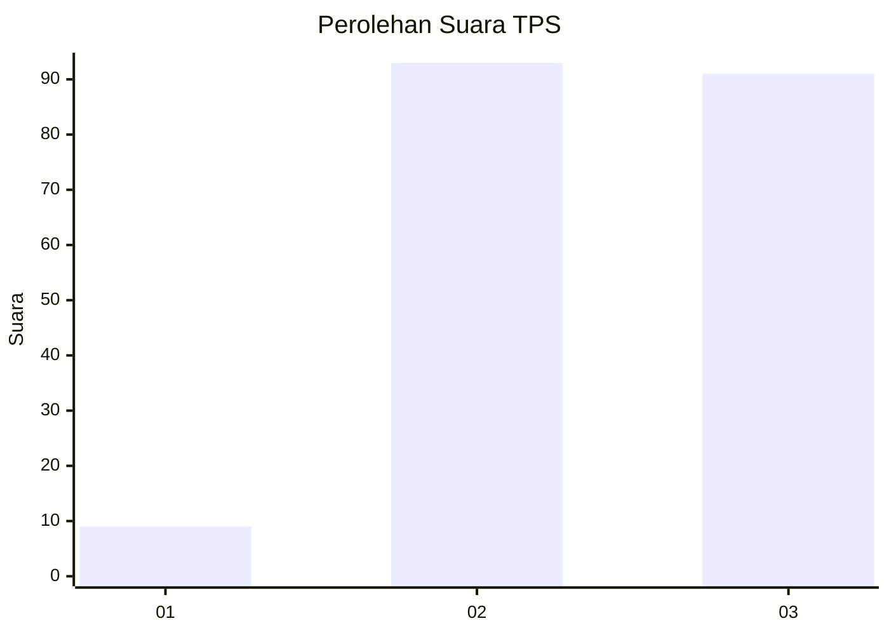
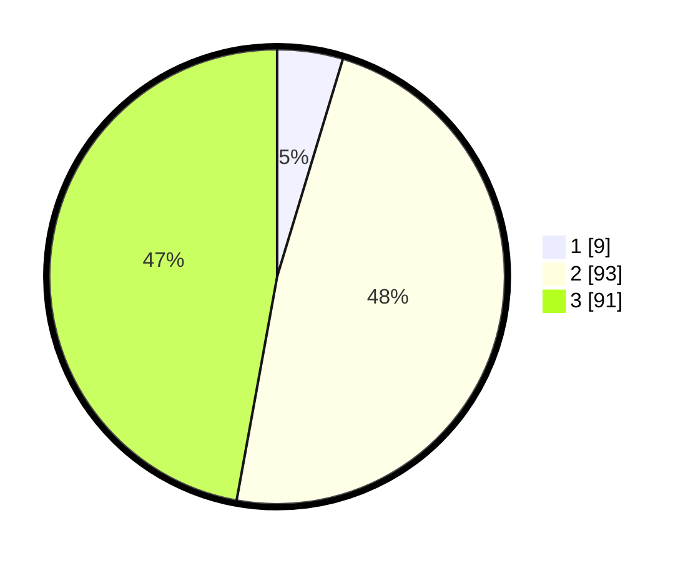

# Hasil

## Grafik

## Tabel

| No. | Nama Paslon    | Suara | Suara (raw) | Persentase |
|:--- |:-------------- | -----:| -----------:| ----------:|
| 1   | ANIES MUHAIMIN | 9     | [9][p-1]    | 4,66       |
| 2   | PRABOWO GIBRAN | 93    | [93][p-2]   | 48,19      |
| 3   | GANJAR MAHFUD  | 91    | [91][p-3]   | 47,15      |

[p-1]: https://github.com/gigit-pemilu/pemilu-2024/blob/main/pilpres/hitung-suara/sub/35-jawa-timur/sub/03-trenggalek/sub/03-pule/sub/2005-pakel/sub/003-tps/sub/paslon-1.txt
[p-2]: https://github.com/gigit-pemilu/pemilu-2024/blob/main/pilpres/hitung-suara/sub/35-jawa-timur/sub/03-trenggalek/sub/03-pule/sub/2005-pakel/sub/003-tps/sub/paslon-2.txt
[p-3]: https://github.com/gigit-pemilu/pemilu-2024/blob/main/pilpres/hitung-suara/sub/35-jawa-timur/sub/03-trenggalek/sub/03-pule/sub/2005-pakel/sub/003-tps/sub/paslon-3.txt

## Foto C Plano

https://sirekap-obj-formc.kpu.go.id/0d92/pemilu/ppwp/35/03/03/20/05/3503032005003-20240217-091137--4abf49d1-1b2d-42a8-870f-8cd115dc8a5f.jpg

https://sirekap-obj-formc.kpu.go.id/0d92/pemilu/ppwp/35/03/03/20/05/3503032005003-20240214-222518--72f6df37-1d7f-460d-af9b-9d8f458f1238.jpg

## Metadata

| Key        | Value               |
| ---------- | ------------------- |
| Time Stamp | 2024-02-17 11:00:02 |

