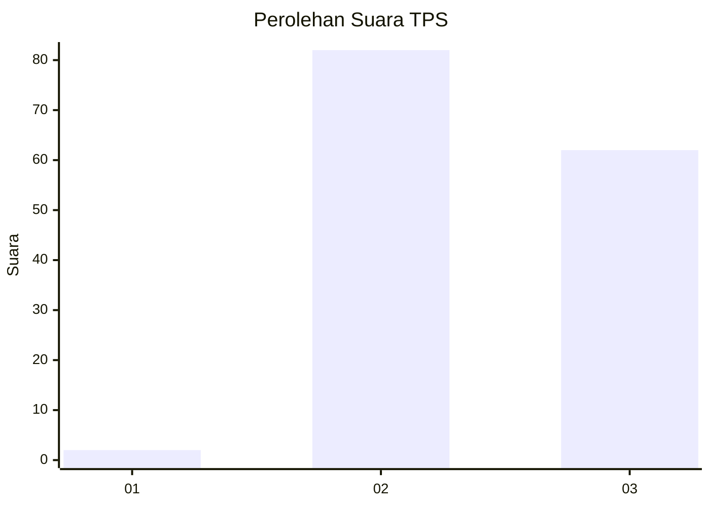
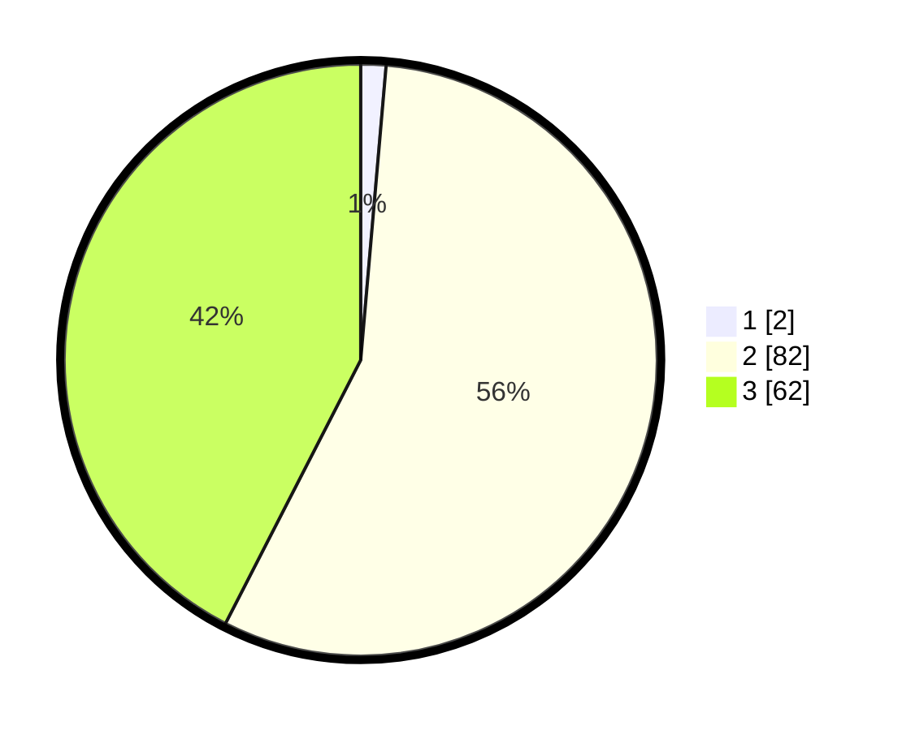

# Hasil

## Grafik

## Tabel

| No. | Nama Paslon    | Suara | Suara (raw) | Persentase |
|:--- |:-------------- | -----:| -----------:| ----------:|
| 1   | ANIES MUHAIMIN | 2     | [2][p-1]    | 1,37       |
| 2   | PRABOWO GIBRAN | 82    | [82][p-2]   | 56,16      |
| 3   | GANJAR MAHFUD  | 62    | [62][p-3]   | 42,47      |

[p-1]: https://github.com/gigit-pemilu/pemilu-2024/blob/main/pilpres/hitung-suara/sub/35-jawa-timur/sub/03-trenggalek/sub/03-pule/sub/2005-pakel/sub/005-tps/sub/paslon-1.txt
[p-2]: https://github.com/gigit-pemilu/pemilu-2024/blob/main/pilpres/hitung-suara/sub/35-jawa-timur/sub/03-trenggalek/sub/03-pule/sub/2005-pakel/sub/005-tps/sub/paslon-2.txt
[p-3]: https://github.com/gigit-pemilu/pemilu-2024/blob/main/pilpres/hitung-suara/sub/35-jawa-timur/sub/03-trenggalek/sub/03-pule/sub/2005-pakel/sub/005-tps/sub/paslon-3.txt

## Foto C Plano

https://sirekap-obj-formc.kpu.go.id/202d/pemilu/ppwp/35/03/03/20/05/3503032005005-20240216-214735--cc156b2f-9970-45c7-beb6-8ec50bbc910b.jpg

https://sirekap-obj-formc.kpu.go.id/202d/pemilu/ppwp/35/03/03/20/05/3503032005005-20240216-214415--e12afe83-961c-4fe7-a331-e8c98f25c719.jpg

## Metadata

| Key        | Value               |
| ---------- | ------------------- |
| Time Stamp | 2024-02-25 12:00:00 |

