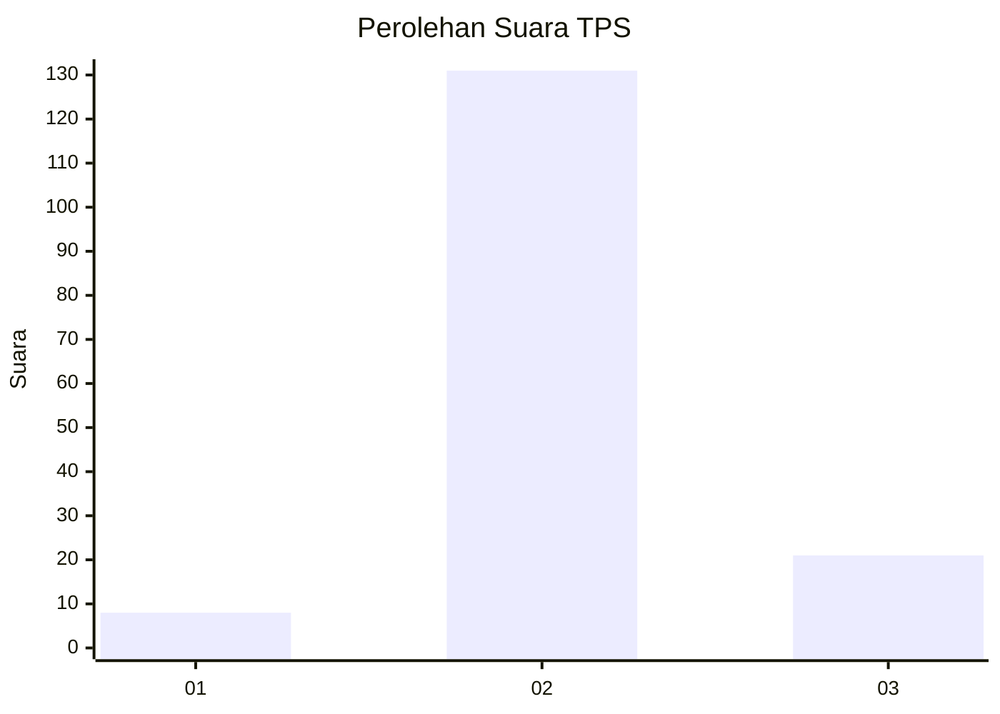
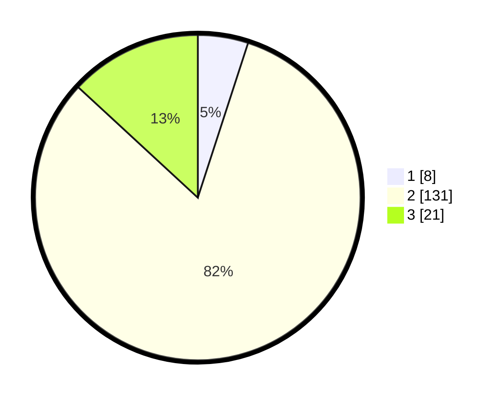

# Hasil

## Grafik

## Tabel

| No. | Nama Paslon    | Suara | Suara (raw) | Persentase |
|:--- |:-------------- | -----:| -----------:| ----------:|
| 1   | ANIES MUHAIMIN | 8     | [8][p-1]    | 5,00       |
| 2   | PRABOWO GIBRAN | 131   | [131][p-2]  | 81,88      |
| 3   | GANJAR MAHFUD  | 21    | [21][p-3]   | 13,13      |

[p-1]: https://github.com/gigit-pemilu/pemilu-2024/blob/main/pilpres/hitung-suara/sub/35-jawa-timur/sub/03-trenggalek/sub/03-pule/sub/2009-jombok/sub/021-tps/sub/paslon-1.txt
[p-2]: https://github.com/gigit-pemilu/pemilu-2024/blob/main/pilpres/hitung-suara/sub/35-jawa-timur/sub/03-trenggalek/sub/03-pule/sub/2009-jombok/sub/021-tps/sub/paslon-2.txt
[p-3]: https://github.com/gigit-pemilu/pemilu-2024/blob/main/pilpres/hitung-suara/sub/35-jawa-timur/sub/03-trenggalek/sub/03-pule/sub/2009-jombok/sub/021-tps/sub/paslon-3.txt

## Foto C Plano

https://sirekap-obj-formc.kpu.go.id/978a/pemilu/ppwp/35/03/03/20/09/3503032009021-20240214-141356--5fa1d520-d42b-4c57-a4ef-700e0ed1eadf.jpg

https://sirekap-obj-formc.kpu.go.id/978a/pemilu/ppwp/35/03/03/20/09/3503032009021-20240214-141400--c3689d1d-a5e0-4a2b-989d-c0eba6a124d4.jpg

https://sirekap-obj-formc.kpu.go.id/978a/pemilu/ppwp/35/03/03/20/09/3503032009021-20240214-141404--9f102c97-63c3-4b42-ba5d-c5c1f21e7b83.jpg

## Metadata

| Key        | Value               |
| ---------- | ------------------- |
| Time Stamp | 2024-02-17 02:30:03 |

