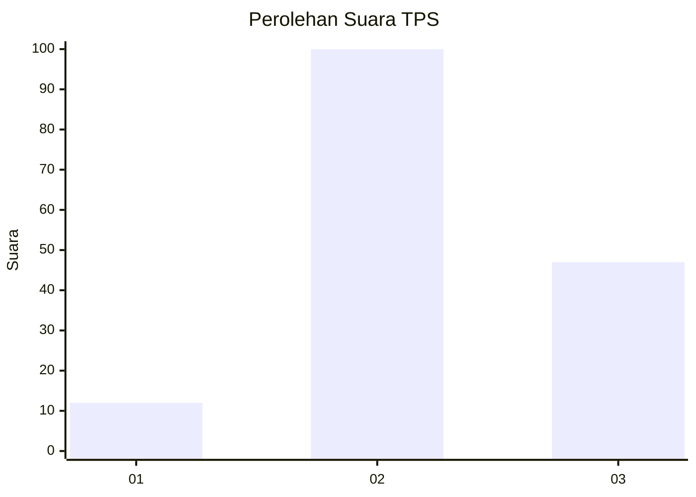
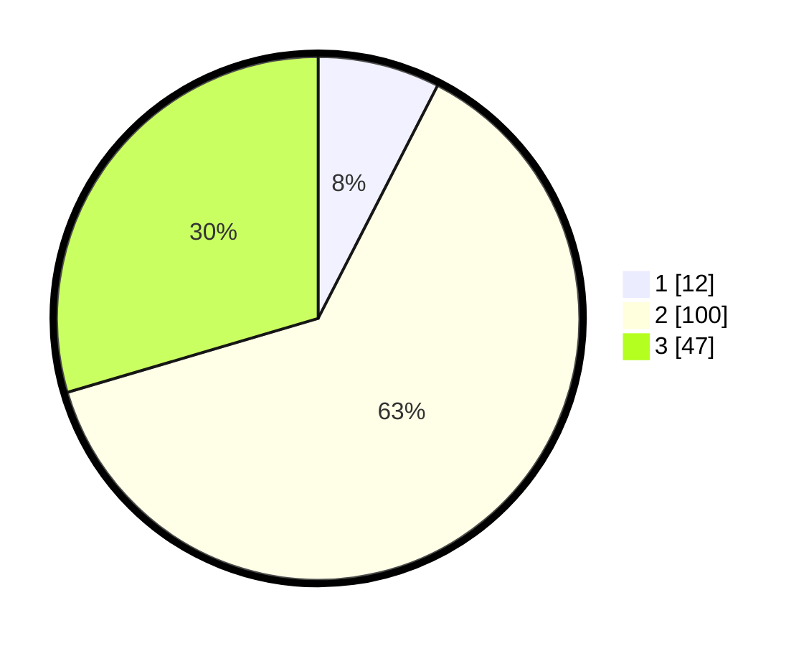

# Hasil

## Grafik

## Tabel

| No. | Nama Paslon    | Suara | Suara (raw) | Persentase |
|:--- |:-------------- | -----:| -----------:| ----------:|
| 1   | ANIES MUHAIMIN | 12    | [12][p-1]   | 7,55       |
| 2   | PRABOWO GIBRAN | 100   | [100][p-2]  | 62,89      |
| 3   | GANJAR MAHFUD  | 47    | [47][p-3]   | 29,56      |

[p-1]: https://github.com/gigit-pemilu/pemilu-2024/blob/main/pilpres/hitung-suara/sub/35-jawa-timur/sub/03-trenggalek/sub/04-dongko/sub/2001-cakul/sub/003-tps/sub/paslon-1.txt
[p-2]: https://github.com/gigit-pemilu/pemilu-2024/blob/main/pilpres/hitung-suara/sub/35-jawa-timur/sub/03-trenggalek/sub/04-dongko/sub/2001-cakul/sub/003-tps/sub/paslon-2.txt
[p-3]: https://github.com/gigit-pemilu/pemilu-2024/blob/main/pilpres/hitung-suara/sub/35-jawa-timur/sub/03-trenggalek/sub/04-dongko/sub/2001-cakul/sub/003-tps/sub/paslon-3.txt

## Foto C Plano

https://sirekap-obj-formc.kpu.go.id/0b60/pemilu/ppwp/35/03/04/20/01/3503042001003-20240216-165326--3ee43c74-47c4-4184-8ad6-b0e92eb7a379.jpg

https://sirekap-obj-formc.kpu.go.id/0b60/pemilu/ppwp/35/03/04/20/01/3503042001003-20240216-165338--5cda432f-fc9a-4b7d-9ebe-fa4900117185.jpg

https://sirekap-obj-formc.kpu.go.id/0b60/pemilu/ppwp/35/03/04/20/01/3503042001003-20240218-111306--defb8627-5fc6-4447-94a2-5a4b44c3db33.jpg

## Metadata

| Key        | Value               |
| ---------- | ------------------- |
| Time Stamp | 2024-02-19 06:16:00 |

## DATA PEMILIH TETAP

Jumlah pemilih dalam DPT: **231**.
 * L: **117**.
 * P: **114**.

## DATA PENGGUNA HAK PILIH

Jumlah pengguna hak pilih dalam DPT: **166**.
 * L: **79**.
 * P: **87**.

Jumlah pengguna hak pilih dalam DPTb: **0**.
 * L: **0**.
 * P: **0**.

Jumlah pengguna hak pilih dalam DPK: **1**.
 * L: **1**.
 * P: **0**.

Jumlah pengguna hak pilih: **167**.
 * L: **80**.
 * P: **87**.

## JUMLAH SUARA SAH DAN TIDAK SAH

JUMLAH SELURUH SUARA SAH: **159**.

JUMLAH SUARA TIDAK SAH: **8**.

JUMLAH SELURUH SUARA SAH DAN SUARA TIDAK SAH: **167**.

