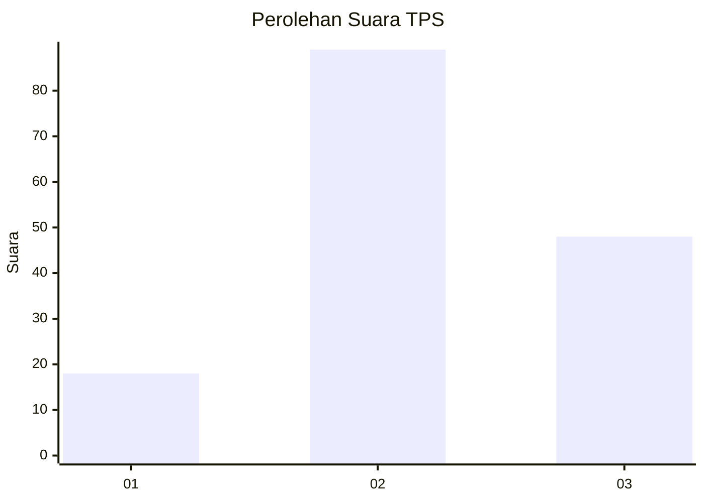
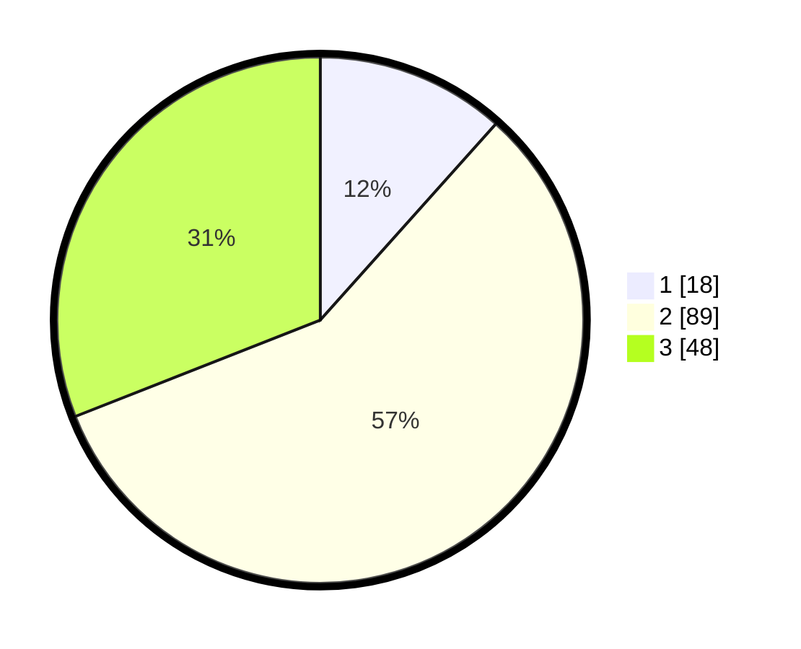

# Hasil

## Grafik

## Tabel

| No. | Nama Paslon    | Suara | Suara (raw) | Persentase |
|:--- |:-------------- | -----:| -----------:| ----------:|
| 1   | ANIES MUHAIMIN | 18    | [18][p-1]   | 11,61      |
| 2   | PRABOWO GIBRAN | 89    | [89][p-2]   | 57,42      |
| 3   | GANJAR MAHFUD  | 48    | [48][p-3]   | 30,97      |

[p-1]: https://github.com/gigit-pemilu/pemilu-2024-35-jawa-timur/blob/main/pilpres/hitung-suara/sub/35-jawa-timur/sub/03-trenggalek/sub/04-dongko/sub/2002-siki/sub/012-tps/sub/paslon-1.txt
[p-2]: https://github.com/gigit-pemilu/pemilu-2024-35-jawa-timur/blob/main/pilpres/hitung-suara/sub/35-jawa-timur/sub/03-trenggalek/sub/04-dongko/sub/2002-siki/sub/012-tps/sub/paslon-2.txt
[p-3]: https://github.com/gigit-pemilu/pemilu-2024-35-jawa-timur/blob/main/pilpres/hitung-suara/sub/35-jawa-timur/sub/03-trenggalek/sub/04-dongko/sub/2002-siki/sub/012-tps/sub/paslon-3.txt

## Foto C Plano

https://sirekap-obj-formc.kpu.go.id/f077/pemilu/ppwp/35/03/04/20/02/3503042002012-20240214-202347--f3331cbe-31b9-4b4a-b1f7-769dff1e7457.jpg

https://sirekap-obj-formc.kpu.go.id/f077/pemilu/ppwp/35/03/04/20/02/3503042002012-20240214-202416--f376cbf4-b57b-4f21-9243-dcb5fb78d944.jpg

https://sirekap-obj-formc.kpu.go.id/f077/pemilu/ppwp/35/03/04/20/02/3503042002012-20240214-202431--14246ab4-1c3d-4902-823f-5b7d2ace5ccf.jpg

## Metadata

| Key        | Value               |
| ---------- | ------------------- |
| Time Stamp | 2024-02-15 00:56:54 |

