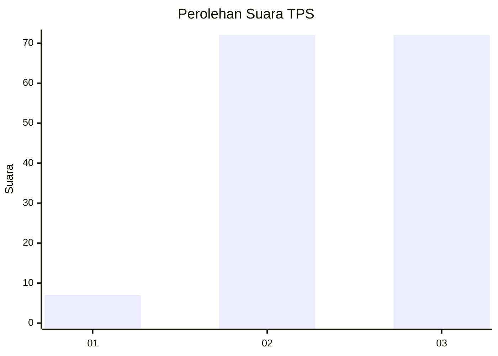
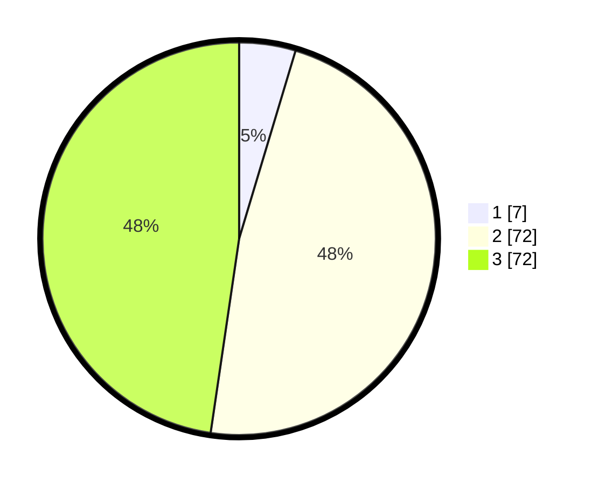

# Hasil

## Grafik

## Tabel

| No. | Nama Paslon    | Suara | Suara (raw) | Persentase |
|:--- |:-------------- | -----:| -----------:| ----------:|
| 1   | ANIES MUHAIMIN | 7     | [7][p-1]    | 4,64       |
| 2   | PRABOWO GIBRAN | 72    | [72][p-2]   | 47,68      |
| 3   | GANJAR MAHFUD  | 72    | [72][p-3]   | 47,68      |

[p-1]: https://github.com/gigit-pemilu/pemilu-2024/blob/main/pilpres/hitung-suara/sub/35-jawa-timur/sub/03-trenggalek/sub/04-dongko/sub/2002-siki/sub/014-tps/sub/paslon-1.txt
[p-2]: https://github.com/gigit-pemilu/pemilu-2024/blob/main/pilpres/hitung-suara/sub/35-jawa-timur/sub/03-trenggalek/sub/04-dongko/sub/2002-siki/sub/014-tps/sub/paslon-2.txt
[p-3]: https://github.com/gigit-pemilu/pemilu-2024/blob/main/pilpres/hitung-suara/sub/35-jawa-timur/sub/03-trenggalek/sub/04-dongko/sub/2002-siki/sub/014-tps/sub/paslon-3.txt

## Foto C Plano

https://sirekap-obj-formc.kpu.go.id/b67b/pemilu/ppwp/35/03/04/20/02/3503042002014-20240218-094555--5c51385c-4939-4376-9a59-20a02e7e681d.jpg

https://sirekap-obj-formc.kpu.go.id/b67b/pemilu/ppwp/35/03/04/20/02/3503042002014-20240214-221304--857661f3-ef03-498b-9c12-2fb393e895ab.jpg

https://sirekap-obj-formc.kpu.go.id/b67b/pemilu/ppwp/35/03/04/20/02/3503042002014-20240218-095632--70f83055-65b5-4a8c-b7db-2b10dc672590.jpg

## Metadata

| Key        | Value               |
| ---------- | ------------------- |
| Time Stamp | 2024-02-19 06:16:00 |

