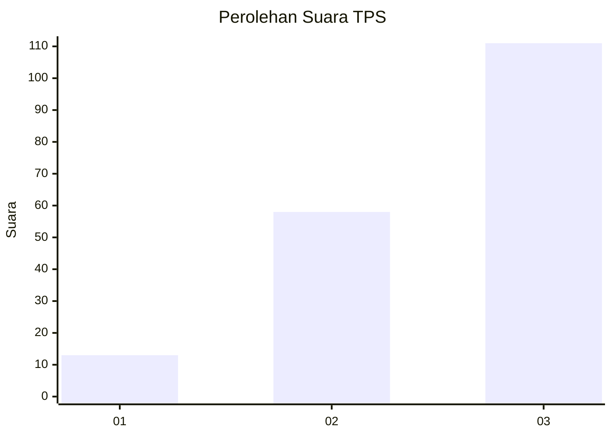
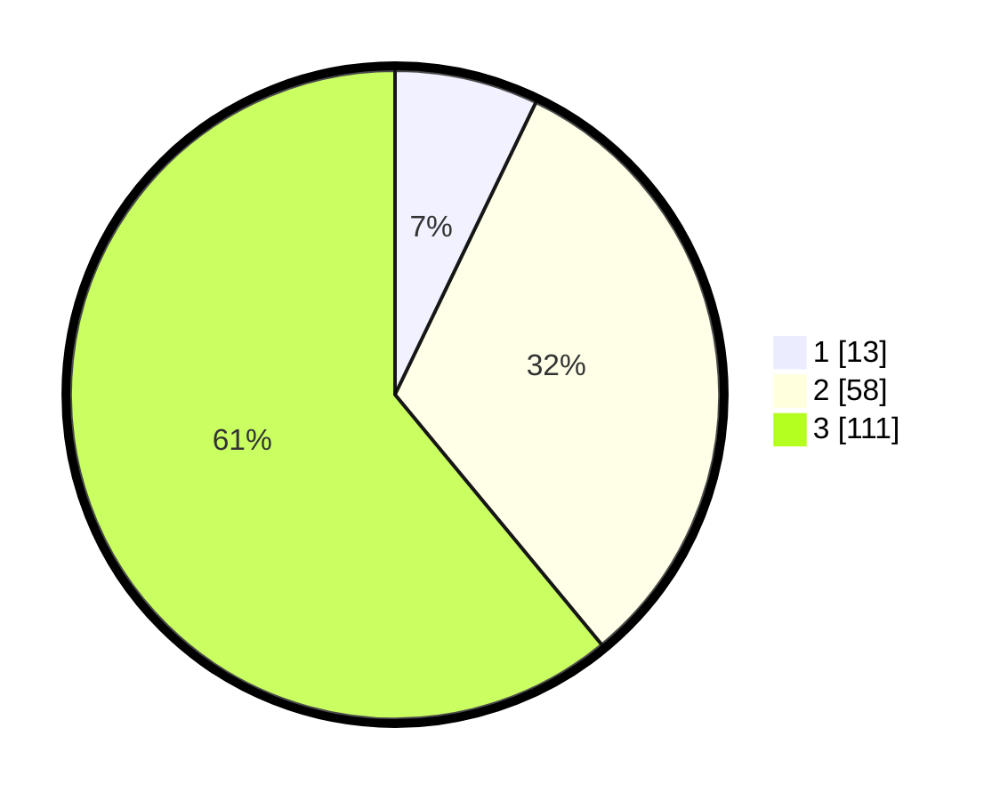

# Hasil

## Grafik

## Tabel

| No. | Nama Paslon    | Suara | Suara (raw) | Persentase |
|:--- |:-------------- | -----:| -----------:| ----------:|
| 1   | ANIES MUHAIMIN | 13    | [13][p-1]   | 7,14       |
| 2   | PRABOWO GIBRAN | 58    | [58][p-2]   | 31,87      |
| 3   | GANJAR MAHFUD  | 111   | [111][p-3]  | 60,99      |

[p-1]: https://github.com/gigit-pemilu/pemilu-2024/blob/main/pilpres/hitung-suara/sub/35-jawa-timur/sub/03-trenggalek/sub/04-dongko/sub/2002-siki/sub/016-tps/sub/paslon-1.txt
[p-2]: https://github.com/gigit-pemilu/pemilu-2024/blob/main/pilpres/hitung-suara/sub/35-jawa-timur/sub/03-trenggalek/sub/04-dongko/sub/2002-siki/sub/016-tps/sub/paslon-2.txt
[p-3]: https://github.com/gigit-pemilu/pemilu-2024/blob/main/pilpres/hitung-suara/sub/35-jawa-timur/sub/03-trenggalek/sub/04-dongko/sub/2002-siki/sub/016-tps/sub/paslon-3.txt

## Foto C Plano

https://sirekap-obj-formc.kpu.go.id/7be1/pemilu/ppwp/35/03/04/20/02/3503042002016-20240214-210412--4bb595e2-26f2-45c2-86fd-dfa62c0c4bb3.jpg

https://sirekap-obj-formc.kpu.go.id/7be1/pemilu/ppwp/35/03/04/20/02/3503042002016-20240214-210437--7efc4e1f-0a29-4cfc-b2b3-ae7f8944944d.jpg

https://sirekap-obj-formc.kpu.go.id/7be1/pemilu/ppwp/35/03/04/20/02/3503042002016-20240214-210513--3ae7c403-34ed-401e-9b36-96b9d8772e27.jpg

## Metadata

| Key        | Value               |
| ---------- | ------------------- |
| Time Stamp | 2024-02-15 01:04:11 |

