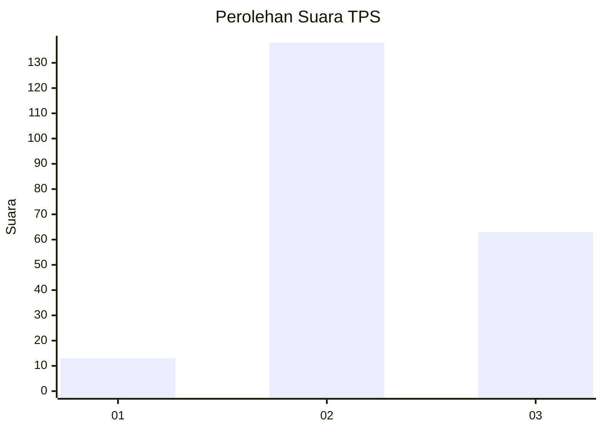

# Hasil

## Grafik

## Tabel

| No. | Nama Paslon    | Suara | Suara (raw) | Persentase |
|:--- |:-------------- | -----:| -----------:| ----------:|
| 1   | ANIES MUHAIMIN | 13    | [13][p-1]   | 6,07       |
| 2   | PRABOWO GIBRAN | 138   | [138][p-2]  | 64,49      |
| 3   | GANJAR MAHFUD  | 63    | [63][p-3]   | 29,44      |

[p-1]: https://github.com/gigit-pemilu/pemilu-2024-35-jawa-timur/blob/main/pilpres/hitung-suara/sub/35-jawa-timur/sub/03-trenggalek/sub/04-dongko/sub/2004-pandean/sub/002-tps/sub/paslon-1.txt
[p-2]: https://github.com/gigit-pemilu/pemilu-2024-35-jawa-timur/blob/main/pilpres/hitung-suara/sub/35-jawa-timur/sub/03-trenggalek/sub/04-dongko/sub/2004-pandean/sub/002-tps/sub/paslon-2.txt
[p-3]: https://github.com/gigit-pemilu/pemilu-2024-35-jawa-timur/blob/main/pilpres/hitung-suara/sub/35-jawa-timur/sub/03-trenggalek/sub/04-dongko/sub/2004-pandean/sub/002-tps/sub/paslon-3.txt

## Foto C Plano

https://sirekap-obj-formc.kpu.go.id/ec6c/pemilu/ppwp/35/03/04/20/04/3503042004002-20240214-205909--c8d251d6-f983-4ad6-b7b2-a72beda55d10.jpg

https://sirekap-obj-formc.kpu.go.id/ec6c/pemilu/ppwp/35/03/04/20/04/3503042004002-20240215-013300--f5e307a2-199d-4eeb-828c-e06bf6476bd7.jpg

https://sirekap-obj-formc.kpu.go.id/ec6c/pemilu/ppwp/35/03/04/20/04/3503042004002-20240215-013323--4ce739ad-d667-415e-9d72-078cef2fa134.jpg

## Metadata

| Key        | Value               |
| ---------- | ------------------- |
| Time Stamp | 2024-02-15 22:40:13 |

