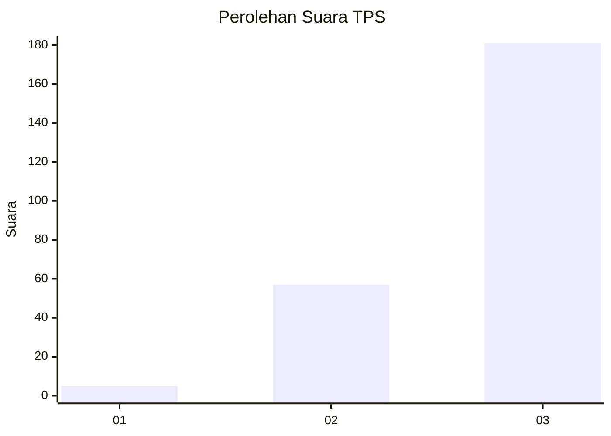
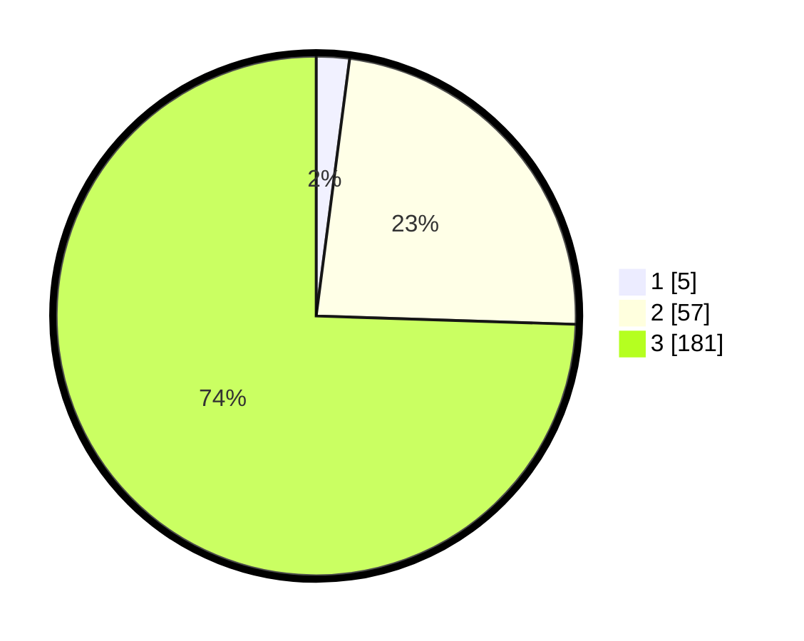

# Hasil

## Grafik

## Tabel

| No. | Nama Paslon    | Suara | Suara (raw) | Persentase |
|:--- |:-------------- | -----:| -----------:| ----------:|
| 1   | ANIES MUHAIMIN | 5     | [5][p-1]    | 2,06       |
| 2   | PRABOWO GIBRAN | 57    | [57][p-2]   | 23,46      |
| 3   | GANJAR MAHFUD  | 181   | [181][p-3]  | 74,49      |

[p-1]: https://github.com/gigit-pemilu/pemilu-2024-35-jawa-timur/blob/main/pilpres/hitung-suara/sub/35-jawa-timur/sub/03-trenggalek/sub/04-dongko/sub/2006-salamwates/sub/020-tps/sub/paslon-1.txt
[p-2]: https://github.com/gigit-pemilu/pemilu-2024-35-jawa-timur/blob/main/pilpres/hitung-suara/sub/35-jawa-timur/sub/03-trenggalek/sub/04-dongko/sub/2006-salamwates/sub/020-tps/sub/paslon-2.txt
[p-3]: https://github.com/gigit-pemilu/pemilu-2024-35-jawa-timur/blob/main/pilpres/hitung-suara/sub/35-jawa-timur/sub/03-trenggalek/sub/04-dongko/sub/2006-salamwates/sub/020-tps/sub/paslon-3.txt

## Foto C Plano

https://sirekap-obj-formc.kpu.go.id/c855/pemilu/ppwp/35/03/04/20/06/3503042006020-20240217-100723--bb433264-88c8-43e0-bdc8-c5cfa2481dbe.jpg

https://sirekap-obj-formc.kpu.go.id/c855/pemilu/ppwp/35/03/04/20/06/3503042006020-20240217-105139--4094b7d3-605b-4140-b75f-93398a860de8.jpg

https://sirekap-obj-formc.kpu.go.id/c855/pemilu/ppwp/35/03/04/20/06/3503042006020-20240218-191851--208f246b-d83b-4ba2-8ee3-37ad5811ac6b.jpg

## Metadata

| Key        | Value               |
| ---------- | ------------------- |
| Time Stamp | 2024-02-19 06:16:00 |

