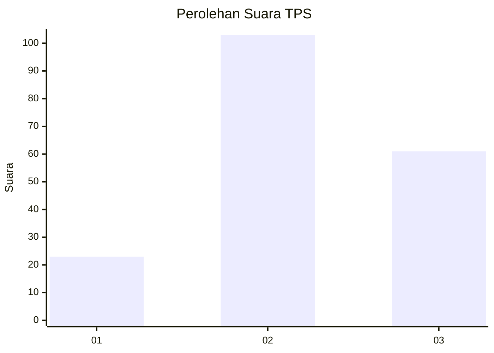
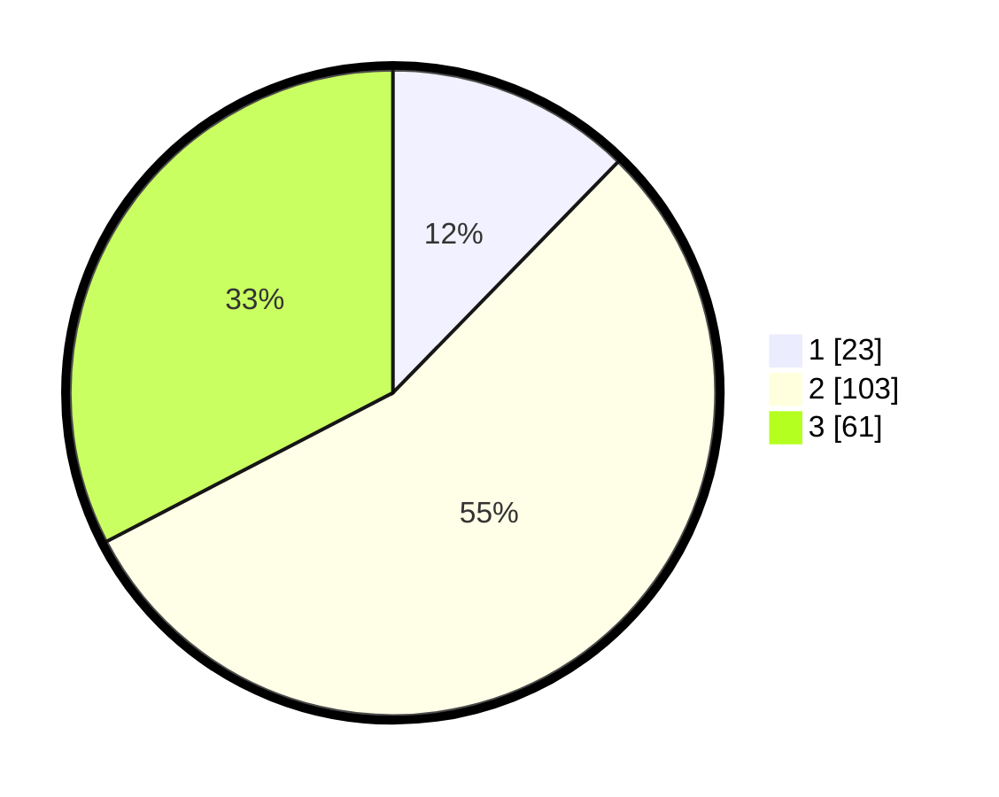

# Hasil

## Grafik

## Tabel

| No. | Nama Paslon    | Suara | Suara (raw) | Persentase |
|:--- |:-------------- | -----:| -----------:| ----------:|
| 1   | ANIES MUHAIMIN | 23    | [23][p-1]   | 12,30      |
| 2   | PRABOWO GIBRAN | 103   | [103][p-2]  | 55,08      |
| 3   | GANJAR MAHFUD  | 61    | [61][p-3]   | 32,62      |

[p-1]: https://github.com/gigit-pemilu/pemilu-2024-35-jawa-timur/blob/main/pilpres/hitung-suara/sub/35-jawa-timur/sub/03-trenggalek/sub/04-dongko/sub/2009-ngerdani/sub/002-tps/sub/paslon-1.txt
[p-2]: https://github.com/gigit-pemilu/pemilu-2024-35-jawa-timur/blob/main/pilpres/hitung-suara/sub/35-jawa-timur/sub/03-trenggalek/sub/04-dongko/sub/2009-ngerdani/sub/002-tps/sub/paslon-2.txt
[p-3]: https://github.com/gigit-pemilu/pemilu-2024-35-jawa-timur/blob/main/pilpres/hitung-suara/sub/35-jawa-timur/sub/03-trenggalek/sub/04-dongko/sub/2009-ngerdani/sub/002-tps/sub/paslon-3.txt

## Foto C Plano

https://sirekap-obj-formc.kpu.go.id/4eab/pemilu/ppwp/35/03/04/20/09/3503042009002-20240221-181735--93237025-ed9a-492b-9b64-60dacef534a6.jpg

https://sirekap-obj-formc.kpu.go.id/4eab/pemilu/ppwp/35/03/04/20/09/3503042009002-20240218-091951--39e5470f-953a-4386-9536-0cc0a656b5a8.jpg

https://sirekap-obj-formc.kpu.go.id/4eab/pemilu/ppwp/35/03/04/20/09/3503042009002-20240220-113333--d23aac8c-c2d2-45f2-8658-7142d7bf0a7b.jpg

## Metadata

| Key        | Value               |
| ---------- | ------------------- |
| Time Stamp | 2024-02-21 19:00:00 |

