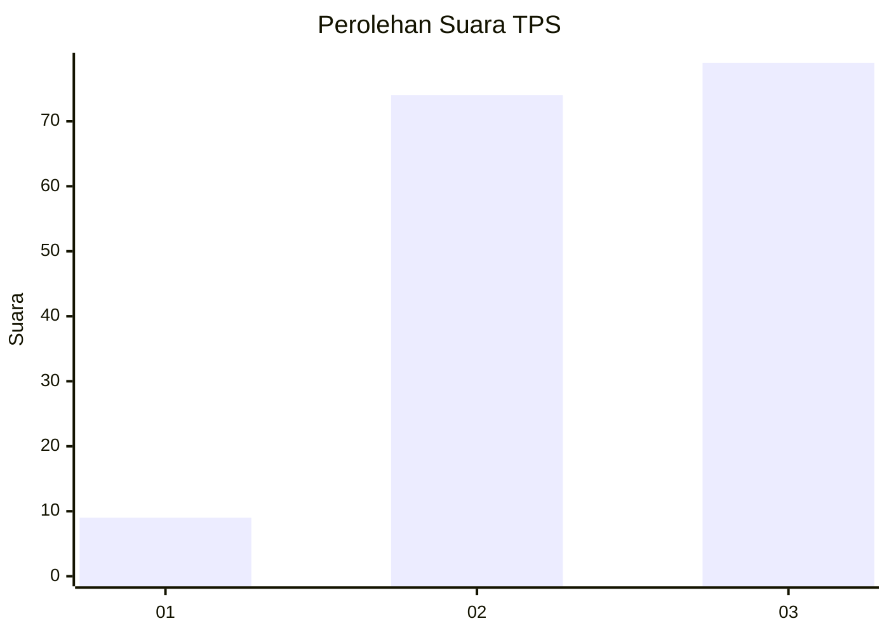
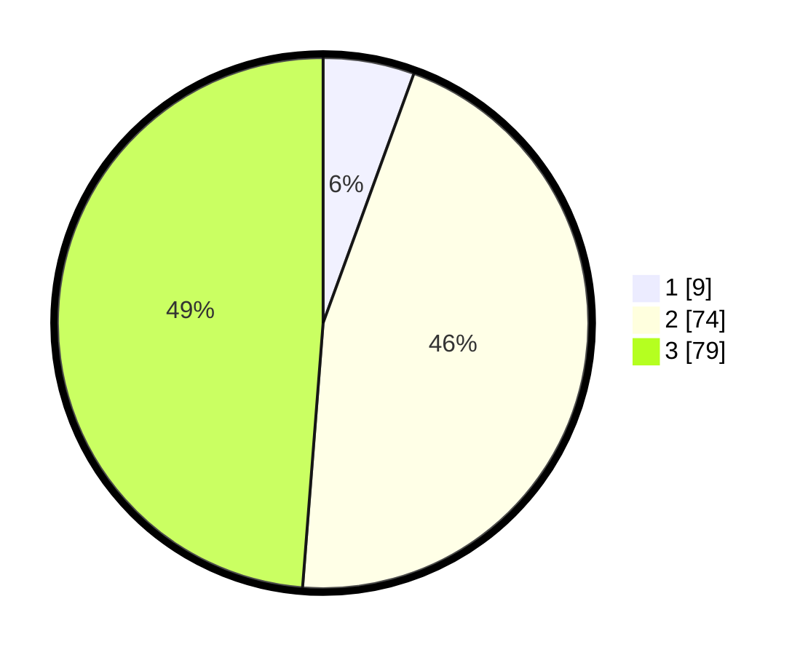

# Hasil

## Grafik

## Tabel

| No. | Nama Paslon    | Suara | Suara (raw) | Persentase |
|:--- |:-------------- | -----:| -----------:| ----------:|
| 1   | ANIES MUHAIMIN | 9     | [9][p-1]    | 5,56       |
| 2   | PRABOWO GIBRAN | 74    | [74][p-2]   | 45,68      |
| 3   | GANJAR MAHFUD  | 79    | [79][p-3]   | 48,77      |

[p-1]: https://github.com/gigit-pemilu/pemilu-2024/blob/main/pilpres/hitung-suara/sub/35-jawa-timur/sub/03-trenggalek/sub/04-dongko/sub/2009-ngerdani/sub/011-tps/sub/paslon-1.txt
[p-2]: https://github.com/gigit-pemilu/pemilu-2024/blob/main/pilpres/hitung-suara/sub/35-jawa-timur/sub/03-trenggalek/sub/04-dongko/sub/2009-ngerdani/sub/011-tps/sub/paslon-2.txt
[p-3]: https://github.com/gigit-pemilu/pemilu-2024/blob/main/pilpres/hitung-suara/sub/35-jawa-timur/sub/03-trenggalek/sub/04-dongko/sub/2009-ngerdani/sub/011-tps/sub/paslon-3.txt

## Foto C Plano

https://sirekap-obj-formc.kpu.go.id/8e79/pemilu/ppwp/35/03/04/20/09/3503042009011-20240214-141014--c3574e6a-7f2c-4dbf-8834-04aa886d5b7c.jpg

https://sirekap-obj-formc.kpu.go.id/8e79/pemilu/ppwp/35/03/04/20/09/3503042009011-20240216-054023--369c6465-fce1-46db-9ea4-d630f359fa20.jpg

## Metadata

| Key        | Value               |
| ---------- | ------------------- |
| Time Stamp | 2024-02-16 06:00:27 |

