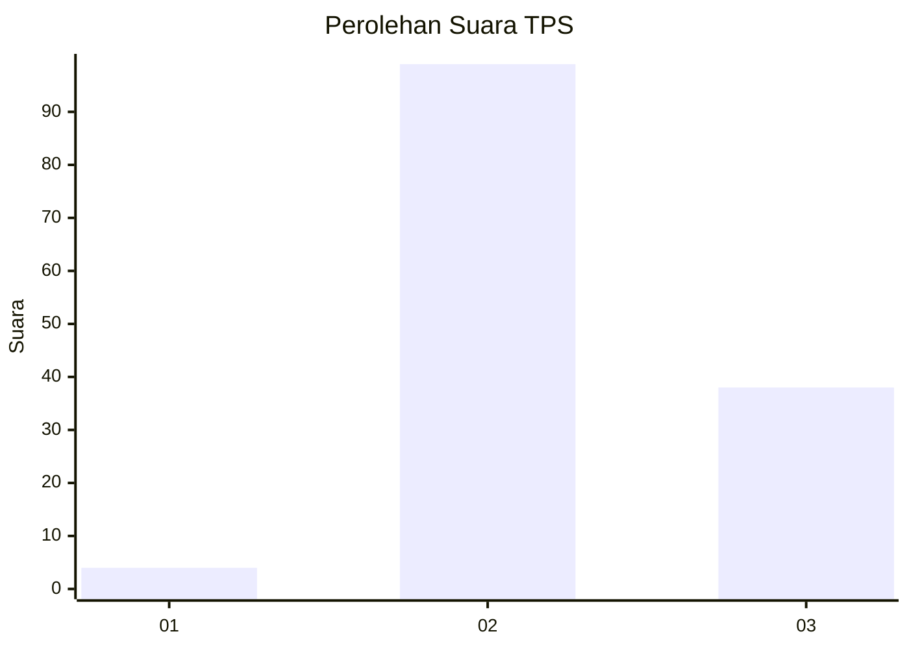
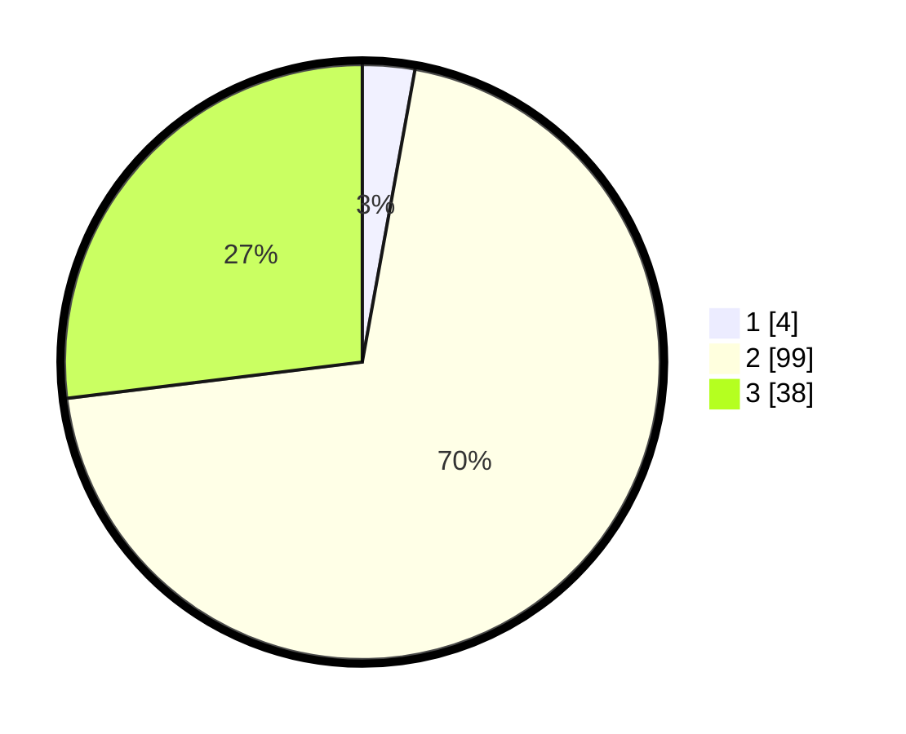

# Hasil

## Grafik

## Tabel

| No. | Nama Paslon    | Suara | Suara (raw) | Persentase |
|:--- |:-------------- | -----:| -----------:| ----------:|
| 1   | ANIES MUHAIMIN | 4     | [4][p-1]    | 2,84       |
| 2   | PRABOWO GIBRAN | 99    | [99][p-2]   | 70,21      |
| 3   | GANJAR MAHFUD  | 38    | [38][p-3]   | 26,95      |

[p-1]: https://github.com/gigit-pemilu/pemilu-2024-35-jawa-timur/blob/main/pilpres/hitung-suara/sub/35-jawa-timur/sub/03-trenggalek/sub/04-dongko/sub/2010-pringapus/sub/012-tps/sub/paslon-1.txt
[p-2]: https://github.com/gigit-pemilu/pemilu-2024-35-jawa-timur/blob/main/pilpres/hitung-suara/sub/35-jawa-timur/sub/03-trenggalek/sub/04-dongko/sub/2010-pringapus/sub/012-tps/sub/paslon-2.txt
[p-3]: https://github.com/gigit-pemilu/pemilu-2024-35-jawa-timur/blob/main/pilpres/hitung-suara/sub/35-jawa-timur/sub/03-trenggalek/sub/04-dongko/sub/2010-pringapus/sub/012-tps/sub/paslon-3.txt

## Foto C Plano

https://sirekap-obj-formc.kpu.go.id/0ef4/pemilu/ppwp/35/03/04/20/10/3503042010012-20240214-190538--962053d7-5932-42f4-93c0-314c99ffb3d5.jpg

https://sirekap-obj-formc.kpu.go.id/0ef4/pemilu/ppwp/35/03/04/20/10/3503042010012-20240214-193428--734052fe-6b63-49e8-aaf6-2ebf75328923.jpg

## Metadata

| Key        | Value               |
| ---------- | ------------------- |
| Time Stamp | 2024-02-16 12:51:22 |

