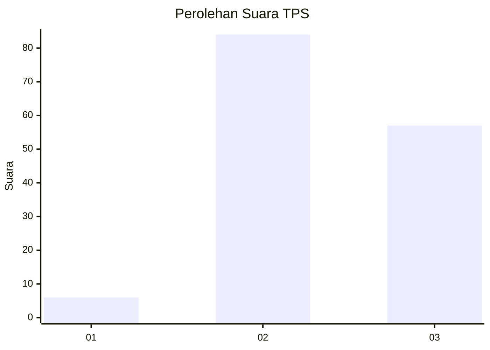
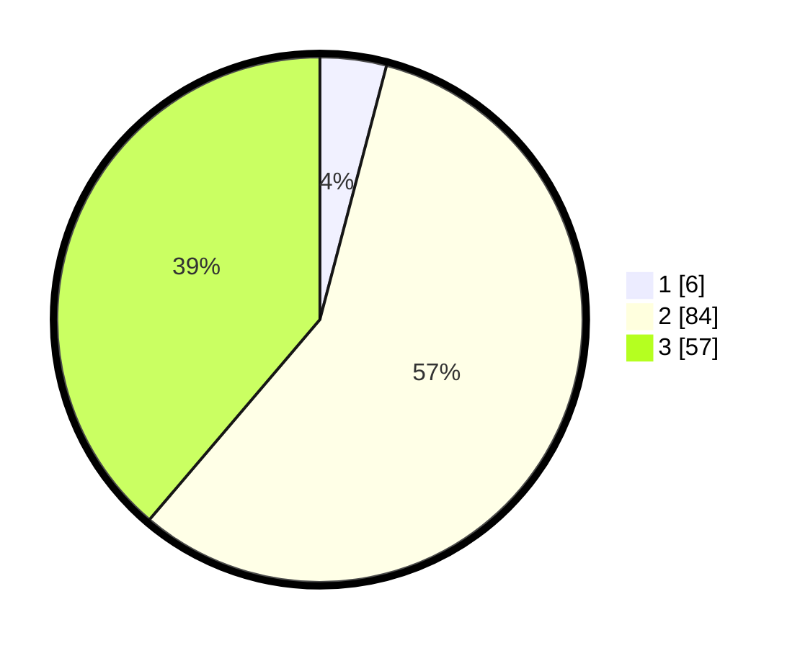

# Hasil

## Grafik

## Tabel

| No. | Nama Paslon    | Suara | Suara (raw) | Persentase |
|:--- |:-------------- | -----:| -----------:| ----------:|
| 1   | ANIES MUHAIMIN | 6     | [6][p-1]    | 4,08       |
| 2   | PRABOWO GIBRAN | 84    | [84][p-2]   | 57,14      |
| 3   | GANJAR MAHFUD  | 57    | [57][p-3]   | 38,78      |

[p-1]: https://github.com/gigit-pemilu/pemilu-2024/blob/main/pilpres/hitung-suara/sub/35-jawa-timur/sub/03-trenggalek/sub/04-dongko/sub/2010-pringapus/sub/014-tps/sub/paslon-1.txt
[p-2]: https://github.com/gigit-pemilu/pemilu-2024/blob/main/pilpres/hitung-suara/sub/35-jawa-timur/sub/03-trenggalek/sub/04-dongko/sub/2010-pringapus/sub/014-tps/sub/paslon-2.txt
[p-3]: https://github.com/gigit-pemilu/pemilu-2024/blob/main/pilpres/hitung-suara/sub/35-jawa-timur/sub/03-trenggalek/sub/04-dongko/sub/2010-pringapus/sub/014-tps/sub/paslon-3.txt

## Foto C Plano

https://sirekap-obj-formc.kpu.go.id/1c4a/pemilu/ppwp/35/03/04/20/10/3503042010014-20240215-000339--e8f1ab48-6f1f-47d8-9bc2-cb9a80504fc7.jpg

https://sirekap-obj-formc.kpu.go.id/1c4a/pemilu/ppwp/35/03/04/20/10/3503042010014-20240215-000629--12fb30c5-10b7-444a-819f-94c39779f298.jpg

https://sirekap-obj-formc.kpu.go.id/1c4a/pemilu/ppwp/35/03/04/20/10/3503042010014-20240215-001043--cd48d1e6-0b5a-414d-9371-3e1cdbcba1f7.jpg

## Metadata

| Key        | Value               |
| ---------- | ------------------- |
| Time Stamp | 2024-02-15 19:30:26 |

