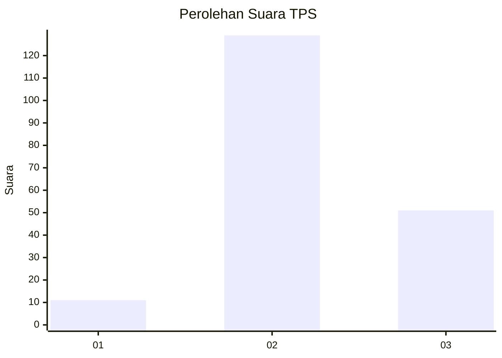

# Hasil

## Grafik

## Tabel

| No. | Nama Paslon    | Suara | Suara (raw) | Persentase |
|:--- |:-------------- | -----:| -----------:| ----------:|
| 1   | ANIES MUHAIMIN | 11    | [11][p-1]   | 5,76       |
| 2   | PRABOWO GIBRAN | 129   | [129][p-2]  | 67,54      |
| 3   | GANJAR MAHFUD  | 51    | [51][p-3]   | 26,70      |

[p-1]: https://github.com/gigit-pemilu/pemilu-2024/blob/main/pilpres/hitung-suara/sub/35-jawa-timur/sub/03-trenggalek/sub/05-tugu/sub/2001-nglinggis/sub/002-tps/sub/paslon-1.txt
[p-2]: https://github.com/gigit-pemilu/pemilu-2024/blob/main/pilpres/hitung-suara/sub/35-jawa-timur/sub/03-trenggalek/sub/05-tugu/sub/2001-nglinggis/sub/002-tps/sub/paslon-2.txt
[p-3]: https://github.com/gigit-pemilu/pemilu-2024/blob/main/pilpres/hitung-suara/sub/35-jawa-timur/sub/03-trenggalek/sub/05-tugu/sub/2001-nglinggis/sub/002-tps/sub/paslon-3.txt

## Foto C Plano

https://sirekap-obj-formc.kpu.go.id/b1e9/pemilu/ppwp/35/03/05/20/01/3503052001002-20240215-025554--0f18f0df-6453-4f11-b6d0-91a655978527.jpg

https://sirekap-obj-formc.kpu.go.id/b1e9/pemilu/ppwp/35/03/05/20/01/3503052001002-20240217-101136--7b02184c-8888-4cdc-8325-58b87bab922f.jpg

https://sirekap-obj-formc.kpu.go.id/b1e9/pemilu/ppwp/35/03/05/20/01/3503052001002-20240215-025836--baa5a1b8-3be8-4c6d-8a72-b63ff69d5bd9.jpg

## Metadata

| Key        | Value               |
| ---------- | ------------------- |
| Time Stamp | 2024-02-17 13:37:34 |

## DATA PEMILIH TETAP

Jumlah pemilih dalam DPT: **249**.
 * L: **126**.
 * P: **123**.

## DATA PENGGUNA HAK PILIH

Jumlah pengguna hak pilih dalam DPT: **191**.
 * L: **89**.
 * P: **102**.

Jumlah pengguna hak pilih dalam DPTb: **0**.
 * L: **0**.
 * P: **0**.

Jumlah pengguna hak pilih dalam DPK: **2**.
 * L: **0**.
 * P: **2**.

Jumlah pengguna hak pilih: **193**.
 * L: **89**.
 * P: **104**.

## JUMLAH SUARA SAH DAN TIDAK SAH

JUMLAH SELURUH SUARA SAH: **191**.

JUMLAH SUARA TIDAK SAH: **2**.

JUMLAH SELURUH SUARA SAH DAN SUARA TIDAK SAH: **193**.

