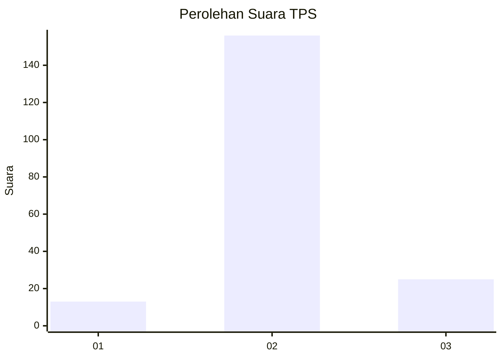
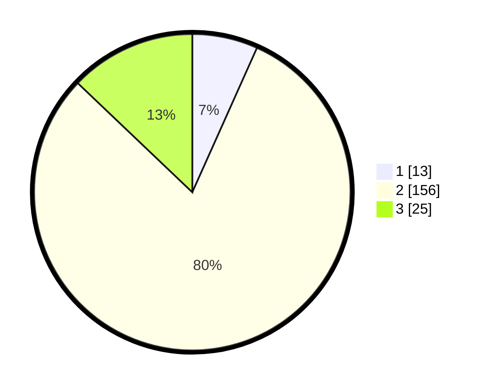

# Hasil

## Grafik

## Tabel

| No. | Nama Paslon    | Suara | Suara (raw) | Persentase |
|:--- |:-------------- | -----:| -----------:| ----------:|
| 1   | ANIES MUHAIMIN | 13    | [13][p-1]   | 6,70       |
| 2   | PRABOWO GIBRAN | 156   | [156][p-2]  | 80,41      |
| 3   | GANJAR MAHFUD  | 25    | [25][p-3]   | 12,89      |

[p-1]: https://github.com/gigit-pemilu/pemilu-2024/blob/main/pilpres/hitung-suara/sub/35-jawa-timur/sub/03-trenggalek/sub/05-tugu/sub/2001-nglinggis/sub/007-tps/sub/paslon-1.txt
[p-2]: https://github.com/gigit-pemilu/pemilu-2024/blob/main/pilpres/hitung-suara/sub/35-jawa-timur/sub/03-trenggalek/sub/05-tugu/sub/2001-nglinggis/sub/007-tps/sub/paslon-2.txt
[p-3]: https://github.com/gigit-pemilu/pemilu-2024/blob/main/pilpres/hitung-suara/sub/35-jawa-timur/sub/03-trenggalek/sub/05-tugu/sub/2001-nglinggis/sub/007-tps/sub/paslon-3.txt

## Foto C Plano

https://sirekap-obj-formc.kpu.go.id/3135/pemilu/ppwp/35/03/05/20/01/3503052001007-20240216-063825--ee5183d8-fa30-471d-aff7-63cb3555d306.jpg

https://sirekap-obj-formc.kpu.go.id/3135/pemilu/ppwp/35/03/05/20/01/3503052001007-20240215-195223--c798fc3f-b5d7-4349-902a-3a15348167f2.jpg

https://sirekap-obj-formc.kpu.go.id/3135/pemilu/ppwp/35/03/05/20/01/3503052001007-20240215-195238--e49dd51f-9ac5-4f4d-9a93-136b05a3df8f.jpg

## Metadata

| Key        | Value               |
| ---------- | ------------------- |
| Time Stamp | 2024-02-16 08:00:28 |

