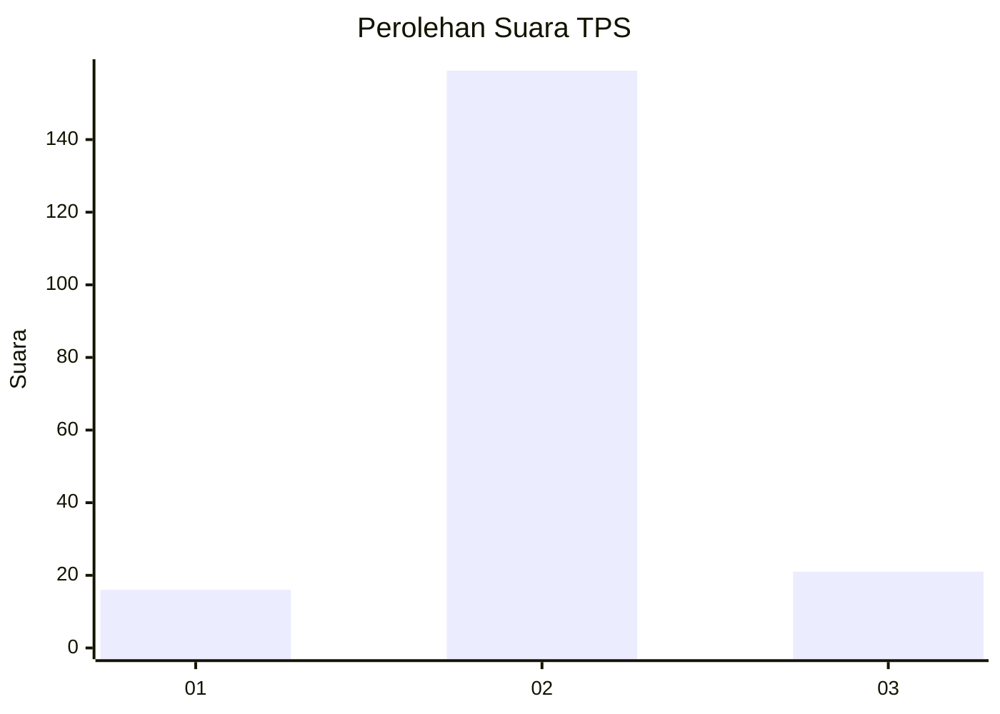
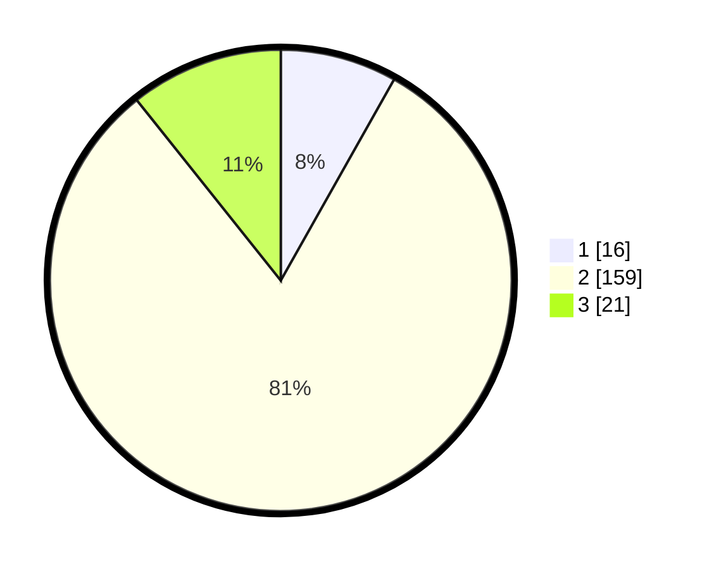

# Hasil

## Grafik

## Tabel

| No. | Nama Paslon    | Suara | Suara (raw) | Persentase |
|:--- |:-------------- | -----:| -----------:| ----------:|
| 1   | ANIES MUHAIMIN | 16    | [16][p-1]   | 8,16       |
| 2   | PRABOWO GIBRAN | 159   | [159][p-2]  | 81,12      |
| 3   | GANJAR MAHFUD  | 21    | [21][p-3]   | 10,71      |

[p-1]: https://github.com/gigit-pemilu/pemilu-2024-35-jawa-timur/blob/main/pilpres/hitung-suara/sub/35-jawa-timur/sub/03-trenggalek/sub/05-tugu/sub/2005-ngepeh/sub/005-tps/sub/paslon-1.txt
[p-2]: https://github.com/gigit-pemilu/pemilu-2024-35-jawa-timur/blob/main/pilpres/hitung-suara/sub/35-jawa-timur/sub/03-trenggalek/sub/05-tugu/sub/2005-ngepeh/sub/005-tps/sub/paslon-2.txt
[p-3]: https://github.com/gigit-pemilu/pemilu-2024-35-jawa-timur/blob/main/pilpres/hitung-suara/sub/35-jawa-timur/sub/03-trenggalek/sub/05-tugu/sub/2005-ngepeh/sub/005-tps/sub/paslon-3.txt

## Foto C Plano

https://sirekap-obj-formc.kpu.go.id/c561/pemilu/ppwp/35/03/05/20/05/3503052005005-20240217-104956--f3a0488b-568a-460d-9087-f97ec373c2f1.jpg

https://sirekap-obj-formc.kpu.go.id/c561/pemilu/ppwp/35/03/05/20/05/3503052005005-20240217-105108--32cb7c65-d242-4fd7-8b2a-8ec62b4f5dee.jpg

https://sirekap-obj-formc.kpu.go.id/c561/pemilu/ppwp/35/03/05/20/05/3503052005005-20240217-105205--89a76cf7-bc5b-44aa-a440-9c78944f37b0.jpg

## Metadata

| Key        | Value               |
| ---------- | ------------------- |
| Time Stamp | 2024-02-17 12:00:00 |

