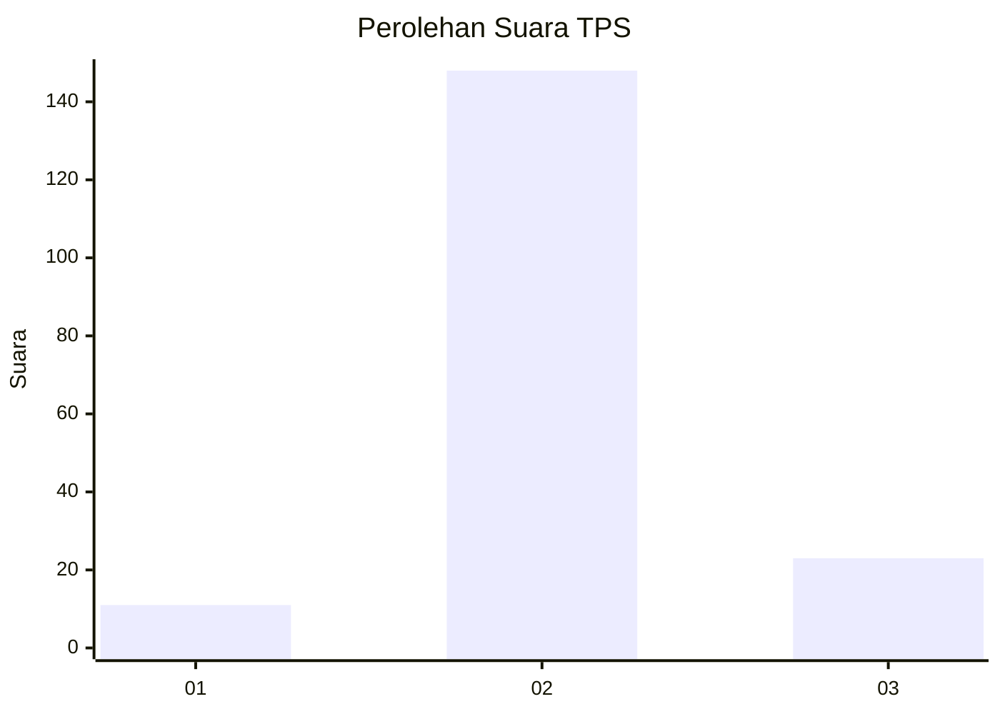
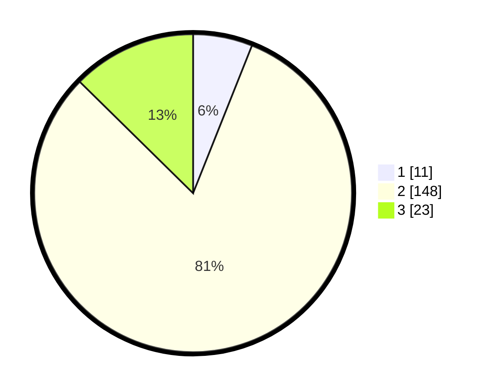

# Hasil

## Grafik

## Tabel

| No. | Nama Paslon    | Suara | Suara (raw) | Persentase |
|:--- |:-------------- | -----:| -----------:| ----------:|
| 1   | ANIES MUHAIMIN | 11    | [11][p-1]   | 6,04       |
| 2   | PRABOWO GIBRAN | 148   | [148][p-2]  | 81,32      |
| 3   | GANJAR MAHFUD  | 23    | [23][p-3]   | 12,64      |

[p-1]: https://github.com/gigit-pemilu/pemilu-2024-35-jawa-timur/blob/main/pilpres/hitung-suara/sub/35-jawa-timur/sub/03-trenggalek/sub/05-tugu/sub/2006-jambu/sub/005-tps/sub/paslon-1.txt
[p-2]: https://github.com/gigit-pemilu/pemilu-2024-35-jawa-timur/blob/main/pilpres/hitung-suara/sub/35-jawa-timur/sub/03-trenggalek/sub/05-tugu/sub/2006-jambu/sub/005-tps/sub/paslon-2.txt
[p-3]: https://github.com/gigit-pemilu/pemilu-2024-35-jawa-timur/blob/main/pilpres/hitung-suara/sub/35-jawa-timur/sub/03-trenggalek/sub/05-tugu/sub/2006-jambu/sub/005-tps/sub/paslon-3.txt

## Foto C Plano

https://sirekap-obj-formc.kpu.go.id/2937/pemilu/ppwp/35/03/05/20/06/3503052006005-20240215-005044--d90fdc1d-4624-4c8a-b6bb-0ff0e6e954d7.jpg

https://sirekap-obj-formc.kpu.go.id/2937/pemilu/ppwp/35/03/05/20/06/3503052006005-20240215-005100--078bc901-87c7-4179-a6a8-2b78dffea54e.jpg

## Metadata

| Key        | Value               |
| ---------- | ------------------- |
| Time Stamp | 2024-02-15 12:00:28 |

