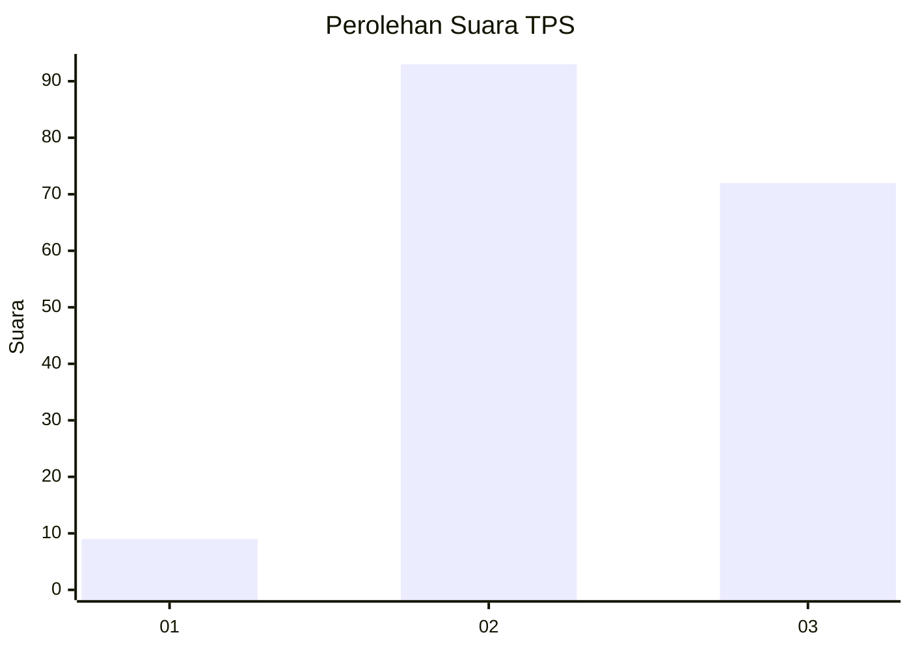
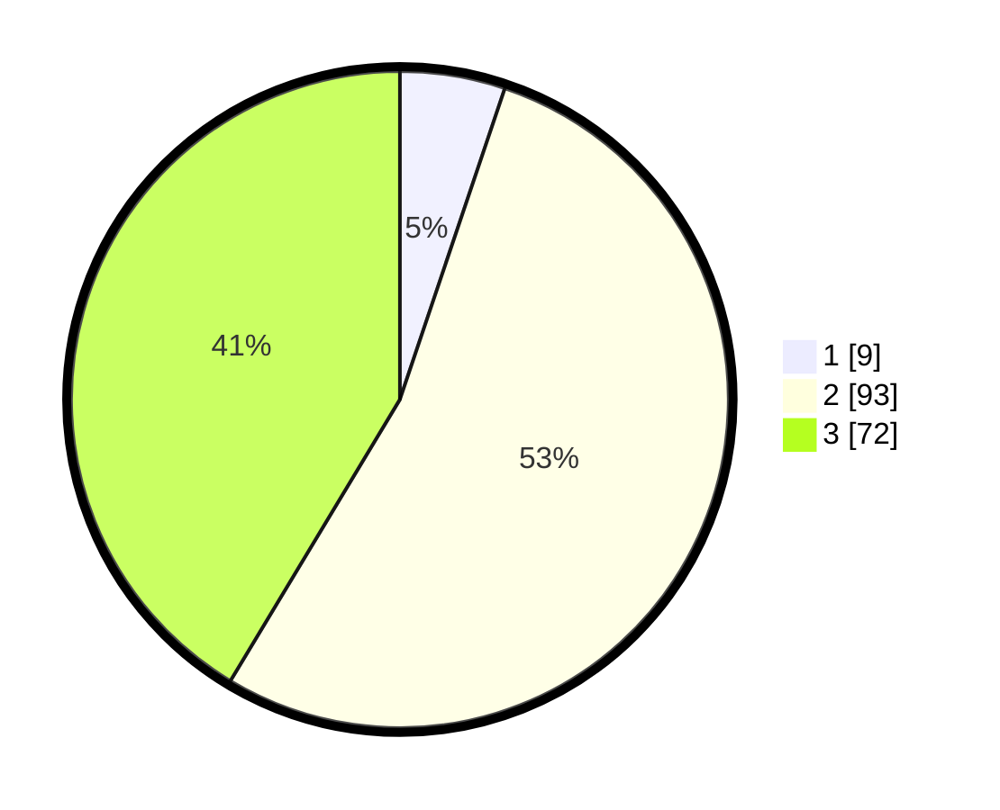

# Hasil

## Grafik

## Tabel

| No. | Nama Paslon    | Suara | Suara (raw) | Persentase |
|:--- |:-------------- | -----:| -----------:| ----------:|
| 1   | ANIES MUHAIMIN | 9     | [9][p-1]    | 5,17       |
| 2   | PRABOWO GIBRAN | 93    | [93][p-2]   | 53,45      |
| 3   | GANJAR MAHFUD  | 72    | [72][p-3]   | 41,38      |

[p-1]: https://github.com/gigit-pemilu/pemilu-2024-35-jawa-timur/blob/main/pilpres/hitung-suara/sub/35-jawa-timur/sub/03-trenggalek/sub/05-tugu/sub/2010-winong/sub/007-tps/sub/paslon-1.txt
[p-2]: https://github.com/gigit-pemilu/pemilu-2024-35-jawa-timur/blob/main/pilpres/hitung-suara/sub/35-jawa-timur/sub/03-trenggalek/sub/05-tugu/sub/2010-winong/sub/007-tps/sub/paslon-2.txt
[p-3]: https://github.com/gigit-pemilu/pemilu-2024-35-jawa-timur/blob/main/pilpres/hitung-suara/sub/35-jawa-timur/sub/03-trenggalek/sub/05-tugu/sub/2010-winong/sub/007-tps/sub/paslon-3.txt

## Foto C Plano

https://sirekap-obj-formc.kpu.go.id/c84a/pemilu/ppwp/35/03/05/20/10/3503052010007-20240214-215322--0d314f47-649b-4e92-b643-682a3a9d11fd.jpg

https://sirekap-obj-formc.kpu.go.id/c84a/pemilu/ppwp/35/03/05/20/10/3503052010007-20240214-215817--e2bdba33-00b5-494d-8e46-7fba8e616a65.jpg

https://sirekap-obj-formc.kpu.go.id/c84a/pemilu/ppwp/35/03/05/20/10/3503052010007-20240219-215057--84a3edd3-1258-47db-9109-b124b325e584.jpg

## Metadata

| Key        | Value               |
| ---------- | ------------------- |
| Time Stamp | 2024-02-19 22:00:00 |

