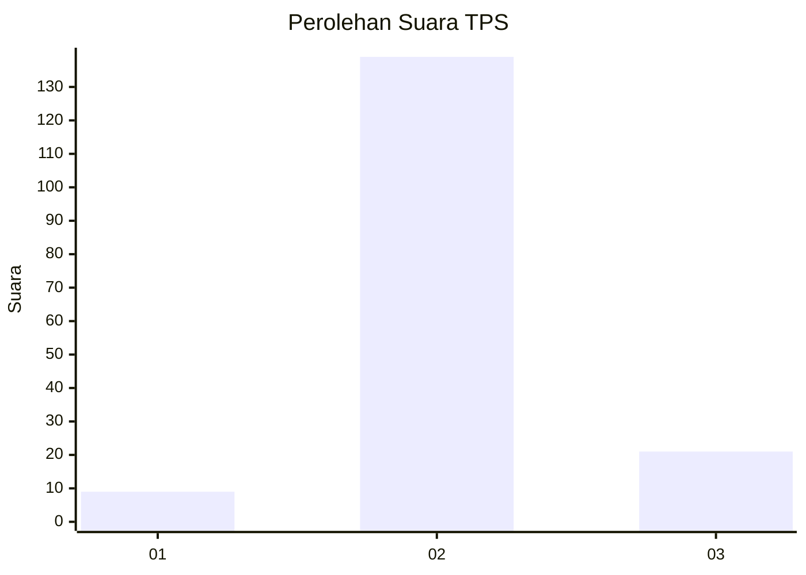
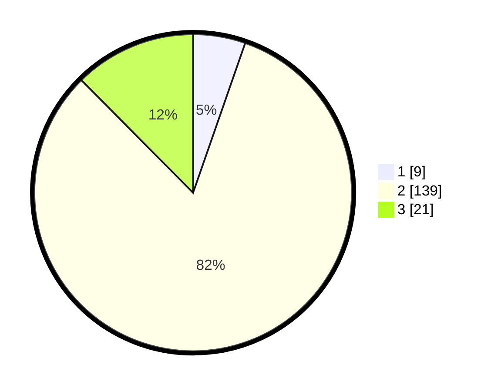

# Hasil

## Grafik

## Tabel

| No. | Nama Paslon    | Suara | Suara (raw) | Persentase |
|:--- |:-------------- | -----:| -----------:| ----------:|
| 1   | ANIES MUHAIMIN | 9     | [9][p-1]    | 5,33       |
| 2   | PRABOWO GIBRAN | 139   | [139][p-2]  | 82,25      |
| 3   | GANJAR MAHFUD  | 21    | [21][p-3]   | 12,43      |

[p-1]: https://github.com/gigit-pemilu/pemilu-2024-35-jawa-timur/blob/main/pilpres/hitung-suara/sub/35-jawa-timur/sub/03-trenggalek/sub/05-tugu/sub/2011-tegaren/sub/005-tps/sub/paslon-1.txt
[p-2]: https://github.com/gigit-pemilu/pemilu-2024-35-jawa-timur/blob/main/pilpres/hitung-suara/sub/35-jawa-timur/sub/03-trenggalek/sub/05-tugu/sub/2011-tegaren/sub/005-tps/sub/paslon-2.txt
[p-3]: https://github.com/gigit-pemilu/pemilu-2024-35-jawa-timur/blob/main/pilpres/hitung-suara/sub/35-jawa-timur/sub/03-trenggalek/sub/05-tugu/sub/2011-tegaren/sub/005-tps/sub/paslon-3.txt

## Foto C Plano

https://sirekap-obj-formc.kpu.go.id/acc4/pemilu/ppwp/35/03/05/20/11/3503052011005-20240217-223358--c099e3bd-e5f5-41a1-be37-a64a9b5f5e66.jpg

https://sirekap-obj-formc.kpu.go.id/acc4/pemilu/ppwp/35/03/05/20/11/3503052011005-20240217-223559--7c9beba4-87e3-4fbb-ad4c-389997ebd2a0.jpg

## Metadata

| Key        | Value               |
| ---------- | ------------------- |
| Time Stamp | 2024-02-21 15:00:00 |

