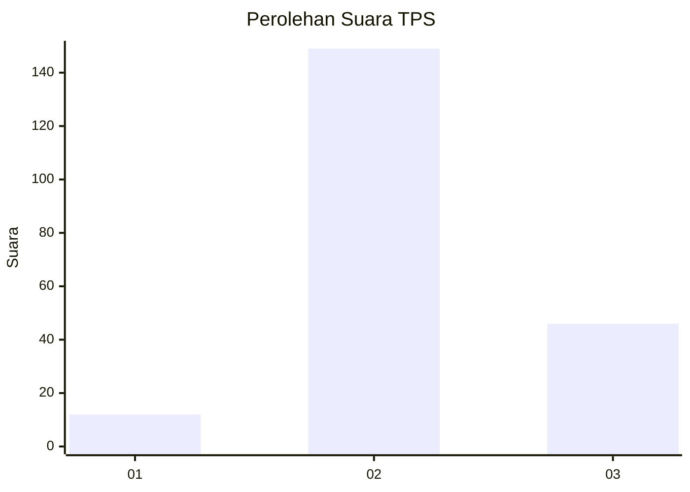
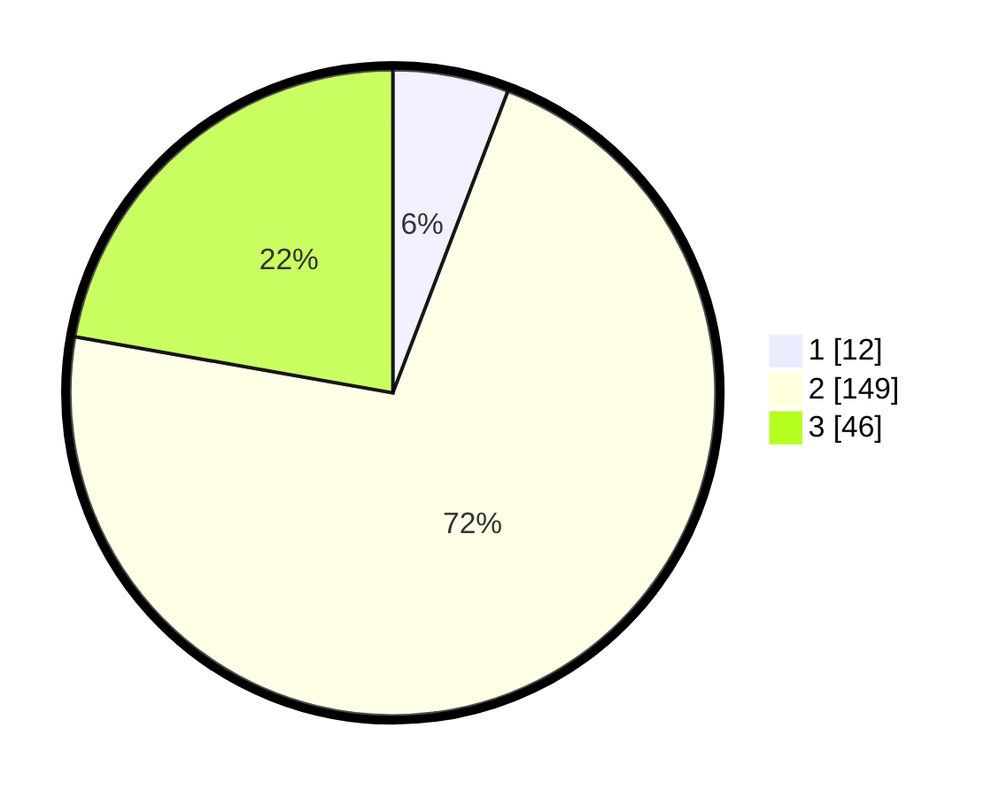

# Hasil

## Grafik

## Tabel

| No. | Nama Paslon    | Suara | Suara (raw) | Persentase |
|:--- |:-------------- | -----:| -----------:| ----------:|
| 1   | ANIES MUHAIMIN | 12    | [12][p-1]   | 5,80       |
| 2   | PRABOWO GIBRAN | 149   | [149][p-2]  | 71,98      |
| 3   | GANJAR MAHFUD  | 46    | [46][p-3]   | 22,22      |

[p-1]: https://github.com/gigit-pemilu/pemilu-2024/blob/main/pilpres/hitung-suara/sub/35-jawa-timur/sub/03-trenggalek/sub/05-tugu/sub/2014-banaran/sub/001-tps/sub/paslon-1.txt
[p-2]: https://github.com/gigit-pemilu/pemilu-2024/blob/main/pilpres/hitung-suara/sub/35-jawa-timur/sub/03-trenggalek/sub/05-tugu/sub/2014-banaran/sub/001-tps/sub/paslon-2.txt
[p-3]: https://github.com/gigit-pemilu/pemilu-2024/blob/main/pilpres/hitung-suara/sub/35-jawa-timur/sub/03-trenggalek/sub/05-tugu/sub/2014-banaran/sub/001-tps/sub/paslon-3.txt

## Foto C Plano

https://sirekap-obj-formc.kpu.go.id/58cd/pemilu/ppwp/35/03/05/20/14/3503052014001-20240216-175357--9c7ce197-b431-4f15-b1c9-5abbcb4f3709.jpg

https://sirekap-obj-formc.kpu.go.id/58cd/pemilu/ppwp/35/03/05/20/14/3503052014001-20240216-175512--d0a2976b-d4b9-4075-82e6-df0e779d5d76.jpg

https://sirekap-obj-formc.kpu.go.id/58cd/pemilu/ppwp/35/03/05/20/14/3503052014001-20240216-175644--f883a735-9175-4d97-88b5-17350eabe269.jpg

## Metadata

| Key        | Value               |
| ---------- | ------------------- |
| Time Stamp | 2024-02-21 16:00:00 |

## DATA PEMILIH TETAP

Jumlah pemilih dalam DPT: **269**.
 * L: **129**.
 * P: **140**.

## DATA PENGGUNA HAK PILIH

Jumlah pengguna hak pilih dalam DPT: **212**.
 * L: **87**.
 * P: **125**.

Jumlah pengguna hak pilih dalam DPTb: **212**.
 * L: **87**.
 * P: **125**.

Jumlah pengguna hak pilih dalam DPK: **1**.
 * L: **0**.
 * P: **1**.

Jumlah pengguna hak pilih: **214**.
 * L: **87**.
 * P: **127**.

## JUMLAH SUARA SAH DAN TIDAK SAH

JUMLAH SELURUH SUARA SAH: **207**.

JUMLAH SUARA TIDAK SAH: **7**.

JUMLAH SELURUH SUARA SAH DAN SUARA TIDAK SAH: **214**.

