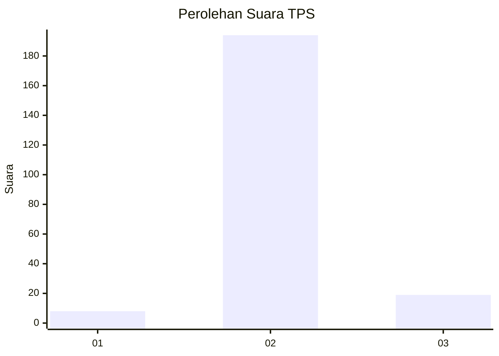
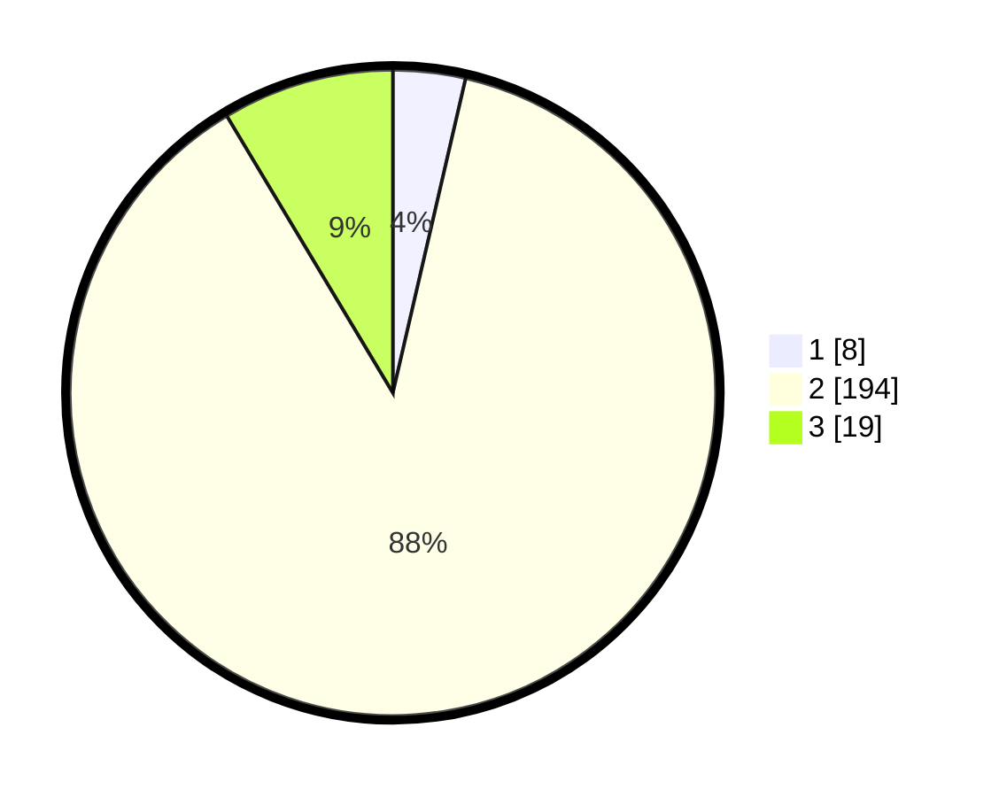

# Hasil

## Grafik

## Tabel

| No. | Nama Paslon    | Suara | Suara (raw) | Persentase |
|:--- |:-------------- | -----:| -----------:| ----------:|
| 1   | ANIES MUHAIMIN | 8     | [8][p-1]    | 3,62       |
| 2   | PRABOWO GIBRAN | 194   | [194][p-2]  | 87,78      |
| 3   | GANJAR MAHFUD  | 19    | [19][p-3]   | 8,60       |

[p-1]: https://github.com/gigit-pemilu/pemilu-2024-35-jawa-timur/blob/main/pilpres/hitung-suara/sub/35-jawa-timur/sub/03-trenggalek/sub/05-tugu/sub/2015-prambon/sub/010-tps/sub/paslon-1.txt
[p-2]: https://github.com/gigit-pemilu/pemilu-2024-35-jawa-timur/blob/main/pilpres/hitung-suara/sub/35-jawa-timur/sub/03-trenggalek/sub/05-tugu/sub/2015-prambon/sub/010-tps/sub/paslon-2.txt
[p-3]: https://github.com/gigit-pemilu/pemilu-2024-35-jawa-timur/blob/main/pilpres/hitung-suara/sub/35-jawa-timur/sub/03-trenggalek/sub/05-tugu/sub/2015-prambon/sub/010-tps/sub/paslon-3.txt

## Foto C Plano

https://sirekap-obj-formc.kpu.go.id/9dea/pemilu/ppwp/35/03/05/20/15/3503052015010-20240218-181926--4b1c03eb-b067-4428-abdd-13bbd745b6f1.jpg

https://sirekap-obj-formc.kpu.go.id/9dea/pemilu/ppwp/35/03/05/20/15/3503052015010-20240218-182037--23e3f585-2a68-483d-9120-b4f6ff6eb3d0.jpg

https://sirekap-obj-formc.kpu.go.id/9dea/pemilu/ppwp/35/03/05/20/15/3503052015010-20240218-205754--fcb88330-bf0c-4b8c-b082-e5fe991e54d2.jpg

## Metadata

| Key        | Value               |
| ---------- | ------------------- |
| Time Stamp | 2024-02-19 06:16:00 |

