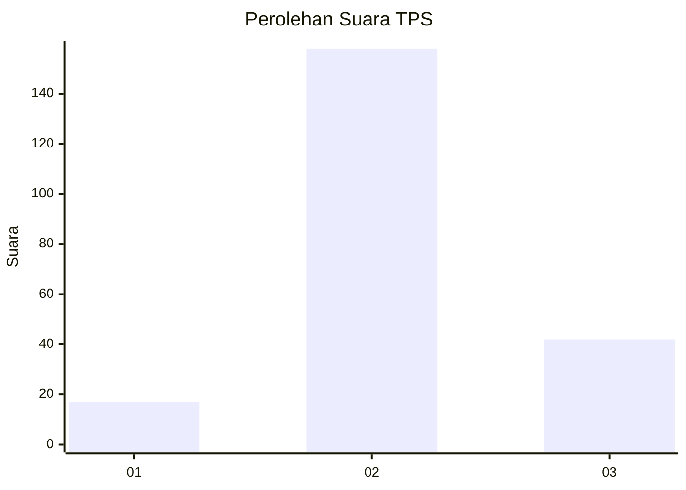
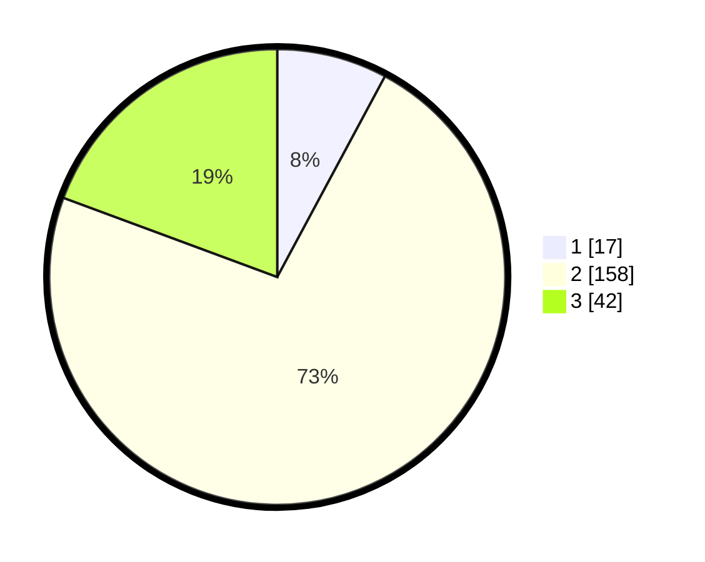

# Hasil

## Grafik

## Tabel

| No. | Nama Paslon    | Suara | Suara (raw) | Persentase |
|:--- |:-------------- | -----:| -----------:| ----------:|
| 1   | ANIES MUHAIMIN | 17    | [17][p-1]   | 7,83       |
| 2   | PRABOWO GIBRAN | 158   | [158][p-2]  | 72,81      |
| 3   | GANJAR MAHFUD  | 42    | [42][p-3]   | 19,35      |

[p-1]: https://github.com/gigit-pemilu/pemilu-2024-35-jawa-timur/blob/main/pilpres/hitung-suara/sub/35-jawa-timur/sub/03-trenggalek/sub/05-tugu/sub/2015-prambon/sub/013-tps/sub/paslon-1.txt
[p-2]: https://github.com/gigit-pemilu/pemilu-2024-35-jawa-timur/blob/main/pilpres/hitung-suara/sub/35-jawa-timur/sub/03-trenggalek/sub/05-tugu/sub/2015-prambon/sub/013-tps/sub/paslon-2.txt
[p-3]: https://github.com/gigit-pemilu/pemilu-2024-35-jawa-timur/blob/main/pilpres/hitung-suara/sub/35-jawa-timur/sub/03-trenggalek/sub/05-tugu/sub/2015-prambon/sub/013-tps/sub/paslon-3.txt

## Foto C Plano

https://sirekap-obj-formc.kpu.go.id/b41d/pemilu/ppwp/35/03/05/20/15/3503052015013-20240218-064329--3b1bdaf0-672e-4eb0-966c-1e758fb30b05.jpg

https://sirekap-obj-formc.kpu.go.id/b41d/pemilu/ppwp/35/03/05/20/15/3503052015013-20240218-064650--61f4a09a-51c7-4056-ae9c-82d15b50e988.jpg

https://sirekap-obj-formc.kpu.go.id/b41d/pemilu/ppwp/35/03/05/20/15/3503052015013-20240218-064829--041877d2-8088-4667-b46b-a0d038decc0c.jpg

## Metadata

| Key        | Value               |
| ---------- | ------------------- |
| Time Stamp | 2024-02-19 06:16:00 |

