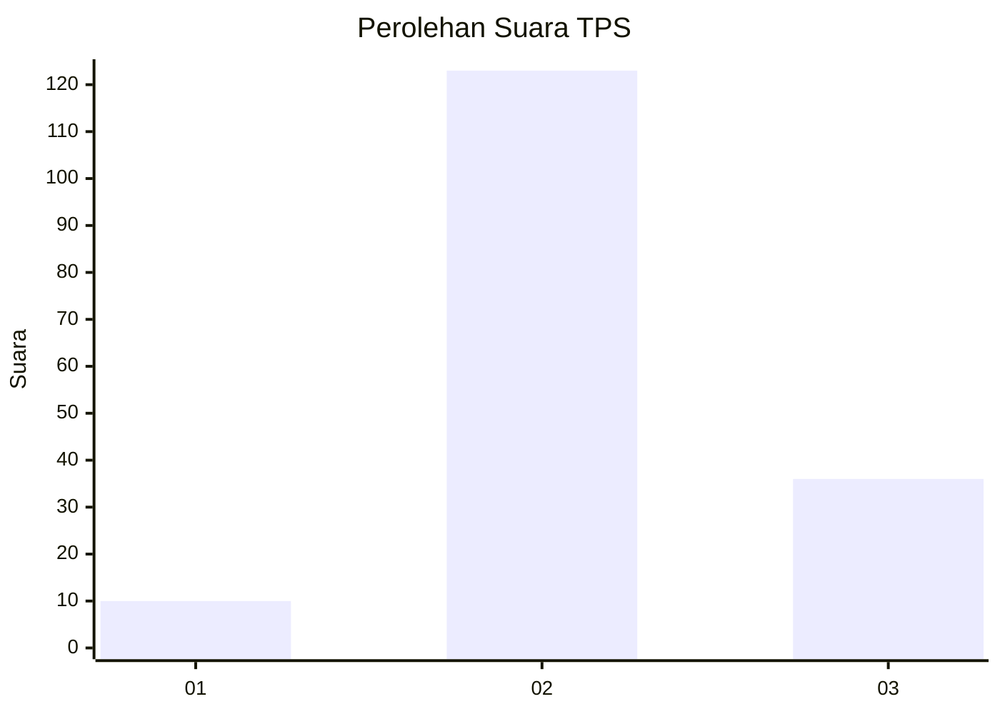

# Hasil

## Grafik

## Tabel

| No. | Nama Paslon    | Suara | Suara (raw) | Persentase |
|:--- |:-------------- | -----:| -----------:| ----------:|
| 1   | ANIES MUHAIMIN | 10    | [10][p-1]   | 5,92       |
| 2   | PRABOWO GIBRAN | 123   | [123][p-2]  | 72,78      |
| 3   | GANJAR MAHFUD  | 36    | [36][p-3]   | 21,30      |

[p-1]: https://github.com/gigit-pemilu/pemilu-2024-35-jawa-timur/blob/main/pilpres/hitung-suara/sub/35-jawa-timur/sub/03-trenggalek/sub/05-tugu/sub/2015-prambon/sub/015-tps/sub/paslon-1.txt
[p-2]: https://github.com/gigit-pemilu/pemilu-2024-35-jawa-timur/blob/main/pilpres/hitung-suara/sub/35-jawa-timur/sub/03-trenggalek/sub/05-tugu/sub/2015-prambon/sub/015-tps/sub/paslon-2.txt
[p-3]: https://github.com/gigit-pemilu/pemilu-2024-35-jawa-timur/blob/main/pilpres/hitung-suara/sub/35-jawa-timur/sub/03-trenggalek/sub/05-tugu/sub/2015-prambon/sub/015-tps/sub/paslon-3.txt

## Foto C Plano

https://sirekap-obj-formc.kpu.go.id/e94a/pemilu/ppwp/35/03/05/20/15/3503052015015-20240214-141333--461cef72-8895-4179-8c01-c0f079446ba2.jpg

https://sirekap-obj-formc.kpu.go.id/e94a/pemilu/ppwp/35/03/05/20/15/3503052015015-20240214-141442--a91e3906-432b-47da-963c-e226e2fa92f6.jpg

https://sirekap-obj-formc.kpu.go.id/e94a/pemilu/ppwp/35/03/05/20/15/3503052015015-20240217-103044--2f149ebd-5ae0-4eb4-bd04-946181099ab2.jpg

## Metadata

| Key        | Value               |
| ---------- | ------------------- |
| Time Stamp | 2024-02-17 11:00:02 |

