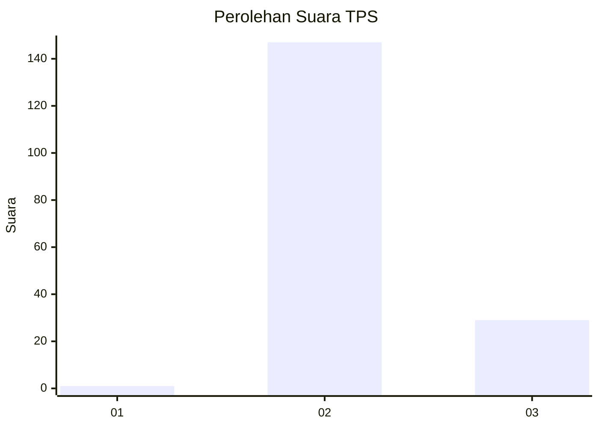
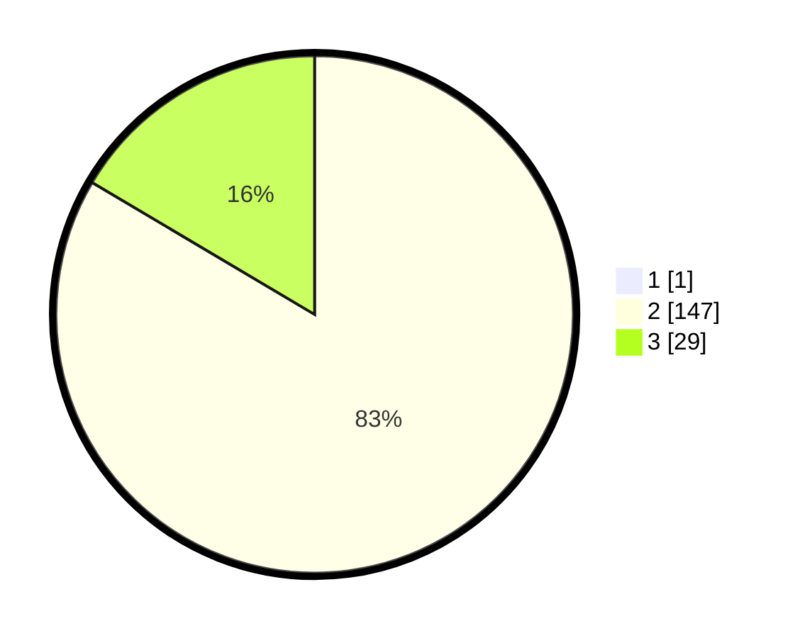

# Hasil

## Grafik

## Tabel

| No. | Nama Paslon    | Suara | Suara (raw) | Persentase |
|:--- |:-------------- | -----:| -----------:| ----------:|
| 1   | ANIES MUHAIMIN | 1     | [1][p-1]    | 0,56       |
| 2   | PRABOWO GIBRAN | 147   | [147][p-2]  | 83,05      |
| 3   | GANJAR MAHFUD  | 29    | [29][p-3]   | 16,38      |

[p-1]: https://github.com/gigit-pemilu/pemilu-2024-35-jawa-timur/blob/main/pilpres/hitung-suara/sub/35-jawa-timur/sub/03-trenggalek/sub/05-tugu/sub/2015-prambon/sub/024-tps/sub/paslon-1.txt
[p-2]: https://github.com/gigit-pemilu/pemilu-2024-35-jawa-timur/blob/main/pilpres/hitung-suara/sub/35-jawa-timur/sub/03-trenggalek/sub/05-tugu/sub/2015-prambon/sub/024-tps/sub/paslon-2.txt
[p-3]: https://github.com/gigit-pemilu/pemilu-2024-35-jawa-timur/blob/main/pilpres/hitung-suara/sub/35-jawa-timur/sub/03-trenggalek/sub/05-tugu/sub/2015-prambon/sub/024-tps/sub/paslon-3.txt

## Foto C Plano

https://sirekap-obj-formc.kpu.go.id/ea78/pemilu/ppwp/35/03/05/20/15/3503052015024-20240218-142949--08e334da-87f2-4bc0-80e6-932b3ca63428.jpg

https://sirekap-obj-formc.kpu.go.id/ea78/pemilu/ppwp/35/03/05/20/15/3503052015024-20240218-142818--9e73860a-3b0d-447c-971b-048387a5c3f1.jpg

https://sirekap-obj-formc.kpu.go.id/ea78/pemilu/ppwp/35/03/05/20/15/3503052015024-20240218-142857--5e601d2a-ca96-4dd2-a6cb-48be63b04950.jpg

## Metadata

| Key        | Value               |
| ---------- | ------------------- |
| Time Stamp | 2024-02-25 17:00:00 |

