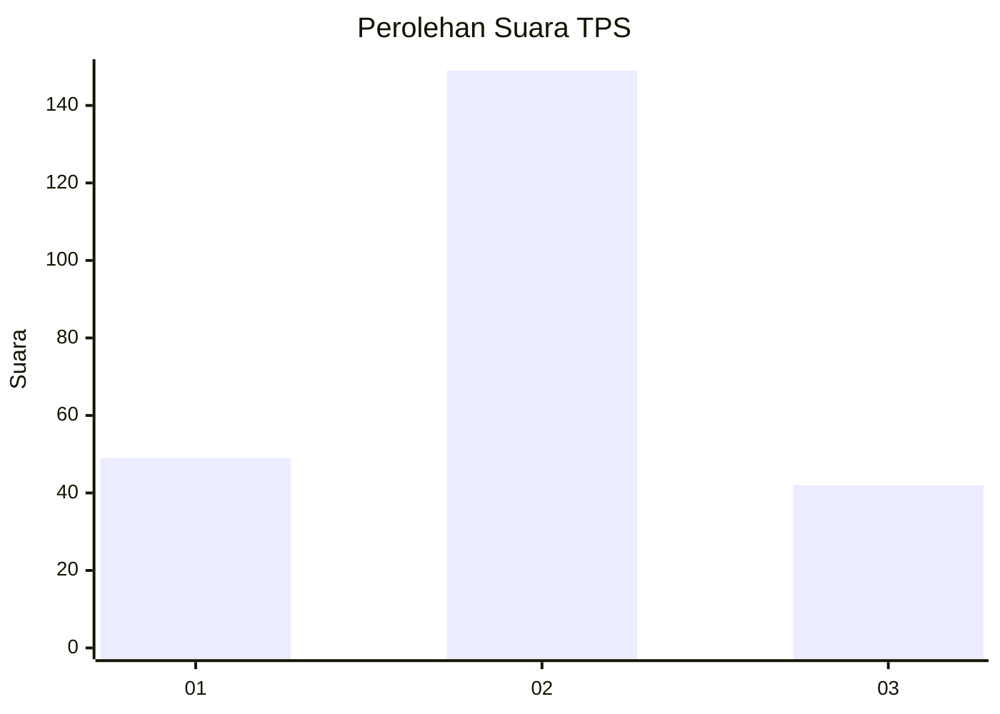

# Hasil

## Grafik

## Tabel

| No. | Nama Paslon    | Suara | Suara (raw) | Persentase |
|:--- |:-------------- | -----:| -----------:| ----------:|
| 1   | ANIES MUHAIMIN | 49    | [49][p-1]   | 20,42      |
| 2   | PRABOWO GIBRAN | 149   | [149][p-2]  | 62,08      |
| 3   | GANJAR MAHFUD  | 42    | [42][p-3]   | 17,50      |

[p-1]: https://github.com/gigit-pemilu/pemilu-2024/blob/main/pilpres/hitung-suara/sub/35-jawa-timur/sub/03-trenggalek/sub/06-karangan/sub/2002-jati/sub/015-tps/sub/paslon-1.txt
[p-2]: https://github.com/gigit-pemilu/pemilu-2024/blob/main/pilpres/hitung-suara/sub/35-jawa-timur/sub/03-trenggalek/sub/06-karangan/sub/2002-jati/sub/015-tps/sub/paslon-2.txt
[p-3]: https://github.com/gigit-pemilu/pemilu-2024/blob/main/pilpres/hitung-suara/sub/35-jawa-timur/sub/03-trenggalek/sub/06-karangan/sub/2002-jati/sub/015-tps/sub/paslon-3.txt

## Foto C Plano

https://sirekap-obj-formc.kpu.go.id/be5d/pemilu/ppwp/35/03/06/20/02/3503062002015-20240214-233335--1c9d500e-dbfa-4006-bae2-4500581578d0.jpg

https://sirekap-obj-formc.kpu.go.id/be5d/pemilu/ppwp/35/03/06/20/02/3503062002015-20240214-233448--ae2c318d-dadc-48de-b25e-34379bc10d5c.jpg

https://sirekap-obj-formc.kpu.go.id/be5d/pemilu/ppwp/35/03/06/20/02/3503062002015-20240214-233533--1b394d10-5f7e-48eb-acd2-7a9af5337951.jpg

## Metadata

| Key        | Value               |
| ---------- | ------------------- |
| Time Stamp | 2024-02-15 18:30:25 |

