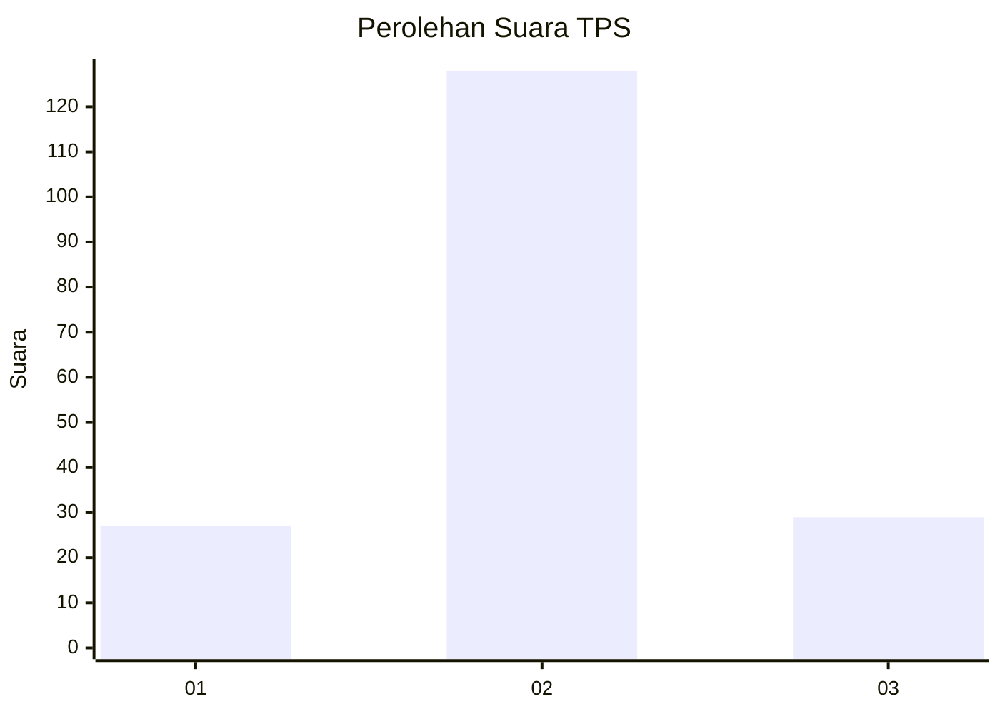

# Hasil

## Grafik

## Tabel

| No. | Nama Paslon    | Suara | Suara (raw) | Persentase |
|:--- |:-------------- | -----:| -----------:| ----------:|
| 1   | ANIES MUHAIMIN | 27    | [27][p-1]   | 14,67      |
| 2   | PRABOWO GIBRAN | 128   | [128][p-2]  | 69,57      |
| 3   | GANJAR MAHFUD  | 29    | [29][p-3]   | 15,76      |

[p-1]: https://github.com/gigit-pemilu/pemilu-2024/blob/main/pilpres/hitung-suara/sub/35-jawa-timur/sub/03-trenggalek/sub/06-karangan/sub/2004-kerjo/sub/012-tps/sub/paslon-1.txt
[p-2]: https://github.com/gigit-pemilu/pemilu-2024/blob/main/pilpres/hitung-suara/sub/35-jawa-timur/sub/03-trenggalek/sub/06-karangan/sub/2004-kerjo/sub/012-tps/sub/paslon-2.txt
[p-3]: https://github.com/gigit-pemilu/pemilu-2024/blob/main/pilpres/hitung-suara/sub/35-jawa-timur/sub/03-trenggalek/sub/06-karangan/sub/2004-kerjo/sub/012-tps/sub/paslon-3.txt

## Foto C Plano

https://sirekap-obj-formc.kpu.go.id/47b3/pemilu/ppwp/35/03/06/20/04/3503062004012-20240214-223200--a1113f55-0eca-45a4-83aa-d000997c63d0.jpg

https://sirekap-obj-formc.kpu.go.id/47b3/pemilu/ppwp/35/03/06/20/04/3503062004012-20240214-185500--ee3d9fc3-6bb7-4ba3-b626-180f5c9316e9.jpg

https://sirekap-obj-formc.kpu.go.id/47b3/pemilu/ppwp/35/03/06/20/04/3503062004012-20240214-223302--3f052a41-1833-440a-b0e0-31cfd07a6f6e.jpg

## Metadata

| Key        | Value               |
| ---------- | ------------------- |
| Time Stamp | 2024-02-15 02:10:27 |

