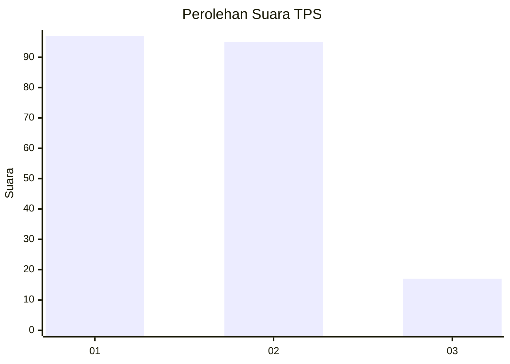
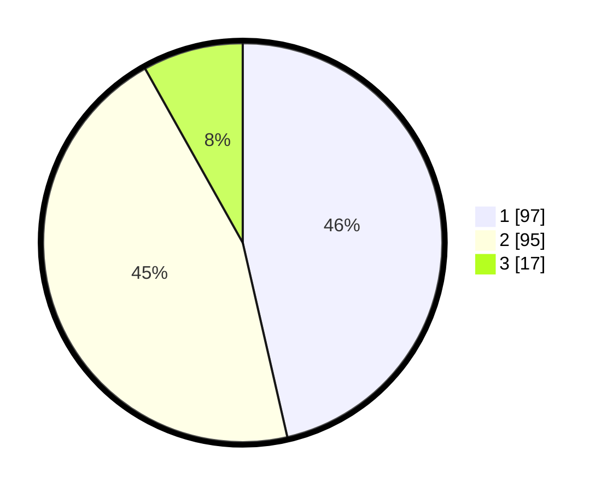

# Hasil

## Grafik

## Tabel

| No. | Nama Paslon    | Suara | Suara (raw) | Persentase |
|:--- |:-------------- | -----:| -----------:| ----------:|
| 1   | ANIES MUHAIMIN | 97    | [97][p-1]   | 46,41      |
| 2   | PRABOWO GIBRAN | 95    | [95][p-2]   | 45,45      |
| 3   | GANJAR MAHFUD  | 17    | [17][p-3]   | 8,13       |

[p-1]: https://github.com/gigit-pemilu/pemilu-2024-35-jawa-timur/blob/main/pilpres/hitung-suara/sub/35-jawa-timur/sub/03-trenggalek/sub/06-karangan/sub/2006-salamrejo/sub/001-tps/sub/paslon-1.txt
[p-2]: https://github.com/gigit-pemilu/pemilu-2024-35-jawa-timur/blob/main/pilpres/hitung-suara/sub/35-jawa-timur/sub/03-trenggalek/sub/06-karangan/sub/2006-salamrejo/sub/001-tps/sub/paslon-2.txt
[p-3]: https://github.com/gigit-pemilu/pemilu-2024-35-jawa-timur/blob/main/pilpres/hitung-suara/sub/35-jawa-timur/sub/03-trenggalek/sub/06-karangan/sub/2006-salamrejo/sub/001-tps/sub/paslon-3.txt

## Foto C Plano

https://sirekap-obj-formc.kpu.go.id/8ced/pemilu/ppwp/35/03/06/20/06/3503062006001-20240215-154916--5ae85b27-0b11-4c4e-86f2-b63fca44ce6f.jpg

https://sirekap-obj-formc.kpu.go.id/8ced/pemilu/ppwp/35/03/06/20/06/3503062006001-20240215-154717--3b679cef-4664-4e0c-8c30-b37384471215.jpg

https://sirekap-obj-formc.kpu.go.id/8ced/pemilu/ppwp/35/03/06/20/06/3503062006001-20240215-155018--0e981e4b-3602-44c7-82ea-2b0f516101ae.jpg

## Metadata

| Key        | Value               |
| ---------- | ------------------- |
| Time Stamp | 2024-02-15 18:00:26 |

