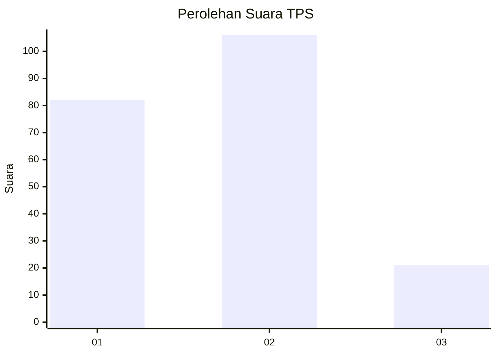
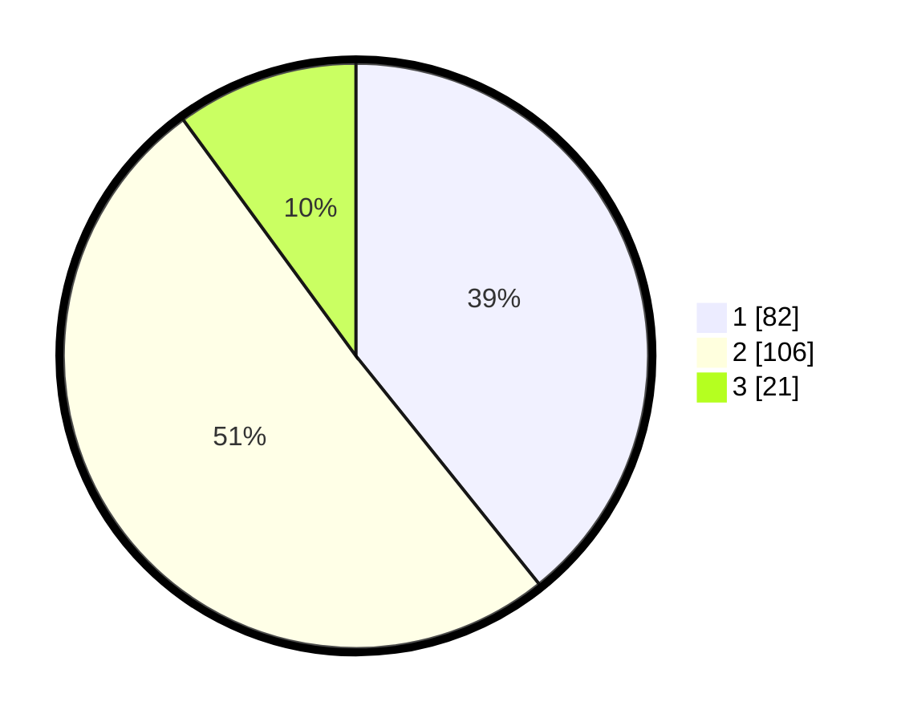

# Hasil

## Grafik

## Tabel

| No. | Nama Paslon    | Suara | Suara (raw) | Persentase |
|:--- |:-------------- | -----:| -----------:| ----------:|
| 1   | ANIES MUHAIMIN | 82    | [82][p-1]   | 39,23      |
| 2   | PRABOWO GIBRAN | 106   | [106][p-2]  | 50,72      |
| 3   | GANJAR MAHFUD  | 21    | [21][p-3]   | 10,05      |

[p-1]: https://github.com/gigit-pemilu/pemilu-2024-35-jawa-timur/blob/main/pilpres/hitung-suara/sub/35-jawa-timur/sub/03-trenggalek/sub/06-karangan/sub/2006-salamrejo/sub/003-tps/sub/paslon-1.txt
[p-2]: https://github.com/gigit-pemilu/pemilu-2024-35-jawa-timur/blob/main/pilpres/hitung-suara/sub/35-jawa-timur/sub/03-trenggalek/sub/06-karangan/sub/2006-salamrejo/sub/003-tps/sub/paslon-2.txt
[p-3]: https://github.com/gigit-pemilu/pemilu-2024-35-jawa-timur/blob/main/pilpres/hitung-suara/sub/35-jawa-timur/sub/03-trenggalek/sub/06-karangan/sub/2006-salamrejo/sub/003-tps/sub/paslon-3.txt

## Foto C Plano

https://sirekap-obj-formc.kpu.go.id/6444/pemilu/ppwp/35/03/06/20/06/3503062006003-20240215-085838--86999f55-b20a-48c0-ab80-6acc4d19ee4c.jpg

https://sirekap-obj-formc.kpu.go.id/6444/pemilu/ppwp/35/03/06/20/06/3503062006003-20240215-085439--43f9c089-47f1-4cfb-ab72-28341004fe23.jpg

https://sirekap-obj-formc.kpu.go.id/6444/pemilu/ppwp/35/03/06/20/06/3503062006003-20240215-085647--e90a7d9b-3017-4200-9701-cc6b28d7b869.jpg

## Metadata

| Key        | Value               |
| ---------- | ------------------- |
| Time Stamp | 2024-02-17 17:30:00 |

