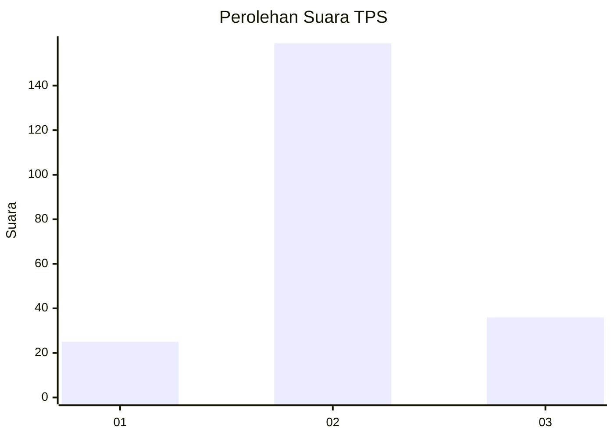
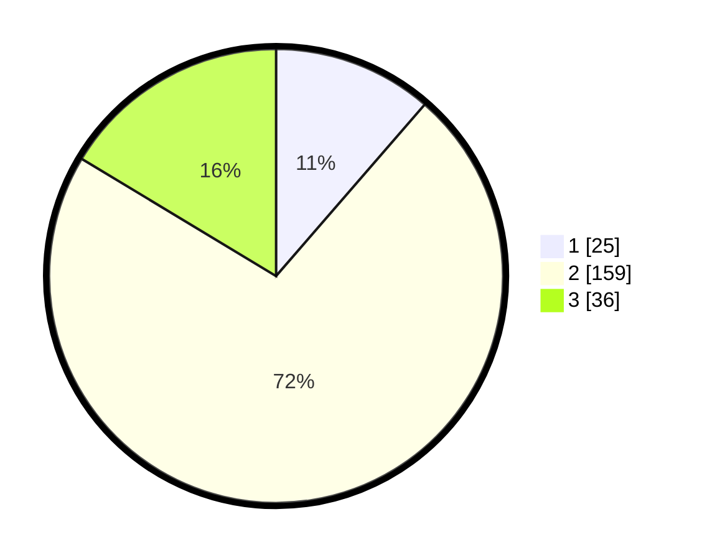

# Hasil

## Grafik

## Tabel

| No. | Nama Paslon    | Suara | Suara (raw) | Persentase |
|:--- |:-------------- | -----:| -----------:| ----------:|
| 1   | ANIES MUHAIMIN | 25    | [25][p-1]   | 11,36      |
| 2   | PRABOWO GIBRAN | 159   | [159][p-2]  | 72,27      |
| 3   | GANJAR MAHFUD  | 36    | [36][p-3]   | 16,36      |

[p-1]: https://github.com/gigit-pemilu/pemilu-2024-35-jawa-timur/blob/main/pilpres/hitung-suara/sub/35-jawa-timur/sub/03-trenggalek/sub/06-karangan/sub/2006-salamrejo/sub/007-tps/sub/paslon-1.txt
[p-2]: https://github.com/gigit-pemilu/pemilu-2024-35-jawa-timur/blob/main/pilpres/hitung-suara/sub/35-jawa-timur/sub/03-trenggalek/sub/06-karangan/sub/2006-salamrejo/sub/007-tps/sub/paslon-2.txt
[p-3]: https://github.com/gigit-pemilu/pemilu-2024-35-jawa-timur/blob/main/pilpres/hitung-suara/sub/35-jawa-timur/sub/03-trenggalek/sub/06-karangan/sub/2006-salamrejo/sub/007-tps/sub/paslon-3.txt

## Foto C Plano

https://sirekap-obj-formc.kpu.go.id/81e4/pemilu/ppwp/35/03/06/20/06/3503062006007-20240215-092131--b8533871-5c65-4614-b0d8-5a2ae8bea50f.jpg

https://sirekap-obj-formc.kpu.go.id/81e4/pemilu/ppwp/35/03/06/20/06/3503062006007-20240215-092029--4bdc1ed8-aaf6-4998-9b44-9d1c25f9ab5f.jpg

https://sirekap-obj-formc.kpu.go.id/81e4/pemilu/ppwp/35/03/06/20/06/3503062006007-20240215-092228--0ea432a9-146c-4f18-9340-c68599ec443c.jpg

## Metadata

| Key        | Value               |
| ---------- | ------------------- |
| Time Stamp | 2024-02-15 17:30:25 |

