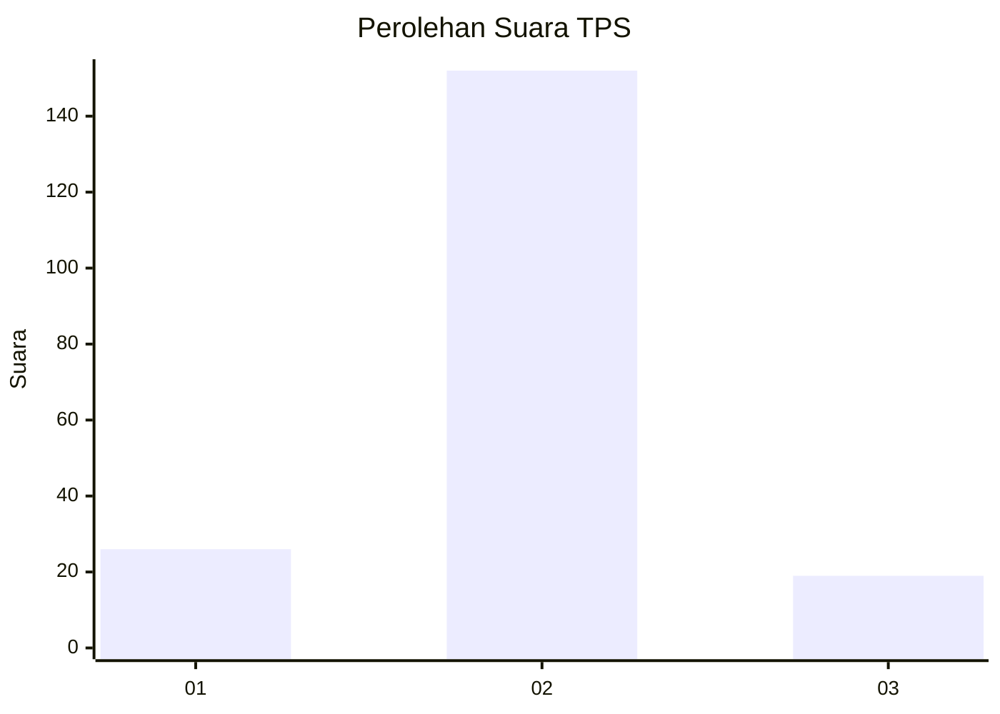
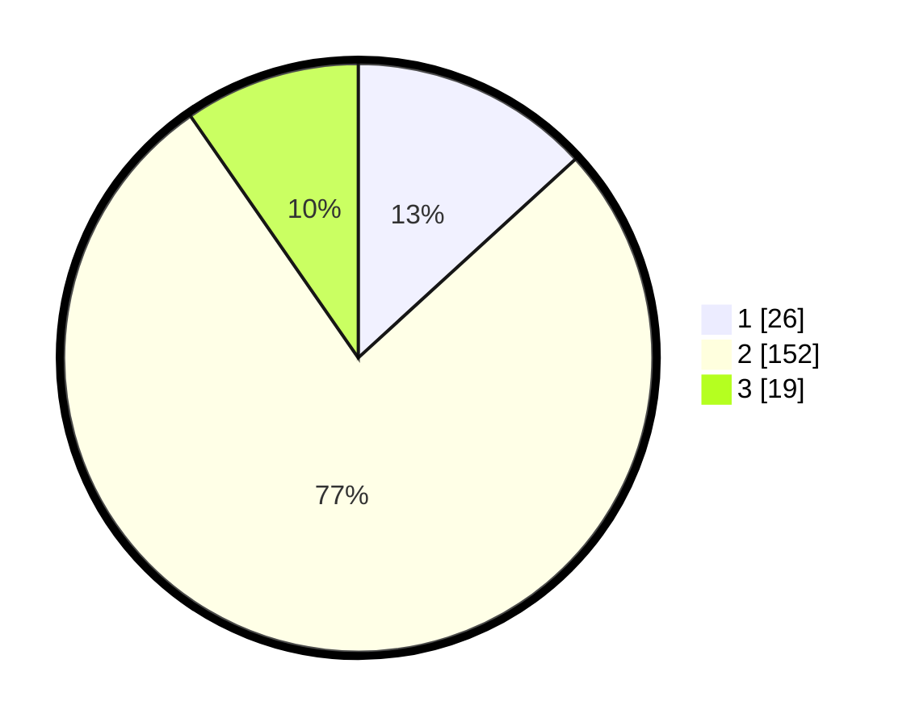

# Hasil

## Grafik

## Tabel

| No. | Nama Paslon    | Suara | Suara (raw) | Persentase |
|:--- |:-------------- | -----:| -----------:| ----------:|
| 1   | ANIES MUHAIMIN | 26    | [26][p-1]   | 13,20      |
| 2   | PRABOWO GIBRAN | 152   | [152][p-2]  | 77,16      |
| 3   | GANJAR MAHFUD  | 19    | [19][p-3]   | 9,64       |

[p-1]: https://github.com/gigit-pemilu/pemilu-2024-35-jawa-timur/blob/main/pilpres/hitung-suara/sub/35-jawa-timur/sub/03-trenggalek/sub/06-karangan/sub/2006-salamrejo/sub/010-tps/sub/paslon-1.txt
[p-2]: https://github.com/gigit-pemilu/pemilu-2024-35-jawa-timur/blob/main/pilpres/hitung-suara/sub/35-jawa-timur/sub/03-trenggalek/sub/06-karangan/sub/2006-salamrejo/sub/010-tps/sub/paslon-2.txt
[p-3]: https://github.com/gigit-pemilu/pemilu-2024-35-jawa-timur/blob/main/pilpres/hitung-suara/sub/35-jawa-timur/sub/03-trenggalek/sub/06-karangan/sub/2006-salamrejo/sub/010-tps/sub/paslon-3.txt

## Foto C Plano

https://sirekap-obj-formc.kpu.go.id/6cd6/pemilu/ppwp/35/03/06/20/06/3503062006010-20240215-142124--bfaa4cd4-29e3-4193-8aa8-51b328c0d2fd.jpg

https://sirekap-obj-formc.kpu.go.id/6cd6/pemilu/ppwp/35/03/06/20/06/3503062006010-20240215-142211--d46e6c7d-f6e3-4178-956a-05eccf4c84de.jpg

https://sirekap-obj-formc.kpu.go.id/6cd6/pemilu/ppwp/35/03/06/20/06/3503062006010-20240215-142242--1bb4bd17-35f6-46c7-a9f3-0e6c73fd1a9c.jpg

## Metadata

| Key        | Value               |
| ---------- | ------------------- |
| Time Stamp | 2024-02-15 20:30:46 |

