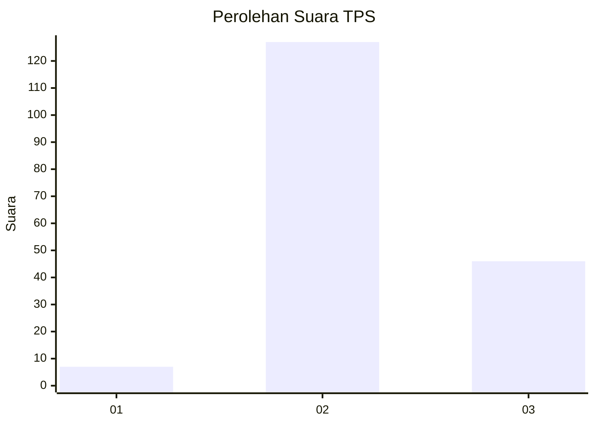
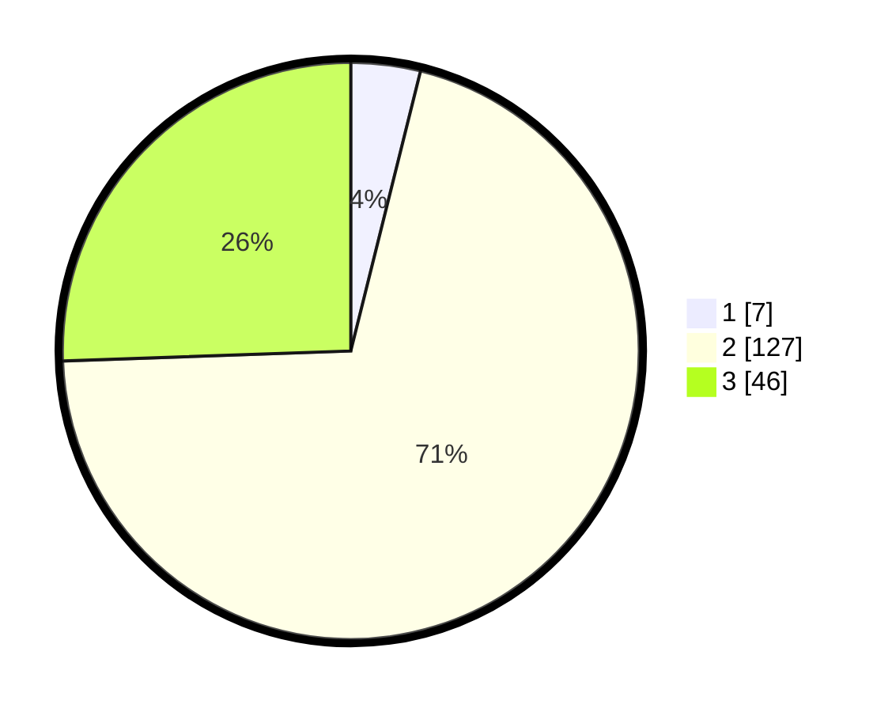

# Hasil

## Grafik

## Tabel

| No. | Nama Paslon    | Suara | Suara (raw) | Persentase |
|:--- |:-------------- | -----:| -----------:| ----------:|
| 1   | ANIES MUHAIMIN | 7     | [7][p-1]    | 3,89       |
| 2   | PRABOWO GIBRAN | 127   | [127][p-2]  | 70,56      |
| 3   | GANJAR MAHFUD  | 46    | [46][p-3]   | 25,56      |

[p-1]: https://github.com/gigit-pemilu/pemilu-2024-35-jawa-timur/blob/main/pilpres/hitung-suara/sub/35-jawa-timur/sub/03-trenggalek/sub/06-karangan/sub/2007-sukowetan/sub/006-tps/sub/paslon-1.txt
[p-2]: https://github.com/gigit-pemilu/pemilu-2024-35-jawa-timur/blob/main/pilpres/hitung-suara/sub/35-jawa-timur/sub/03-trenggalek/sub/06-karangan/sub/2007-sukowetan/sub/006-tps/sub/paslon-2.txt
[p-3]: https://github.com/gigit-pemilu/pemilu-2024-35-jawa-timur/blob/main/pilpres/hitung-suara/sub/35-jawa-timur/sub/03-trenggalek/sub/06-karangan/sub/2007-sukowetan/sub/006-tps/sub/paslon-3.txt

## Foto C Plano

https://sirekap-obj-formc.kpu.go.id/f465/pemilu/ppwp/35/03/06/20/07/3503062007006-20240218-184601--9cd72cb8-75c4-4581-87e1-5f70ea85a528.jpg

https://sirekap-obj-formc.kpu.go.id/f465/pemilu/ppwp/35/03/06/20/07/3503062007006-20240214-200047--7ba1506e-f569-45f8-8fff-4f1e417eee1e.jpg

## Metadata

| Key        | Value               |
| ---------- | ------------------- |
| Time Stamp | 2024-02-24 22:31:28 |

