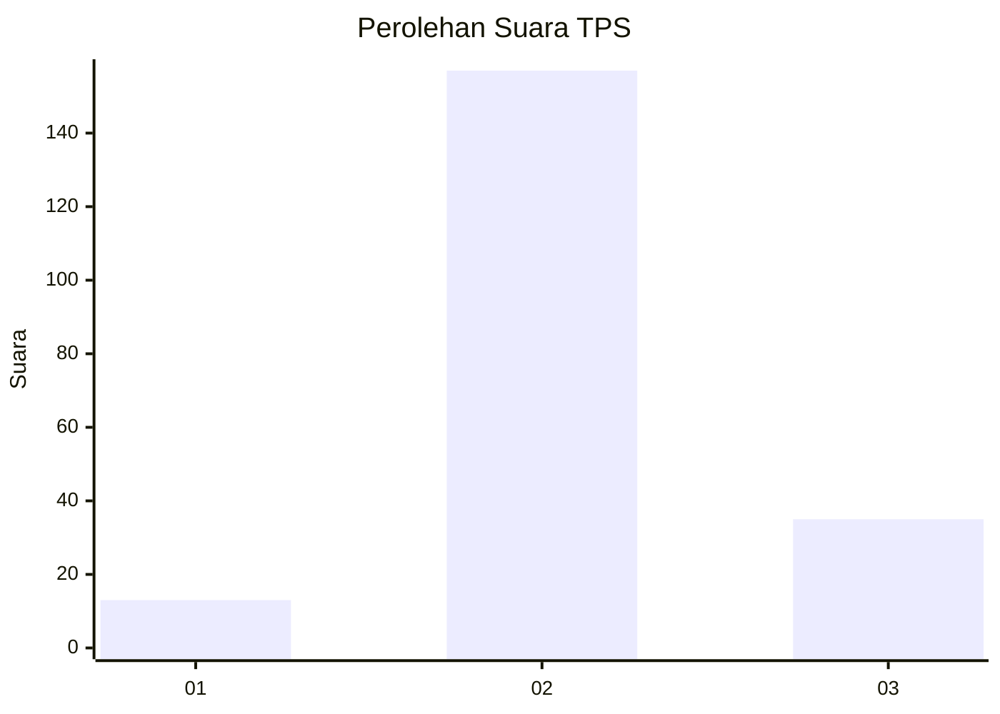

# Hasil

## Grafik

## Tabel

| No. | Nama Paslon    | Suara | Suara (raw) | Persentase |
|:--- |:-------------- | -----:| -----------:| ----------:|
| 1   | ANIES MUHAIMIN | 13    | [13][p-1]   | 6,34       |
| 2   | PRABOWO GIBRAN | 157   | [157][p-2]  | 76,59      |
| 3   | GANJAR MAHFUD  | 35    | [35][p-3]   | 17,07      |

[p-1]: https://github.com/gigit-pemilu/pemilu-2024-35-jawa-timur/blob/main/pilpres/hitung-suara/sub/35-jawa-timur/sub/03-trenggalek/sub/06-karangan/sub/2007-sukowetan/sub/011-tps/sub/paslon-1.txt
[p-2]: https://github.com/gigit-pemilu/pemilu-2024-35-jawa-timur/blob/main/pilpres/hitung-suara/sub/35-jawa-timur/sub/03-trenggalek/sub/06-karangan/sub/2007-sukowetan/sub/011-tps/sub/paslon-2.txt
[p-3]: https://github.com/gigit-pemilu/pemilu-2024-35-jawa-timur/blob/main/pilpres/hitung-suara/sub/35-jawa-timur/sub/03-trenggalek/sub/06-karangan/sub/2007-sukowetan/sub/011-tps/sub/paslon-3.txt

## Foto C Plano

https://sirekap-obj-formc.kpu.go.id/e072/pemilu/ppwp/35/03/06/20/07/3503062007011-20240214-221224--227819d1-2c32-45e2-8c54-fe634691e036.jpg

https://sirekap-obj-formc.kpu.go.id/e072/pemilu/ppwp/35/03/06/20/07/3503062007011-20240214-225919--2f5199e8-cf5a-415c-bbe0-6feaab46e461.jpg

https://sirekap-obj-formc.kpu.go.id/e072/pemilu/ppwp/35/03/06/20/07/3503062007011-20240214-231403--ca66c684-255b-46ae-8d94-bd28466a415f.jpg

## Metadata

| Key        | Value               |
| ---------- | ------------------- |
| Time Stamp | 2024-02-17 17:30:00 |

