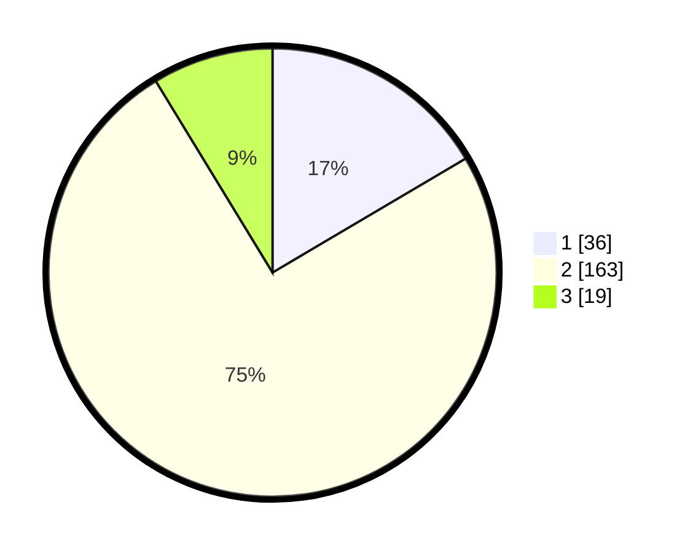

# Hasil

## Grafik

## Tabel

| No. | Nama Paslon    | Suara | Suara (raw) | Persentase |
|:--- |:-------------- | -----:| -----------:| ----------:|
| 1   | ANIES MUHAIMIN | 36    | [36][p-1]   | 16,51      |
| 2   | PRABOWO GIBRAN | 163   | [163][p-2]  | 74,77      |
| 3   | GANJAR MAHFUD  | 19    | [19][p-3]   | 8,72       |

[p-1]: https://github.com/gigit-pemilu/pemilu-2024-35-jawa-timur/blob/main/pilpres/hitung-suara/sub/35-jawa-timur/sub/03-trenggalek/sub/06-karangan/sub/2010-buluagung/sub/007-tps/sub/paslon-1.txt
[p-2]: https://github.com/gigit-pemilu/pemilu-2024-35-jawa-timur/blob/main/pilpres/hitung-suara/sub/35-jawa-timur/sub/03-trenggalek/sub/06-karangan/sub/2010-buluagung/sub/007-tps/sub/paslon-2.txt
[p-3]: https://github.com/gigit-pemilu/pemilu-2024-35-jawa-timur/blob/main/pilpres/hitung-suara/sub/35-jawa-timur/sub/03-trenggalek/sub/06-karangan/sub/2010-buluagung/sub/007-tps/sub/paslon-3.txt

## Foto C Plano

https://sirekap-obj-formc.kpu.go.id/68da/pemilu/ppwp/35/03/06/20/10/3503062010007-20240215-012443--c7884af9-86ca-42b6-a2d2-db639c0b4dee.jpg

https://sirekap-obj-formc.kpu.go.id/68da/pemilu/ppwp/35/03/06/20/10/3503062010007-20240215-034952--89a900ed-8c3a-4def-9bab-54bae8de005a.jpg

https://sirekap-obj-formc.kpu.go.id/68da/pemilu/ppwp/35/03/06/20/10/3503062010007-20240215-035106--74ceaadb-0933-428e-9fdb-f7efc924492c.jpg

## Metadata

| Key        | Value               |
| ---------- | ------------------- |
| Time Stamp | 2024-02-15 17:00:25 |

