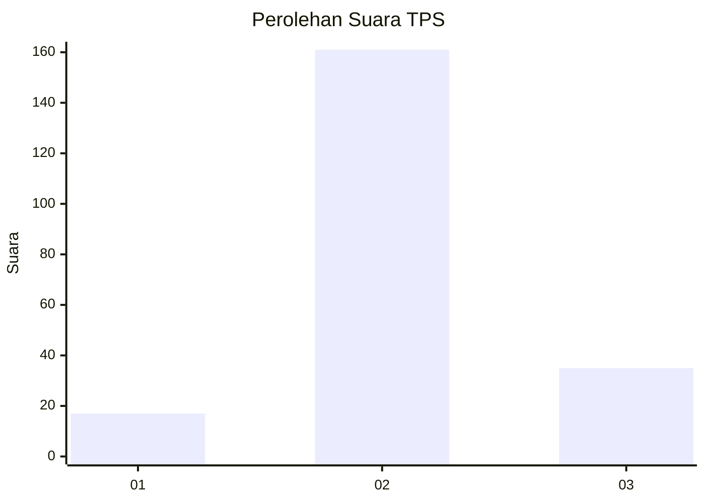
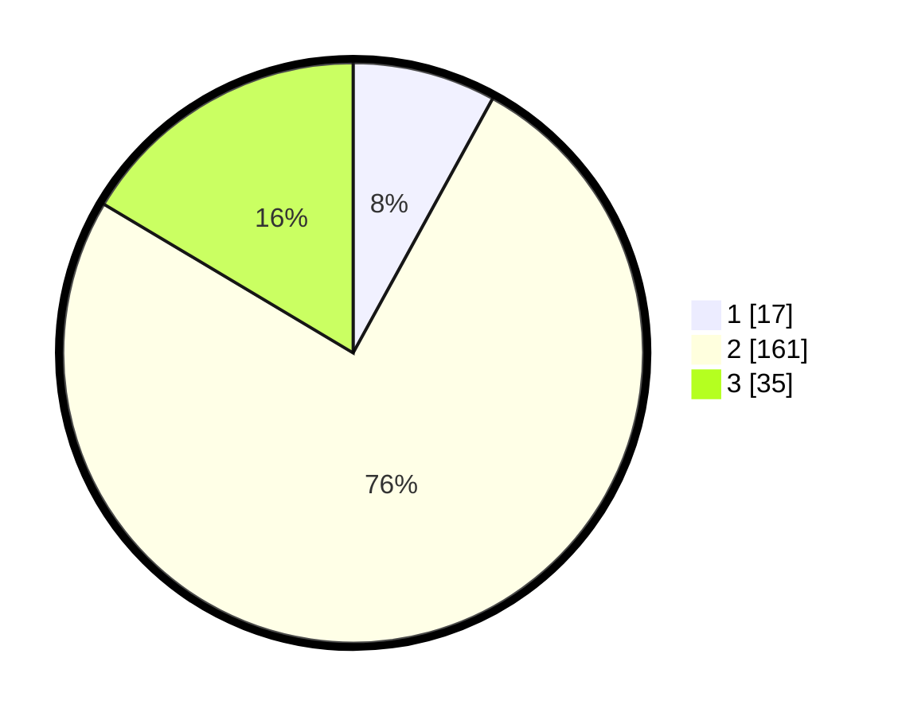

# Hasil

## Grafik

## Tabel

| No. | Nama Paslon    | Suara | Suara (raw) | Persentase |
|:--- |:-------------- | -----:| -----------:| ----------:|
| 1   | ANIES MUHAIMIN | 17    | [17][p-1]   | 7,98       |
| 2   | PRABOWO GIBRAN | 161   | [161][p-2]  | 75,59      |
| 3   | GANJAR MAHFUD  | 35    | [35][p-3]   | 16,43      |

[p-1]: https://github.com/gigit-pemilu/pemilu-2024/blob/main/pilpres/hitung-suara/sub/35-jawa-timur/sub/03-trenggalek/sub/06-karangan/sub/2011-sumberingin/sub/008-tps/sub/paslon-1.txt
[p-2]: https://github.com/gigit-pemilu/pemilu-2024/blob/main/pilpres/hitung-suara/sub/35-jawa-timur/sub/03-trenggalek/sub/06-karangan/sub/2011-sumberingin/sub/008-tps/sub/paslon-2.txt
[p-3]: https://github.com/gigit-pemilu/pemilu-2024/blob/main/pilpres/hitung-suara/sub/35-jawa-timur/sub/03-trenggalek/sub/06-karangan/sub/2011-sumberingin/sub/008-tps/sub/paslon-3.txt

## Foto C Plano

https://sirekap-obj-formc.kpu.go.id/75e0/pemilu/ppwp/35/03/06/20/11/3503062011008-20240215-002504--1c1bbf5f-cbb1-4a7f-9aa1-e5248f470f55.jpg

https://sirekap-obj-formc.kpu.go.id/75e0/pemilu/ppwp/35/03/06/20/11/3503062011008-20240215-002512--c636b41f-e38f-41ff-8d57-92cb75309442.jpg

https://sirekap-obj-formc.kpu.go.id/75e0/pemilu/ppwp/35/03/06/20/11/3503062011008-20240215-002515--5cc0bdf1-3a21-45d0-b12e-060554fdc261.jpg

## Metadata

| Key        | Value               |
| ---------- | ------------------- |
| Time Stamp | 2024-02-15 21:01:18 |

