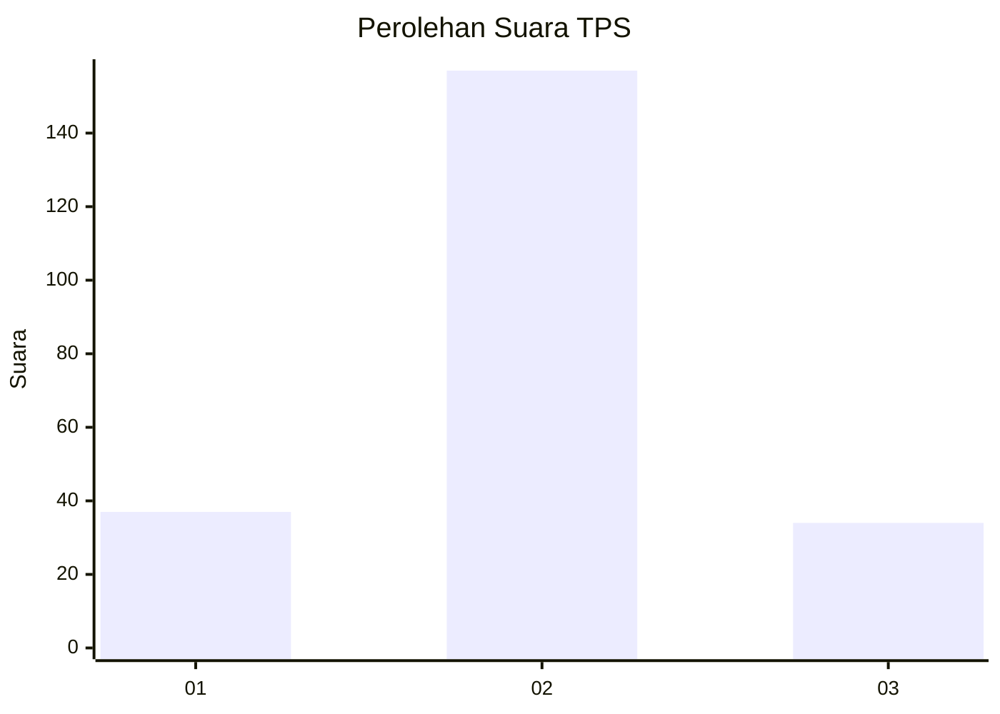

# Hasil

## Grafik

## Tabel

| No. | Nama Paslon    | Suara | Suara (raw) | Persentase |
|:--- |:-------------- | -----:| -----------:| ----------:|
| 1   | ANIES MUHAIMIN | 37    | [37][p-1]   | 16,23      |
| 2   | PRABOWO GIBRAN | 157   | [157][p-2]  | 68,86      |
| 3   | GANJAR MAHFUD  | 34    | [34][p-3]   | 14,91      |

[p-1]: https://github.com/gigit-pemilu/pemilu-2024-35-jawa-timur/blob/main/pilpres/hitung-suara/sub/35-jawa-timur/sub/03-trenggalek/sub/06-karangan/sub/2012-jatiprahu/sub/007-tps/sub/paslon-1.txt
[p-2]: https://github.com/gigit-pemilu/pemilu-2024-35-jawa-timur/blob/main/pilpres/hitung-suara/sub/35-jawa-timur/sub/03-trenggalek/sub/06-karangan/sub/2012-jatiprahu/sub/007-tps/sub/paslon-2.txt
[p-3]: https://github.com/gigit-pemilu/pemilu-2024-35-jawa-timur/blob/main/pilpres/hitung-suara/sub/35-jawa-timur/sub/03-trenggalek/sub/06-karangan/sub/2012-jatiprahu/sub/007-tps/sub/paslon-3.txt

## Foto C Plano

https://sirekap-obj-formc.kpu.go.id/365f/pemilu/ppwp/35/03/06/20/12/3503062012007-20240216-181156--fa8a1621-f120-4241-a8c9-94cdffba549e.jpg

https://sirekap-obj-formc.kpu.go.id/365f/pemilu/ppwp/35/03/06/20/12/3503062012007-20240219-200547--e7a6b45a-dd00-4790-b405-524d71d92629.jpg

https://sirekap-obj-formc.kpu.go.id/365f/pemilu/ppwp/35/03/06/20/12/3503062012007-20240216-211101--10bfbee1-567d-4e21-a457-b9adbb99cefb.jpg

## Metadata

| Key        | Value               |
| ---------- | ------------------- |
| Time Stamp | 2024-02-24 22:31:28 |

