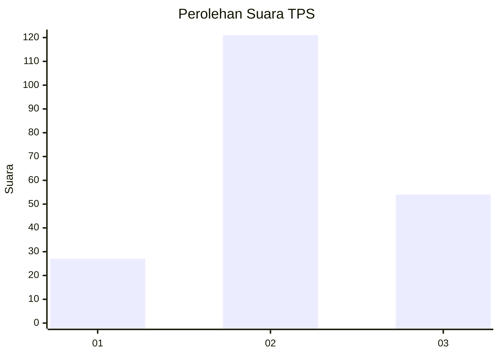
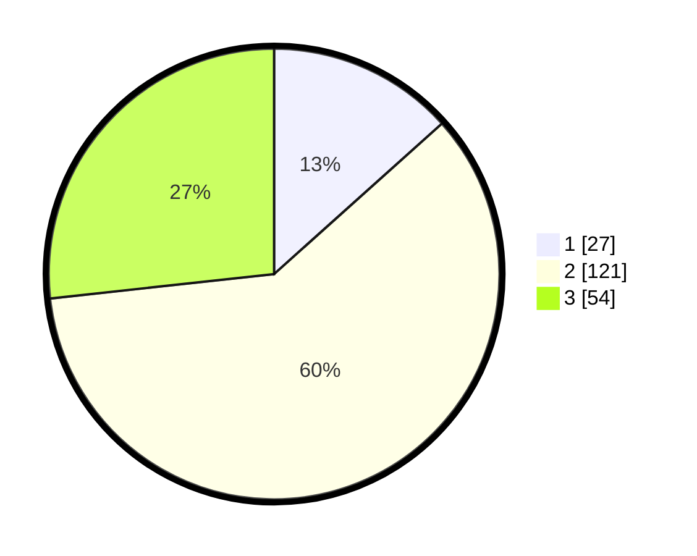

# Hasil

## Grafik

## Tabel

| No. | Nama Paslon    | Suara | Suara (raw) | Persentase |
|:--- |:-------------- | -----:| -----------:| ----------:|
| 1   | ANIES MUHAIMIN | 27    | [27][p-1]   | 13,37      |
| 2   | PRABOWO GIBRAN | 121   | [121][p-2]  | 59,90      |
| 3   | GANJAR MAHFUD  | 54    | [54][p-3]   | 26,73      |

[p-1]: https://github.com/gigit-pemilu/pemilu-2024/blob/main/pilpres/hitung-suara/sub/35-jawa-timur/sub/03-trenggalek/sub/06-karangan/sub/2012-jatiprahu/sub/008-tps/sub/paslon-1.txt
[p-2]: https://github.com/gigit-pemilu/pemilu-2024/blob/main/pilpres/hitung-suara/sub/35-jawa-timur/sub/03-trenggalek/sub/06-karangan/sub/2012-jatiprahu/sub/008-tps/sub/paslon-2.txt
[p-3]: https://github.com/gigit-pemilu/pemilu-2024/blob/main/pilpres/hitung-suara/sub/35-jawa-timur/sub/03-trenggalek/sub/06-karangan/sub/2012-jatiprahu/sub/008-tps/sub/paslon-3.txt

## Foto C Plano

https://sirekap-obj-formc.kpu.go.id/a977/pemilu/ppwp/35/03/06/20/12/3503062012008-20240217-162713--d7f59f49-6c96-4eb1-b9cd-0e50ee223271.jpg

https://sirekap-obj-formc.kpu.go.id/a977/pemilu/ppwp/35/03/06/20/12/3503062012008-20240217-163430--830c9c1e-3cc9-48e7-9ec6-6637e48c2bd1.jpg

https://sirekap-obj-formc.kpu.go.id/a977/pemilu/ppwp/35/03/06/20/12/3503062012008-20240217-162847--46cf058c-0f7e-4a59-9abc-baa2283889b2.jpg

## Metadata

| Key        | Value               |
| ---------- | ------------------- |
| Time Stamp | 2024-02-25 17:00:00 |

