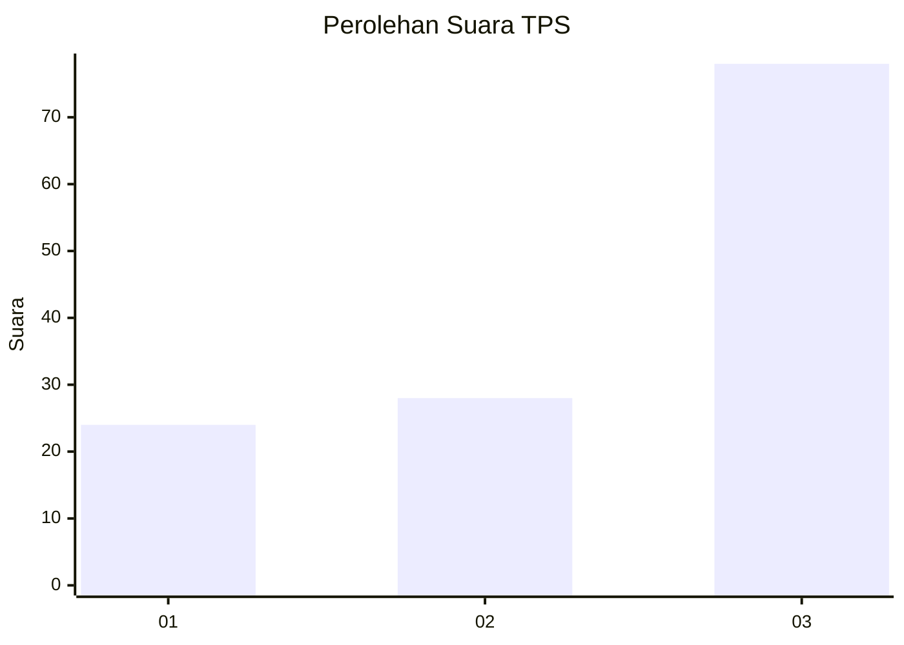
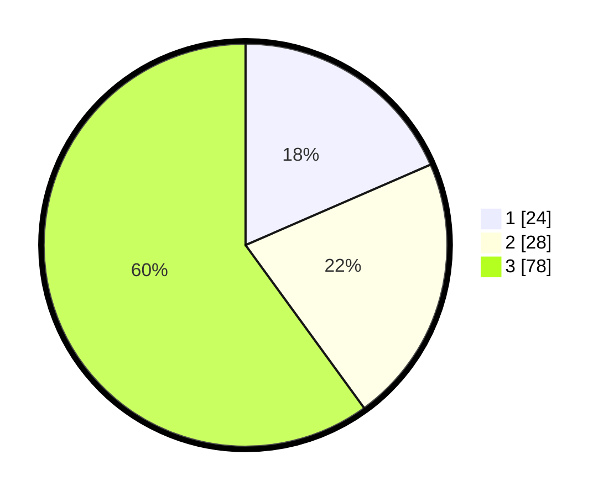

# Hasil

## Grafik

## Tabel

| No. | Nama Paslon    | Suara | Suara (raw) | Persentase |
|:--- |:-------------- | -----:| -----------:| ----------:|
| 1   | ANIES MUHAIMIN | 24    | [24][p-1]   | 18,46      |
| 2   | PRABOWO GIBRAN | 28    | [28][p-2]   | 21,54      |
| 3   | GANJAR MAHFUD  | 78    | [78][p-3]   | 60,00      |

[p-1]: https://github.com/gigit-pemilu/pemilu-2024/blob/main/pilpres/hitung-suara/sub/35-jawa-timur/sub/03-trenggalek/sub/07-kampak/sub/2001-ngadimulyo/sub/001-tps/sub/paslon-1.txt
[p-2]: https://github.com/gigit-pemilu/pemilu-2024/blob/main/pilpres/hitung-suara/sub/35-jawa-timur/sub/03-trenggalek/sub/07-kampak/sub/2001-ngadimulyo/sub/001-tps/sub/paslon-2.txt
[p-3]: https://github.com/gigit-pemilu/pemilu-2024/blob/main/pilpres/hitung-suara/sub/35-jawa-timur/sub/03-trenggalek/sub/07-kampak/sub/2001-ngadimulyo/sub/001-tps/sub/paslon-3.txt

## Foto C Plano

https://sirekap-obj-formc.kpu.go.id/e0fc/pemilu/ppwp/35/03/07/20/01/3503072001001-20240216-113208--b094d79f-06f3-4453-bd0a-4fbdc71b00b9.jpg

https://sirekap-obj-formc.kpu.go.id/e0fc/pemilu/ppwp/35/03/07/20/01/3503072001001-20240216-113254--33f5c712-22f8-402e-be83-ae83240eed2d.jpg

## Metadata

| Key        | Value               |
| ---------- | ------------------- |
| Time Stamp | 2024-02-21 09:00:00 |

