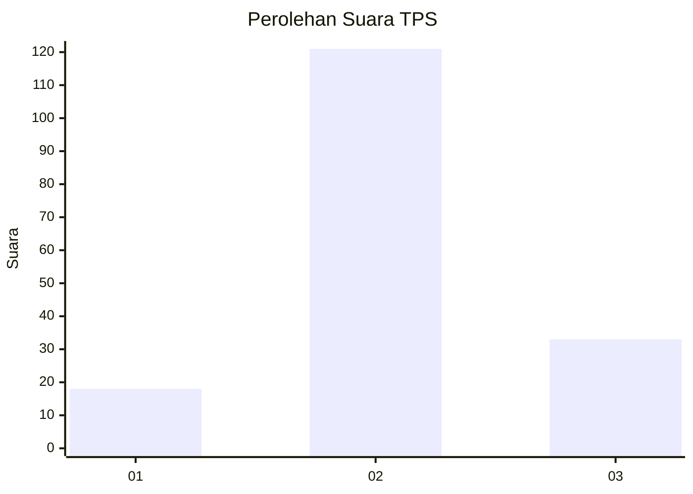
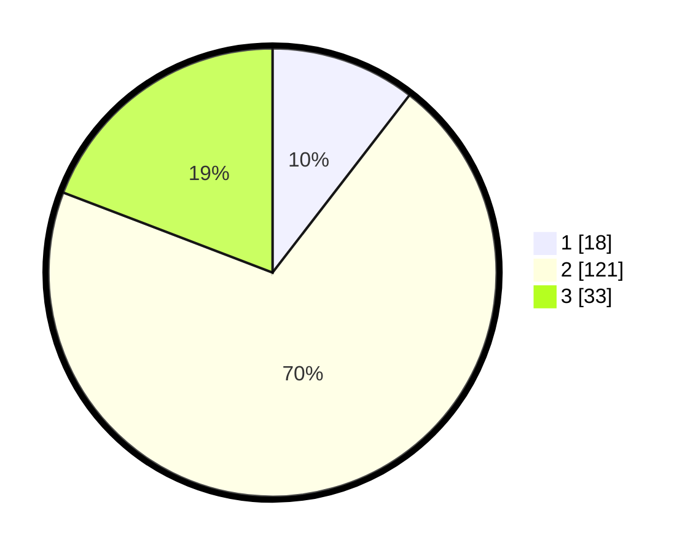

# Hasil

## Grafik

## Tabel

| No. | Nama Paslon    | Suara | Suara (raw) | Persentase |
|:--- |:-------------- | -----:| -----------:| ----------:|
| 1   | ANIES MUHAIMIN | 18    | [18][p-1]   | 10,47      |
| 2   | PRABOWO GIBRAN | 121   | [121][p-2]  | 70,35      |
| 3   | GANJAR MAHFUD  | 33    | [33][p-3]   | 19,19      |

[p-1]: https://github.com/gigit-pemilu/pemilu-2024/blob/main/pilpres/hitung-suara/sub/35-jawa-timur/sub/03-trenggalek/sub/07-kampak/sub/2002-bogoran/sub/003-tps/sub/paslon-1.txt
[p-2]: https://github.com/gigit-pemilu/pemilu-2024/blob/main/pilpres/hitung-suara/sub/35-jawa-timur/sub/03-trenggalek/sub/07-kampak/sub/2002-bogoran/sub/003-tps/sub/paslon-2.txt
[p-3]: https://github.com/gigit-pemilu/pemilu-2024/blob/main/pilpres/hitung-suara/sub/35-jawa-timur/sub/03-trenggalek/sub/07-kampak/sub/2002-bogoran/sub/003-tps/sub/paslon-3.txt

## Foto C Plano

https://sirekap-obj-formc.kpu.go.id/2438/pemilu/ppwp/35/03/07/20/02/3503072002003-20240223-093013--ca6c5a09-5312-4ed1-8e8e-b9beaee75865.jpg

https://sirekap-obj-formc.kpu.go.id/2438/pemilu/ppwp/35/03/07/20/02/3503072002003-20240223-093044--160e613c-7d0e-4e91-a024-f195566b6cd0.jpg

## Metadata

| Key        | Value               |
| ---------- | ------------------- |
| Time Stamp | 2024-02-25 22:00:00 |

