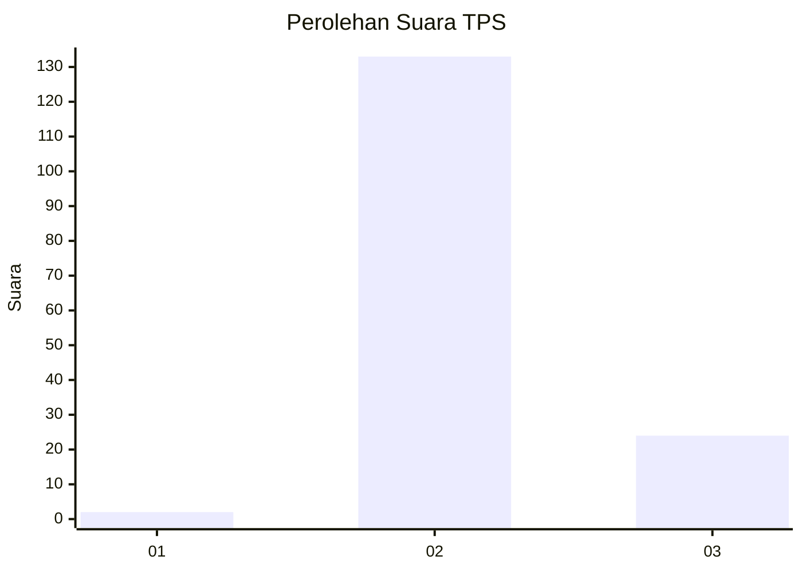
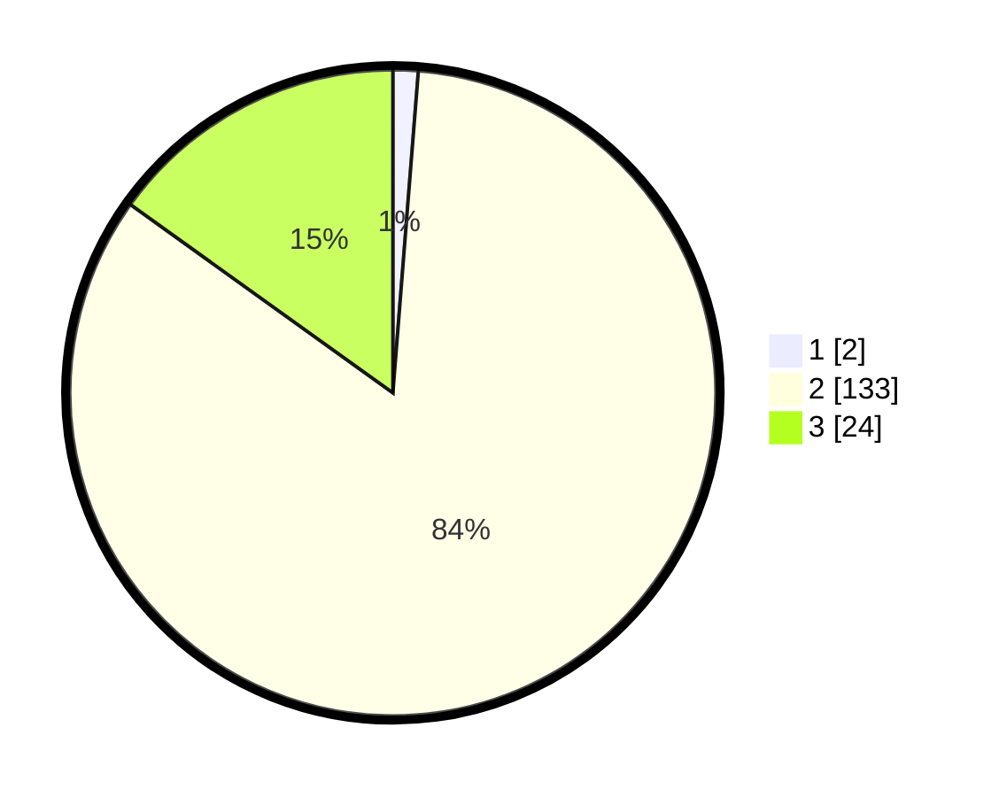

# Hasil

## Grafik

## Tabel

| No. | Nama Paslon    | Suara | Suara (raw) | Persentase |
|:--- |:-------------- | -----:| -----------:| ----------:|
| 1   | ANIES MUHAIMIN | 2     | [2][p-1]    | 1,26       |
| 2   | PRABOWO GIBRAN | 133   | [133][p-2]  | 83,65      |
| 3   | GANJAR MAHFUD  | 24    | [24][p-3]   | 15,09      |

[p-1]: https://github.com/gigit-pemilu/pemilu-2024-35-jawa-timur/blob/main/pilpres/hitung-suara/sub/35-jawa-timur/sub/03-trenggalek/sub/07-kampak/sub/2002-bogoran/sub/014-tps/sub/paslon-1.txt
[p-2]: https://github.com/gigit-pemilu/pemilu-2024-35-jawa-timur/blob/main/pilpres/hitung-suara/sub/35-jawa-timur/sub/03-trenggalek/sub/07-kampak/sub/2002-bogoran/sub/014-tps/sub/paslon-2.txt
[p-3]: https://github.com/gigit-pemilu/pemilu-2024-35-jawa-timur/blob/main/pilpres/hitung-suara/sub/35-jawa-timur/sub/03-trenggalek/sub/07-kampak/sub/2002-bogoran/sub/014-tps/sub/paslon-3.txt

## Foto C Plano

https://sirekap-obj-formc.kpu.go.id/741e/pemilu/ppwp/35/03/07/20/02/3503072002014-20240214-214805--3f04804d-06b9-452e-a684-16dd997efd05.jpg

https://sirekap-obj-formc.kpu.go.id/741e/pemilu/ppwp/35/03/07/20/02/3503072002014-20240214-214811--f6650bb8-2364-4336-8428-9f37c0e6aa79.jpg

https://sirekap-obj-formc.kpu.go.id/741e/pemilu/ppwp/35/03/07/20/02/3503072002014-20240214-214818--b467f7f4-3305-4eab-b321-a7a88e079c7c.jpg

## Metadata

| Key        | Value               |
| ---------- | ------------------- |
| Time Stamp | 2024-02-15 15:30:25 |

