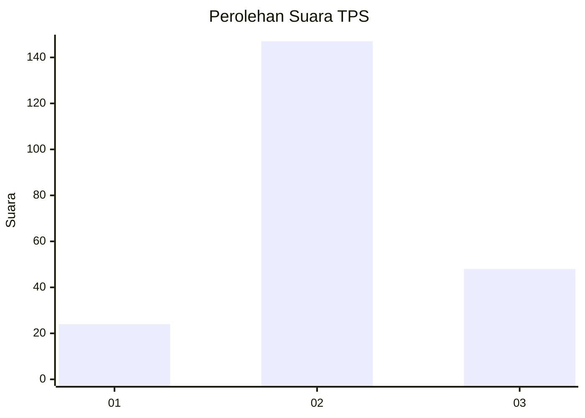
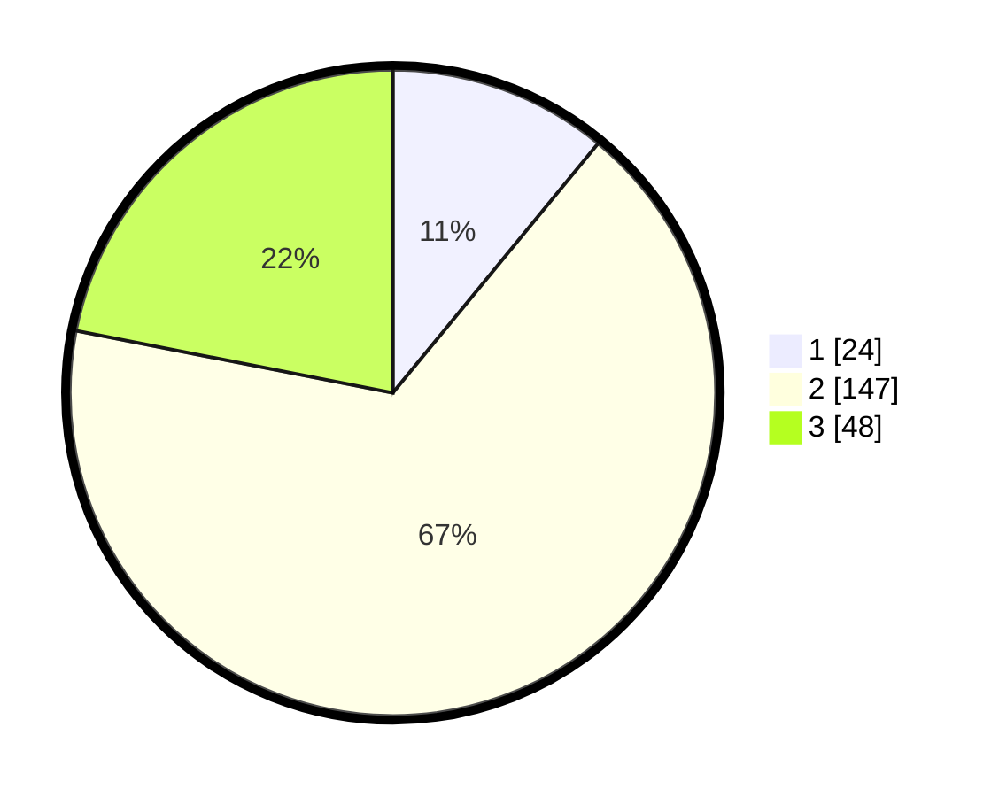

# Hasil

## Grafik

## Tabel

| No. | Nama Paslon    | Suara | Suara (raw) | Persentase |
|:--- |:-------------- | -----:| -----------:| ----------:|
| 1   | ANIES MUHAIMIN | 24    | [24][p-1]   | 10,96      |
| 2   | PRABOWO GIBRAN | 147   | [147][p-2]  | 67,12      |
| 3   | GANJAR MAHFUD  | 48    | [48][p-3]   | 21,92      |

[p-1]: https://github.com/gigit-pemilu/pemilu-2024/blob/main/pilpres/hitung-suara/sub/35-jawa-timur/sub/03-trenggalek/sub/07-kampak/sub/2003-timahan/sub/005-tps/sub/paslon-1.txt
[p-2]: https://github.com/gigit-pemilu/pemilu-2024/blob/main/pilpres/hitung-suara/sub/35-jawa-timur/sub/03-trenggalek/sub/07-kampak/sub/2003-timahan/sub/005-tps/sub/paslon-2.txt
[p-3]: https://github.com/gigit-pemilu/pemilu-2024/blob/main/pilpres/hitung-suara/sub/35-jawa-timur/sub/03-trenggalek/sub/07-kampak/sub/2003-timahan/sub/005-tps/sub/paslon-3.txt

## Foto C Plano

https://sirekap-obj-formc.kpu.go.id/d879/pemilu/ppwp/35/03/07/20/03/3503072003005-20240223-100530--4670a313-69f5-4a4c-9b07-8fee72ca43c2.jpg

https://sirekap-obj-formc.kpu.go.id/d879/pemilu/ppwp/35/03/07/20/03/3503072003005-20240223-100233--e837134a-454e-4524-ba91-7da12b11044d.jpg

https://sirekap-obj-formc.kpu.go.id/d879/pemilu/ppwp/35/03/07/20/03/3503072003005-20240223-100328--05049bd8-77a5-4632-8016-67e969fcad70.jpg

## Metadata

| Key        | Value               |
| ---------- | ------------------- |
| Time Stamp | 2024-02-24 22:31:28 |

