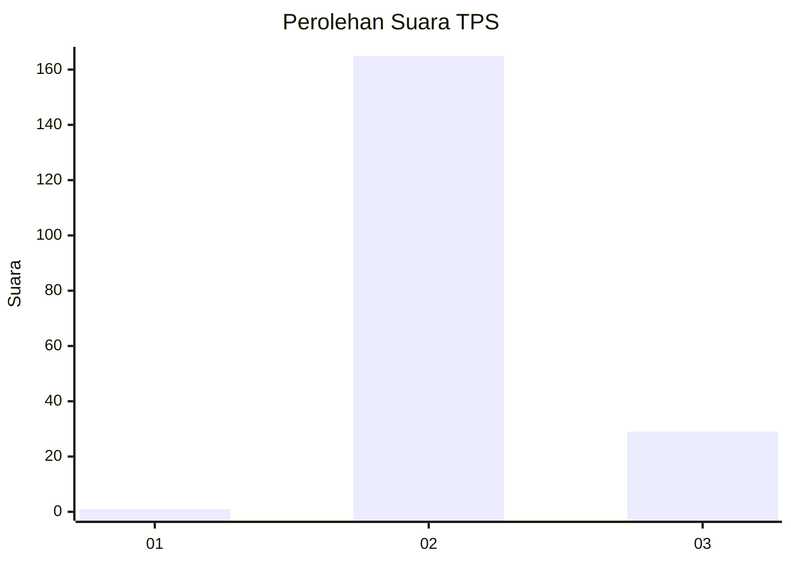
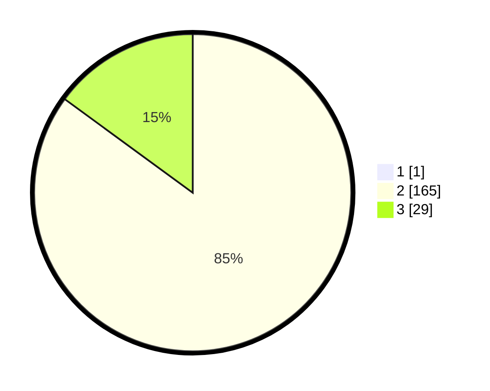

# Hasil

## Grafik

## Tabel

| No. | Nama Paslon    | Suara | Suara (raw) | Persentase |
|:--- |:-------------- | -----:| -----------:| ----------:|
| 1   | ANIES MUHAIMIN | 1     | [1][p-1]    | 0,51       |
| 2   | PRABOWO GIBRAN | 165   | [165][p-2]  | 84,62      |
| 3   | GANJAR MAHFUD  | 29    | [29][p-3]   | 14,87      |

[p-1]: https://github.com/gigit-pemilu/pemilu-2024/blob/main/pilpres/hitung-suara/sub/35-jawa-timur/sub/03-trenggalek/sub/07-kampak/sub/2003-timahan/sub/007-tps/sub/paslon-1.txt
[p-2]: https://github.com/gigit-pemilu/pemilu-2024/blob/main/pilpres/hitung-suara/sub/35-jawa-timur/sub/03-trenggalek/sub/07-kampak/sub/2003-timahan/sub/007-tps/sub/paslon-2.txt
[p-3]: https://github.com/gigit-pemilu/pemilu-2024/blob/main/pilpres/hitung-suara/sub/35-jawa-timur/sub/03-trenggalek/sub/07-kampak/sub/2003-timahan/sub/007-tps/sub/paslon-3.txt

## Foto C Plano

https://sirekap-obj-formc.kpu.go.id/7127/pemilu/ppwp/35/03/07/20/03/3503072003007-20240216-140616--3b35f884-28f2-4a11-b0a9-066d214cc230.jpg

https://sirekap-obj-formc.kpu.go.id/7127/pemilu/ppwp/35/03/07/20/03/3503072003007-20240216-110209--0aeec337-8ace-4700-a38d-cb0c8b82a48a.jpg

https://sirekap-obj-formc.kpu.go.id/7127/pemilu/ppwp/35/03/07/20/03/3503072003007-20240216-111525--3d271fcb-fbca-49c6-aa26-c321963fc7e5.jpg

## Metadata

| Key        | Value               |
| ---------- | ------------------- |
| Time Stamp | 2024-02-21 18:00:00 |

