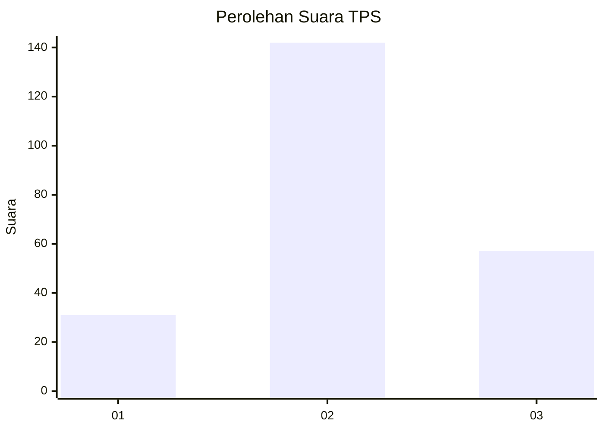
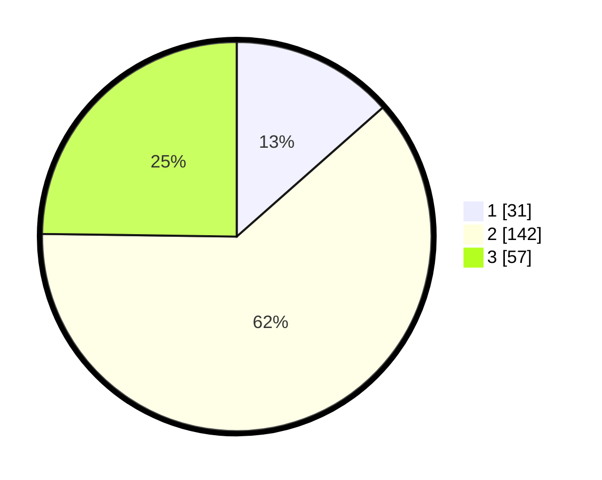

# Hasil

## Grafik

## Tabel

| No. | Nama Paslon    | Suara | Suara (raw) | Persentase |
|:--- |:-------------- | -----:| -----------:| ----------:|
| 1   | ANIES MUHAIMIN | 31    | [31][p-1]   | 13,48      |
| 2   | PRABOWO GIBRAN | 142   | [142][p-2]  | 61,74      |
| 3   | GANJAR MAHFUD  | 57    | [57][p-3]   | 24,78      |

[p-1]: https://github.com/gigit-pemilu/pemilu-2024-35-jawa-timur/blob/main/pilpres/hitung-suara/sub/35-jawa-timur/sub/03-trenggalek/sub/07-kampak/sub/2004-bendoagung/sub/001-tps/sub/paslon-1.txt
[p-2]: https://github.com/gigit-pemilu/pemilu-2024-35-jawa-timur/blob/main/pilpres/hitung-suara/sub/35-jawa-timur/sub/03-trenggalek/sub/07-kampak/sub/2004-bendoagung/sub/001-tps/sub/paslon-2.txt
[p-3]: https://github.com/gigit-pemilu/pemilu-2024-35-jawa-timur/blob/main/pilpres/hitung-suara/sub/35-jawa-timur/sub/03-trenggalek/sub/07-kampak/sub/2004-bendoagung/sub/001-tps/sub/paslon-3.txt

## Foto C Plano

https://sirekap-obj-formc.kpu.go.id/1238/pemilu/ppwp/35/03/07/20/04/3503072004001-20240219-101139--08b9ab30-be38-47ef-97cf-eef69da2fde4.jpg

https://sirekap-obj-formc.kpu.go.id/1238/pemilu/ppwp/35/03/07/20/04/3503072004001-20240219-101741--58c8cb0f-0fb1-4279-84c8-c6829d7c4534.jpg

https://sirekap-obj-formc.kpu.go.id/1238/pemilu/ppwp/35/03/07/20/04/3503072004001-20240219-101426--08221465-e81d-4a20-b9d8-501885d8466b.jpg

## Metadata

| Key        | Value               |
| ---------- | ------------------- |
| Time Stamp | 2024-02-21 01:00:00 |

