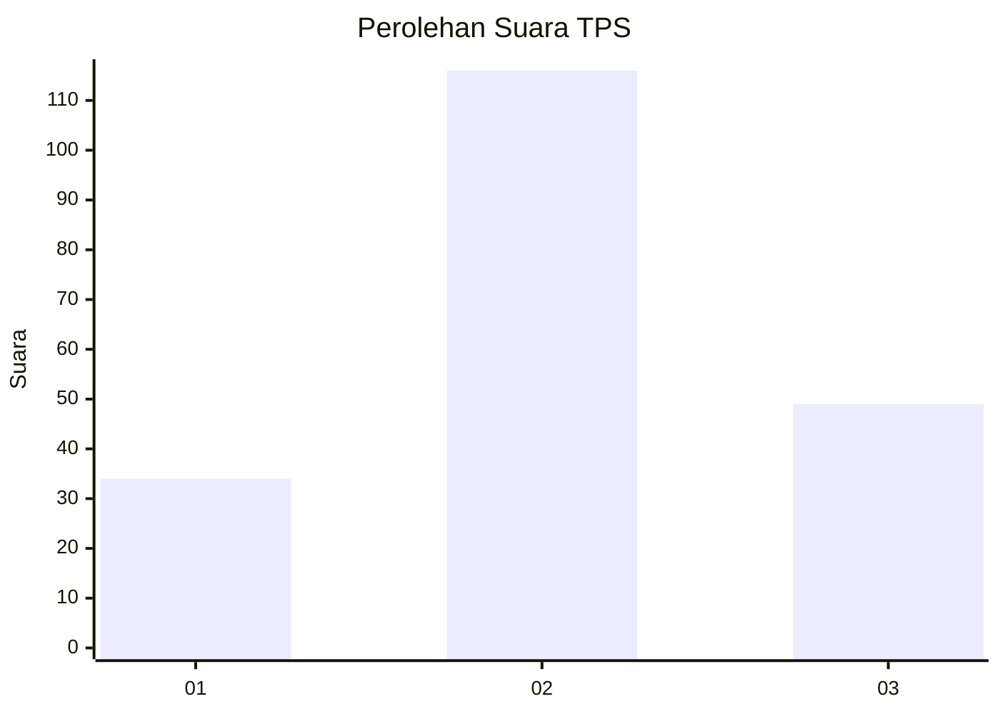
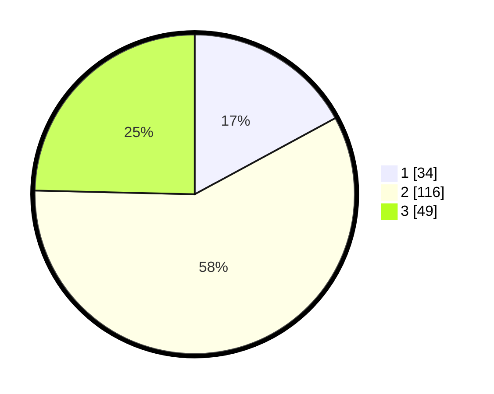

# Hasil

## Grafik

## Tabel

| No. | Nama Paslon    | Suara | Suara (raw) | Persentase |
|:--- |:-------------- | -----:| -----------:| ----------:|
| 1   | ANIES MUHAIMIN | 34    | [34][p-1]   | 17,09      |
| 2   | PRABOWO GIBRAN | 116   | [116][p-2]  | 58,29      |
| 3   | GANJAR MAHFUD  | 49    | [49][p-3]   | 24,62      |

[p-1]: https://github.com/gigit-pemilu/pemilu-2024-35-jawa-timur/blob/main/pilpres/hitung-suara/sub/35-jawa-timur/sub/03-trenggalek/sub/07-kampak/sub/2004-bendoagung/sub/006-tps/sub/paslon-1.txt
[p-2]: https://github.com/gigit-pemilu/pemilu-2024-35-jawa-timur/blob/main/pilpres/hitung-suara/sub/35-jawa-timur/sub/03-trenggalek/sub/07-kampak/sub/2004-bendoagung/sub/006-tps/sub/paslon-2.txt
[p-3]: https://github.com/gigit-pemilu/pemilu-2024-35-jawa-timur/blob/main/pilpres/hitung-suara/sub/35-jawa-timur/sub/03-trenggalek/sub/07-kampak/sub/2004-bendoagung/sub/006-tps/sub/paslon-3.txt

## Foto C Plano

https://sirekap-obj-formc.kpu.go.id/f18c/pemilu/ppwp/35/03/07/20/04/3503072004006-20240216-150212--28f40ee4-6d13-4535-9fa2-02b55ee646db.jpg

https://sirekap-obj-formc.kpu.go.id/f18c/pemilu/ppwp/35/03/07/20/04/3503072004006-20240216-151453--70eb404e-b94e-4a7a-95e4-144522d15d40.jpg

https://sirekap-obj-formc.kpu.go.id/f18c/pemilu/ppwp/35/03/07/20/04/3503072004006-20240216-151207--9ff581e3-bb8c-4e8d-b905-075bd0e86dcb.jpg

## Metadata

| Key        | Value               |
| ---------- | ------------------- |
| Time Stamp | 2024-02-16 16:25:10 |

